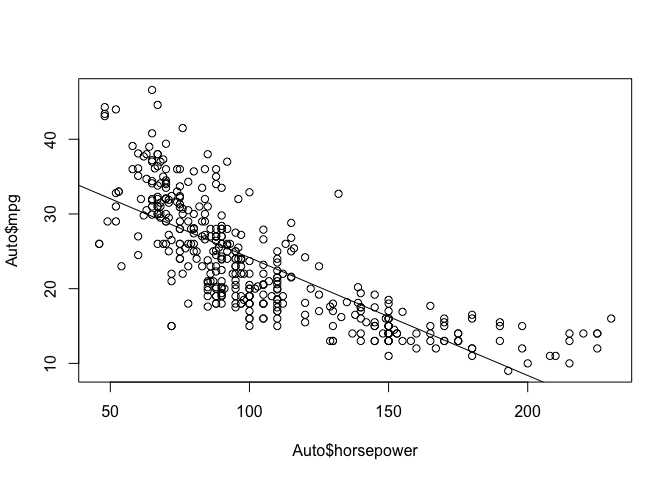
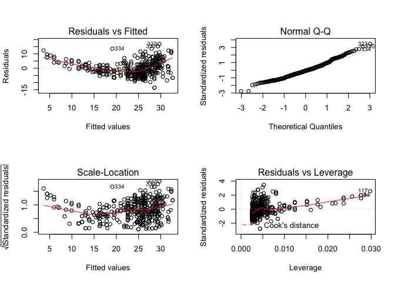
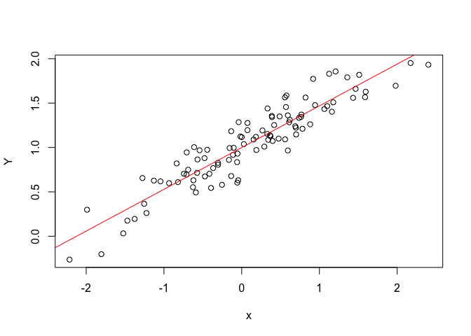
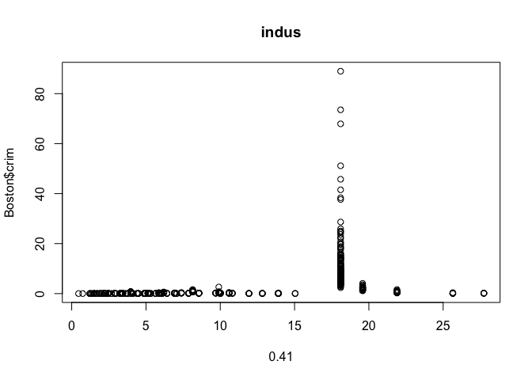
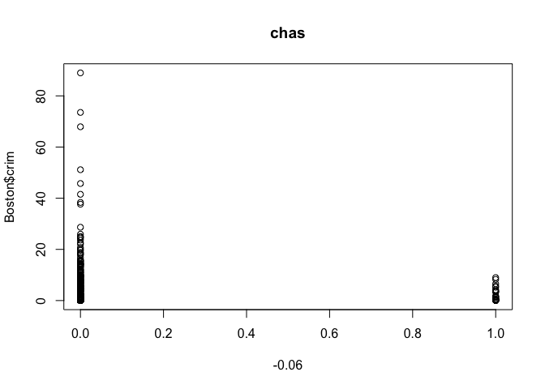
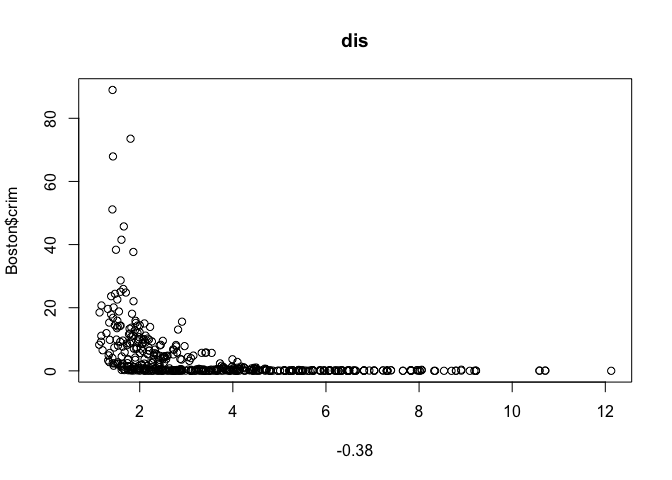
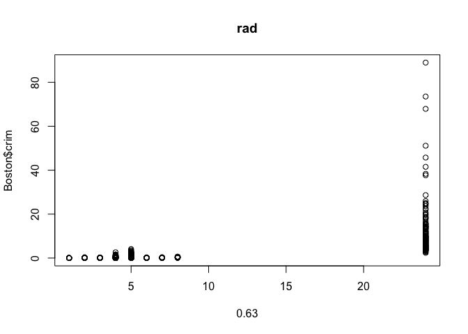
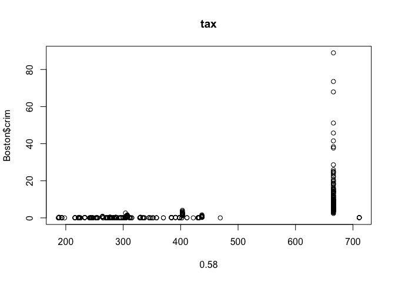
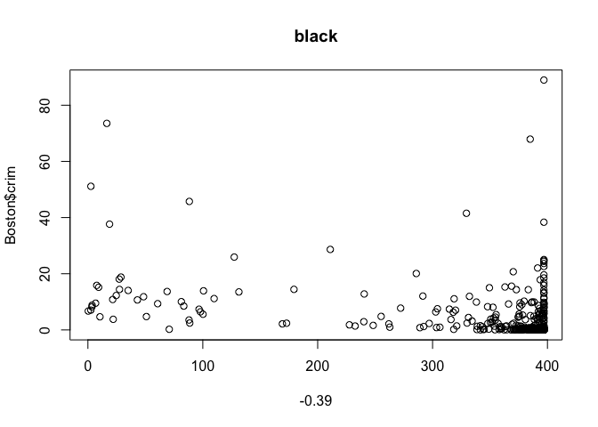
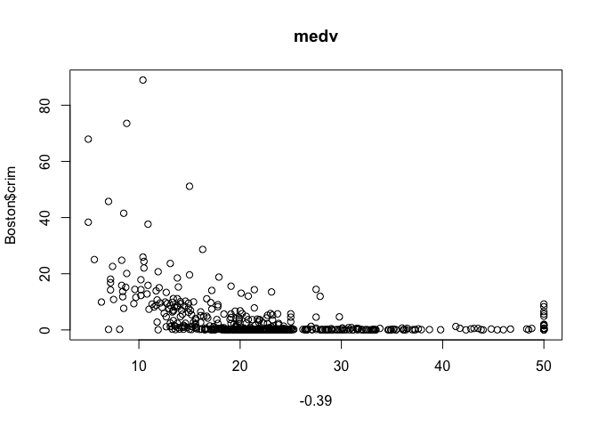

```r
library(tidyverse)
```

```
## Loading tidyverse: ggplot2
## Loading tidyverse: tibble
## Loading tidyverse: tidyr
## Loading tidyverse: readr
## Loading tidyverse: purrr
## Loading tidyverse: dplyr
```

```
## Warning: package 'ggplot2' was built under R version 3.2.5
```

```
## Warning: package 'tibble' was built under R version 3.2.5
```

```
## Warning: package 'tidyr' was built under R version 3.2.5
```

```
## Warning: package 'readr' was built under R version 3.2.5
```

```
## Warning: package 'purrr' was built under R version 3.2.5
```

```
## Warning: package 'dplyr' was built under R version 3.2.5
```

```
## Conflicts with tidy packages ----------------------------------------------
```

```
## filter(): dplyr, stats
## lag():    dplyr, stats
```

```r
library(ISLR)
```

```
## Warning: package 'ISLR' was built under R version 3.2.5
```

```r
library(MASS)
```

```
## Warning: package 'MASS' was built under R version 3.2.5
```

```
## 
## Attaching package: 'MASS'
```

```
## The following object is masked from 'package:dplyr':
## 
##     select
```

### 8 
This question involves the use of simple linear regression on the Auto data set.

(a) Use the lm() function to perform a simple linear regression with mpg as the response and horsepower as the predictor. Use the summary() function to print the results. Comment on the output. For example:

i. Is there a relationship between the predictor and the response?
ii. How strong is the relationship between the predictor and the response?
iii. Is the relationship between the predictor and the response positive or negative?
iv. What is the predicted mpg associated with a horsepower of 98? What are the associated 95 % confidence and prediction intervals? 

```r
colnames(Auto)
```

```
## [1] "mpg"          "cylinders"    "displacement" "horsepower"  
## [5] "weight"       "acceleration" "year"         "origin"      
## [9] "name"
```

```r
fit.m1 <- lm(mpg ~ horsepower, data = Auto)
summary(fit.m1) 
```

```
## 
## Call:
## lm(formula = mpg ~ horsepower, data = Auto)
## 
## Residuals:
##      Min       1Q   Median       3Q      Max 
## -13.5710  -3.2592  -0.3435   2.7630  16.9240 
## 
## Coefficients:
##              Estimate Std. Error t value Pr(>|t|)    
## (Intercept) 39.935861   0.717499   55.66   <2e-16 ***
## horsepower  -0.157845   0.006446  -24.49   <2e-16 ***
## ---
## Signif. codes:  0 '***' 0.001 '**' 0.01 '*' 0.05 '.' 0.1 ' ' 1
## 
## Residual standard error: 4.906 on 390 degrees of freedom
## Multiple R-squared:  0.6059,	Adjusted R-squared:  0.6049 
## F-statistic: 599.7 on 1 and 390 DF,  p-value: < 2.2e-16
```

```r
# Yes, there is a negative linear relationship with a slope of -0.15 between mpg and horsepower, which says every unit of increase of horsepower causes 0.15 unit decrease of mpg. 
 
fit.m1
```

```
## 
## Call:
## lm(formula = mpg ~ horsepower, data = Auto)
## 
## Coefficients:
## (Intercept)   horsepower  
##     39.9359      -0.1578
```

```r
predict(fit.m1,data.frame(horsepower=c(98)), interval ="confidence")
```

```
##        fit      lwr      upr
## 1 24.46708 23.97308 24.96108
```

```r
predict(fit.m1,data.frame(horsepower=c(98)), interval ="prediction") 
```

```
##        fit     lwr      upr
## 1 24.46708 14.8094 34.12476
```

```r
## confidence interval VS prediction interval 

# How do these two intervals differ and why?
# the predicted value for these two are the same but the intervals for predicted value for new individuals are much bigger, because it includes the random variability around the mean.  
```

(b) Plot the response and the predictor. Use the abline() function to display the least squares regression line.

```r
par(mfrow=c(1,1))
plot(Auto$horsepower, Auto$mpg)
abline(fit.m1)
```

<!-- -->

(c) Use the plot() function to produce diagnostic plots of the least squares regression fit. Comment on any problems you see with the fit.

```r
par(mfrow=c(2,2))
plot(fit.m1) # residual is biased, non equal variance; nonnormality of vairance 
```

<!-- -->

```r
### the plots indicate a not very good fit, and transformation might help 

# plot(fit.m1$fitted.values, fit.m1$residuals) > abline(0,0) # abline(0, 0) slope of 0 and intercept of 0 as ref line, seems like there is equal variance assumption 
# qqnorm(fit.m1$residuals)
# qqline(fit.m1$residuals) # seems there is normality assumption  
```

### 13
In this exercise you will create some simulated data and will fit simple linear regression models to it. Make sure to use set.seed(1) prior to starting part (a) to ensure consistent results. 

(a) Using the rnorm() function, create a vector, x, containing 100 observations drawn from a N (0, 1) distribution. This represents a feature, X.

```r
set.seed(1)
x <- rnorm(100, 0, 1) # mean of 0, stdv of 1
```

(b) Using the rnorm() function, create a vector, eps, containing 100 observations drawn from a N(0,0.25) distribution i.e. a normal distribution with mean zero and variance 0.25.

```r
eps <- rnorm(100, 0, 0.25) # what is this??? 
```

(c) Using x and eps, generate a vector y according to the model
Y =−1+0.5X+ε. (3.39)
What is the length of the vector y? What are the values of β0 and β1 in this linear model? 

```r
Y = 1 + 0.5*x + eps
length(Y)
```

```
## [1] 100
```

```r
# b0 = 1, b1 = 0.5
```

(d) Create a scatterplot displaying the relationship between x and y. Comment on what you observe.

```r
par(mfrow=c(1,1))
plot(x, Y)
```

<!-- -->

```r
# a positive linear relationship 
```

(e) Fit a least squares linear model to predict y using x. Comment on the model obtained. How do βˆ0 and βˆ1 compare to β0 and β1?

```r
fit.m2 <- lm(Y ~ x)
summary(fit.m2) # b0^ is 1.00691, b1^ is 0.48663, somewhat different from b0 and b1
```

```
## 
## Call:
## lm(formula = Y ~ x)
## 
## Residuals:
##      Min       1Q   Median       3Q      Max 
## -0.46921 -0.15344 -0.03487  0.13485  0.58654 
## 
## Coefficients:
##             Estimate Std. Error t value Pr(>|t|)    
## (Intercept)  0.99058    0.02425   40.85   <2e-16 ***
## x            0.49973    0.02693   18.56   <2e-16 ***
## ---
## Signif. codes:  0 '***' 0.001 '**' 0.01 '*' 0.05 '.' 0.1 ' ' 1
## 
## Residual standard error: 0.2407 on 98 degrees of freedom
## Multiple R-squared:  0.7784,	Adjusted R-squared:  0.7762 
## F-statistic: 344.3 on 1 and 98 DF,  p-value: < 2.2e-16
```

(f) Display the least squares line on the scatterplot obtained in (d). Draw the population regression line on the plot, in a different color. Use the legend() command to create an appropriate legend.

```r
plot(x, Y)
abline(fit.m2, col = "red") 
```

<!-- -->

(g) Now fit a polynomial regression model that predicts y using x and x2. Is there evidence that the quadratic term improves the model fit? Explain your answer.

```r
fit.m3 <- lm(Y ~ x^2) # not sure he is asking for this, differnet notation should be used here 
summary(fit.m3)
```

```
## 
## Call:
## lm(formula = Y ~ x^2)
## 
## Residuals:
##      Min       1Q   Median       3Q      Max 
## -0.46921 -0.15344 -0.03487  0.13485  0.58654 
## 
## Coefficients:
##             Estimate Std. Error t value Pr(>|t|)    
## (Intercept)  0.99058    0.02425   40.85   <2e-16 ***
## x            0.49973    0.02693   18.56   <2e-16 ***
## ---
## Signif. codes:  0 '***' 0.001 '**' 0.01 '*' 0.05 '.' 0.1 ' ' 1
## 
## Residual standard error: 0.2407 on 98 degrees of freedom
## Multiple R-squared:  0.7784,	Adjusted R-squared:  0.7762 
## F-statistic: 344.3 on 1 and 98 DF,  p-value: < 2.2e-16
```

```r
summary(fit.m2)
```

```
## 
## Call:
## lm(formula = Y ~ x)
## 
## Residuals:
##      Min       1Q   Median       3Q      Max 
## -0.46921 -0.15344 -0.03487  0.13485  0.58654 
## 
## Coefficients:
##             Estimate Std. Error t value Pr(>|t|)    
## (Intercept)  0.99058    0.02425   40.85   <2e-16 ***
## x            0.49973    0.02693   18.56   <2e-16 ***
## ---
## Signif. codes:  0 '***' 0.001 '**' 0.01 '*' 0.05 '.' 0.1 ' ' 1
## 
## Residual standard error: 0.2407 on 98 degrees of freedom
## Multiple R-squared:  0.7784,	Adjusted R-squared:  0.7762 
## F-statistic: 344.3 on 1 and 98 DF,  p-value: < 2.2e-16
```

```r
summary(lm(Y ~ x^2 + x))
```

```
## 
## Call:
## lm(formula = Y ~ x^2 + x)
## 
## Residuals:
##      Min       1Q   Median       3Q      Max 
## -0.46921 -0.15344 -0.03487  0.13485  0.58654 
## 
## Coefficients:
##             Estimate Std. Error t value Pr(>|t|)    
## (Intercept)  0.99058    0.02425   40.85   <2e-16 ***
## x            0.49973    0.02693   18.56   <2e-16 ***
## ---
## Signif. codes:  0 '***' 0.001 '**' 0.01 '*' 0.05 '.' 0.1 ' ' 1
## 
## Residual standard error: 0.2407 on 98 degrees of freedom
## Multiple R-squared:  0.7784,	Adjusted R-squared:  0.7762 
## F-statistic: 344.3 on 1 and 98 DF,  p-value: < 2.2e-16
```

```r
# R squared is the same 
```

(h) Repeat (a)–(f) after modifying the data generation process in such a way that there is less noise in the data. The model (3.39) should remain the same. You can do this by decreasing the variance of the normal distribution used to generate the error term ε in (b). Describe your results.

```r
set.seed(2)
eps2 <- rnorm(100, 0, 0.15) # eps is the non reduced error? 
Y = 1 + 0.5*x + eps2
length(Y)
```

```
## [1] 100
```

```r
# b0 = 1, b1 = 0.5
par(mfrow=c(1,1))
plot(x, Y)
# a positive linear relationship 
fit.m4 <- lm(Y ~ x)
summary(fit.m4) # b0^ and b1^ are closer to b0 and b1 
```

```
## 
## Call:
## lm(formula = Y ~ x)
## 
## Residuals:
##      Min       1Q   Median       3Q      Max 
## -0.36807 -0.12118 -0.01373  0.12472  0.34236 
## 
## Coefficients:
##             Estimate Std. Error t value Pr(>|t|)    
## (Intercept)  0.99864    0.01741   57.36   <2e-16 ***
## x            0.47022    0.01934   24.31   <2e-16 ***
## ---
## Signif. codes:  0 '***' 0.001 '**' 0.01 '*' 0.05 '.' 0.1 ' ' 1
## 
## Residual standard error: 0.1728 on 98 degrees of freedom
## Multiple R-squared:  0.8578,	Adjusted R-squared:  0.8563 
## F-statistic: 591.2 on 1 and 98 DF,  p-value: < 2.2e-16
```

```r
plot(x, Y)
abline(fit.m4, col = "red") 
```

<!-- -->

(i) Repeat (a)–(f) after modifying the data generation process in such a way that there is more noise in the data. The model (3.39) should remain the same. You can do this by increasing the variance of the normal distribution used to generate the error term ε in (b). Describe your results.

```r
set.seed(3)
eps3 <- rnorm(100, 0, 0.35)
Y = 1 + 0.5*x + eps3
length(Y)
```

```
## [1] 100
```

```r
# b0 = 1, b1 = 0.5
par(mfrow=c(1,1))
plot(x, Y)
# a positive linear relationship 
fit.m5 <- lm(Y ~ x)
summary(fit.m5) # b0^ and b1^ are further away from b0 and b1
```

```
## 
## Call:
## lm(formula = Y ~ x)
## 
## Residuals:
##      Min       1Q   Median       3Q      Max 
## -0.80322 -0.25516  0.00376  0.25459  0.59821 
## 
## Coefficients:
##             Estimate Std. Error t value Pr(>|t|)    
## (Intercept)  1.00472    0.03033   33.13   <2e-16 ***
## x            0.49208    0.03369   14.61   <2e-16 ***
## ---
## Signif. codes:  0 '***' 0.001 '**' 0.01 '*' 0.05 '.' 0.1 ' ' 1
## 
## Residual standard error: 0.3011 on 98 degrees of freedom
## Multiple R-squared:  0.6853,	Adjusted R-squared:  0.682 
## F-statistic: 213.4 on 1 and 98 DF,  p-value: < 2.2e-16
```

```r
plot(x, Y)
abline(fit.m5, col = "red") 
```

<!-- -->

(j) What are the confidence intervals for β0 and β1 based on the original data set, the noisier data set, and the less noisy data set? Comment on your results. 

```r
confint(fit.m2)
```

```
##                 2.5 %    97.5 %
## (Intercept) 0.9424598 1.0386939
## x           0.4462897 0.5531801
```

```r
confint(fit.m4)
```

```
##                 2.5 %    97.5 %
## (Intercept) 0.9640862 1.0331906
## x           0.4318379 0.5085945
```

```r
confint(fit.m5)
```

```
##                 2.5 %    97.5 %
## (Intercept) 0.9445373 1.0649124
## x           0.4252278 0.5589324
```

```r
# more vairnace introduce a wider confidence interval 
```

### 15a 
This problem involves the Boston data set, which we saw in the lab for this chapter. We will now try to predict per capita crime rate using the other variables in this data set. In other words, per capita crime rate is the response, and the other variables are the predictors.

(a) For each predictor, fit a simple linear regression model to predict the response. Describe your results. In which of the models is there a statistically significant association between the predictor and the response? Create some plots to back up your assertions. 

```r
colnames(Boston) 
```

```
##  [1] "crim"    "zn"      "indus"   "chas"    "nox"     "rm"      "age"    
##  [8] "dis"     "rad"     "tax"     "ptratio" "black"   "lstat"   "medv"
```

```r
# "crim"    "zn"      "indus"   "chas"    "nox"     "rm"      "age"     "dis"     "rad"     "tax"    
# "ptratio" "black"   "lstat"   "medv"

fit.m6 <- 
lapply(colnames(Boston)[-1], function(i){ 
 lm(Boston$crim ~ Boston[,i]) 
})

names(fit.m6) <- colnames(Boston)[-1]
summary(fit.m6[["zn"]])
```

```
## 
## Call:
## lm(formula = Boston$crim ~ Boston[, i])
## 
## Residuals:
##    Min     1Q Median     3Q    Max 
## -4.429 -4.222 -2.620  1.250 84.523 
## 
## Coefficients:
##             Estimate Std. Error t value Pr(>|t|)    
## (Intercept)  4.45369    0.41722  10.675  < 2e-16 ***
## Boston[, i] -0.07393    0.01609  -4.594 5.51e-06 ***
## ---
## Signif. codes:  0 '***' 0.001 '**' 0.01 '*' 0.05 '.' 0.1 ' ' 1
## 
## Residual standard error: 8.435 on 504 degrees of freedom
## Multiple R-squared:  0.04019,	Adjusted R-squared:  0.03828 
## F-statistic:  21.1 on 1 and 504 DF,  p-value: 5.506e-06
```

```r
summary(fit.m6[["indus"]])
```

```
## 
## Call:
## lm(formula = Boston$crim ~ Boston[, i])
## 
## Residuals:
##     Min      1Q  Median      3Q     Max 
## -11.972  -2.698  -0.736   0.712  81.813 
## 
## Coefficients:
##             Estimate Std. Error t value Pr(>|t|)    
## (Intercept) -2.06374    0.66723  -3.093  0.00209 ** 
## Boston[, i]  0.50978    0.05102   9.991  < 2e-16 ***
## ---
## Signif. codes:  0 '***' 0.001 '**' 0.01 '*' 0.05 '.' 0.1 ' ' 1
## 
## Residual standard error: 7.866 on 504 degrees of freedom
## Multiple R-squared:  0.1653,	Adjusted R-squared:  0.1637 
## F-statistic: 99.82 on 1 and 504 DF,  p-value: < 2.2e-16
```

```r
for(i in colnames(Boston)[-1]){
  plot(Boston[,i], Boston$crim, main = i, xlab = round(cor(Boston$crim, Boston[,i]), 2))
}
```

<!-- --><!-- --><!-- --><!-- --><!-- --><!-- --><!-- --><!-- --><!-- --><!-- --><!-- --><!-- --><!-- -->

