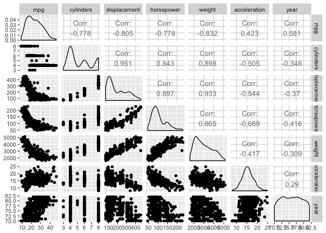
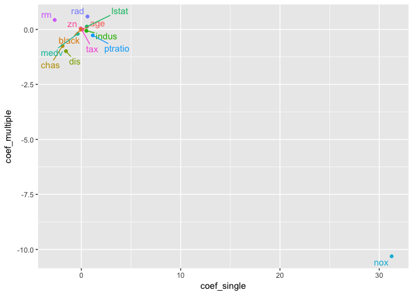

1. Describe the null hypotheses to which the p-values given in Table 3.4 correspond. Explain what conclusions you can draw based on these p-values. Your explanation should be phrased in terms of sales, TV, radio, and newspaper, rather than in terms of the coefficients of the linear model.


```r
#  
```

For a given amount of radio and newspaper advitising, spending an additional $1000 on TV advertising leads to an increase in sales by approximately 46 units. 

For a given amount of TV and newspaper advitising, spending an additional $1000 on radio advertising leads to an increase in sales by approximately 189 units. 

9. This question involves the use of multiple linear regression on the Auto data set.

(a) Produce a scatterplot matrix which includes all of the variables in the data set.

(b) Compute the matrix of correlations between the variables using the function cor(). You will need to exclude the name variable, which is qualitative.


```r
library(tidyverse)
```

```
## Loading tidyverse: ggplot2
## Loading tidyverse: tibble
## Loading tidyverse: tidyr
## Loading tidyverse: readr
## Loading tidyverse: purrr
## Loading tidyverse: dplyr
```

```
## Warning: package 'ggplot2' was built under R version 3.2.5
```

```
## Warning: package 'tibble' was built under R version 3.2.5
```

```
## Warning: package 'tidyr' was built under R version 3.2.5
```

```
## Warning: package 'readr' was built under R version 3.2.5
```

```
## Warning: package 'purrr' was built under R version 3.2.5
```

```
## Warning: package 'dplyr' was built under R version 3.2.5
```

```
## Conflicts with tidy packages ----------------------------------------------
```

```
## filter(): dplyr, stats
## lag():    dplyr, stats
```

```r
library(MASS)
```

```
## Warning: package 'MASS' was built under R version 3.2.5
```

```
## 
## Attaching package: 'MASS'
```

```
## The following object is masked from 'package:dplyr':
## 
##     select
```

```r
library(ISLR)
```

```
## Warning: package 'ISLR' was built under R version 3.2.5
```

```r
library(GGally)
```

```
## Warning: package 'GGally' was built under R version 3.2.5
```

```
## 
## Attaching package: 'GGally'
```

```
## The following object is masked from 'package:dplyr':
## 
##     nasa
```

```r
library(modelr)
```

```
## Warning: package 'modelr' was built under R version 3.2.5
```

```r
ggpairs(Auto[,c(1:7)])  
```

<!-- -->

(c) Use the lm() function to perform a multiple linear regression with mpg as the response and all other variables except name as the predictors. Use the summary() function to print the results. Comment on the output. For instance: 


```r
fit.m1 <- lm(mpg ~ .-name, data = Auto)
summary(fit.m1) 
```

```
## 
## Call:
## lm(formula = mpg ~ . - name, data = Auto)
## 
## Residuals:
##     Min      1Q  Median      3Q     Max 
## -9.5903 -2.1565 -0.1169  1.8690 13.0604 
## 
## Coefficients:
##                Estimate Std. Error t value Pr(>|t|)    
## (Intercept)  -17.218435   4.644294  -3.707  0.00024 ***
## cylinders     -0.493376   0.323282  -1.526  0.12780    
## displacement   0.019896   0.007515   2.647  0.00844 ** 
## horsepower    -0.016951   0.013787  -1.230  0.21963    
## weight        -0.006474   0.000652  -9.929  < 2e-16 ***
## acceleration   0.080576   0.098845   0.815  0.41548    
## year           0.750773   0.050973  14.729  < 2e-16 ***
## origin         1.426141   0.278136   5.127 4.67e-07 ***
## ---
## Signif. codes:  0 '***' 0.001 '**' 0.01 '*' 0.05 '.' 0.1 ' ' 1
## 
## Residual standard error: 3.328 on 384 degrees of freedom
## Multiple R-squared:  0.8215,	Adjusted R-squared:  0.8182 
## F-statistic: 252.4 on 7 and 384 DF,  p-value: < 2.2e-16
```

i. Is there a relationship between the predictors and the response?

ii. Which predictors appear to have a statistically significant relationship to the response?

iii. What does the coefficient for the year variable suggest?

For displacement, weight, year, and origin, yes, there is significant relationship to the response. 

When all the other predictors are fixed, one unit increase in model year lead to an increase in mpg by approximately 0.75 units. 

10. This question should be answered using the Carseats data set.

(a) Fit a multiple regression model to predict Sales using Price,
Urban, and US.

(b) Provide an interpretation of each coefficient in the model. Be
careful—some of the variables in the model are qualitative!

(c) Write out the model in equation form, being careful to handle the qualitative variables properly.

(d) For which of the predictors can you reject the null hypothesis H0 :βj =0?

(e) On the basis of your response to the previous question, fit a smaller model that only uses the predictors for which there is evidence of association with the outcome.

(f) How well do the models in (a) and (e) fit the data?

(g) Using the model from (e), obtain 95% confidence intervals for the coefficient(s).

(h) Is there evidence of outliers or high leverage observations in the model from (e)?


```r
# a) 
fit.m2 <- lm(Sales ~ Price + Urban + US, data = Carseats)

# b) 
summary(fit.m2)
```

```
## 
## Call:
## lm(formula = Sales ~ Price + Urban + US, data = Carseats)
## 
## Residuals:
##     Min      1Q  Median      3Q     Max 
## -6.9206 -1.6220 -0.0564  1.5786  7.0581 
## 
## Coefficients:
##              Estimate Std. Error t value Pr(>|t|)    
## (Intercept) 13.043469   0.651012  20.036  < 2e-16 ***
## Price       -0.054459   0.005242 -10.389  < 2e-16 ***
## UrbanYes    -0.021916   0.271650  -0.081    0.936    
## USYes        1.200573   0.259042   4.635 4.86e-06 ***
## ---
## Signif. codes:  0 '***' 0.001 '**' 0.01 '*' 0.05 '.' 0.1 ' ' 1
## 
## Residual standard error: 2.472 on 396 degrees of freedom
## Multiple R-squared:  0.2393,	Adjusted R-squared:  0.2335 
## F-statistic: 41.52 on 3 and 396 DF,  p-value: < 2.2e-16
```

```r
# Price: the expected mean change in sales is -50 when price goes up $1000, when urban status and US status are held constant, and this relationship is statistically significant.   
# UrbanYes, the expected mean change in sales is -0.02 unit when the the car store is located in an urban area, when price and USyes status are fixed, however this relationship is not statistically significant. 
# USYes, the expected mean change in sales is 1.2 unit when the car store is located in the US, with a fixed price and Urbanstatus, and this relationship is statistically significant. 

# c) 

# d) for price and US, and I reject the null hypothesis 

# e) 
fit.m3 <- lm(Sales ~ Price + US, data = Carseats)

# f) 
summary(fit.m3) # 23.54% variance explained 
```

```
## 
## Call:
## lm(formula = Sales ~ Price + US, data = Carseats)
## 
## Residuals:
##     Min      1Q  Median      3Q     Max 
## -6.9269 -1.6286 -0.0574  1.5766  7.0515 
## 
## Coefficients:
##             Estimate Std. Error t value Pr(>|t|)    
## (Intercept) 13.03079    0.63098  20.652  < 2e-16 ***
## Price       -0.05448    0.00523 -10.416  < 2e-16 ***
## USYes        1.19964    0.25846   4.641 4.71e-06 ***
## ---
## Signif. codes:  0 '***' 0.001 '**' 0.01 '*' 0.05 '.' 0.1 ' ' 1
## 
## Residual standard error: 2.469 on 397 degrees of freedom
## Multiple R-squared:  0.2393,	Adjusted R-squared:  0.2354 
## F-statistic: 62.43 on 2 and 397 DF,  p-value: < 2.2e-16
```

```r
summary(fit.m2) # 23.35% variance explained, slightly decrease in R squared 
```

```
## 
## Call:
## lm(formula = Sales ~ Price + Urban + US, data = Carseats)
## 
## Residuals:
##     Min      1Q  Median      3Q     Max 
## -6.9206 -1.6220 -0.0564  1.5786  7.0581 
## 
## Coefficients:
##              Estimate Std. Error t value Pr(>|t|)    
## (Intercept) 13.043469   0.651012  20.036  < 2e-16 ***
## Price       -0.054459   0.005242 -10.389  < 2e-16 ***
## UrbanYes    -0.021916   0.271650  -0.081    0.936    
## USYes        1.200573   0.259042   4.635 4.86e-06 ***
## ---
## Signif. codes:  0 '***' 0.001 '**' 0.01 '*' 0.05 '.' 0.1 ' ' 1
## 
## Residual standard error: 2.472 on 396 degrees of freedom
## Multiple R-squared:  0.2393,	Adjusted R-squared:  0.2335 
## F-statistic: 41.52 on 3 and 396 DF,  p-value: < 2.2e-16
```

```r
anova(fit.m2, fit.m3) # adding Urban does not improve the model fit
```

```
## Analysis of Variance Table
## 
## Model 1: Sales ~ Price + Urban + US
## Model 2: Sales ~ Price + US
##   Res.Df    RSS Df Sum of Sq      F Pr(>F)
## 1    396 2420.8                           
## 2    397 2420.9 -1  -0.03979 0.0065 0.9357
```

```r
# RSE, how? 
Carseats %>% 
  add_residuals(fit.m3, "residual") %>% 
  ggplot(aes(Price, residual)) + 
  geom_point() + 
  geom_ref_line(h = 0, colour = "red")
```

<!-- -->

```r
# g) 
confint(fit.m3, level = 0.95)
```

```
##                   2.5 %      97.5 %
## (Intercept) 11.79032020 14.27126531
## Price       -0.06475984 -0.04419543
## USYes        0.69151957  1.70776632
```

15. This problem involves the Boston data set, which we saw in the lab for this chapter. We will now try to predict per capita crime rate using the other variables in this data set. In other words, per capita crime rate is the response, and the other variables are the predictors.

(b) Fit a multiple regression model to predict the response using all of the predictors. Describe your results. For which predictors can we reject the null hypothesis H0 : βj = 0?

(c) How do your results from (a) compare to your results from (b)? Create a plot displaying the univariate regression coefficients from (a) on the x-axis, and the multiple regression coefficients from 
(b) on the y-axis. That is, each predictor is displayed as a single point in the plot. Its coefficient in a simple linear regression model is shown on the x-axis, and its coefficient estimate in the multiple linear regression model is shown on the y-axis.

(d) Is there evidence of non-linear association between any of the predictors and the response? To answer this question, for each predictor X, fit a model of the form
Y = β0 +β1X +β2X2 +β3X3 +ε. 


```r
# b) 
fit.m4 <- lm(crim ~ ., data = Boston)
summary(fit.m4) # we can reject those with P-value < 0.05 
```

```
## 
## Call:
## lm(formula = crim ~ ., data = Boston)
## 
## Residuals:
##    Min     1Q Median     3Q    Max 
## -9.924 -2.120 -0.353  1.019 75.051 
## 
## Coefficients:
##               Estimate Std. Error t value Pr(>|t|)    
## (Intercept)  17.033228   7.234903   2.354 0.018949 *  
## zn            0.044855   0.018734   2.394 0.017025 *  
## indus        -0.063855   0.083407  -0.766 0.444294    
## chas         -0.749134   1.180147  -0.635 0.525867    
## nox         -10.313535   5.275536  -1.955 0.051152 .  
## rm            0.430131   0.612830   0.702 0.483089    
## age           0.001452   0.017925   0.081 0.935488    
## dis          -0.987176   0.281817  -3.503 0.000502 ***
## rad           0.588209   0.088049   6.680 6.46e-11 ***
## tax          -0.003780   0.005156  -0.733 0.463793    
## ptratio      -0.271081   0.186450  -1.454 0.146611    
## black        -0.007538   0.003673  -2.052 0.040702 *  
## lstat         0.126211   0.075725   1.667 0.096208 .  
## medv         -0.198887   0.060516  -3.287 0.001087 ** 
## ---
## Signif. codes:  0 '***' 0.001 '**' 0.01 '*' 0.05 '.' 0.1 ' ' 1
## 
## Residual standard error: 6.439 on 492 degrees of freedom
## Multiple R-squared:  0.454,	Adjusted R-squared:  0.4396 
## F-statistic: 31.47 on 13 and 492 DF,  p-value: < 2.2e-16
```

```r
# c) 
# https://github.com/UCD-pbio-rclub/ISLR_Ruijuan.Li/blob/master/R-club-Dec-06/Assignment_12_06_2017.md 
# a) idenfied every variable to be significantly associated with outcome except for chars, however, here in b), only a few were identified significantly associated with the outcome 

coef_single <- 
sapply(colnames(Boston)[-1], function(i){  
 model <- lm(Boston$crim ~ Boston[,i])  
 model$coefficients[2]
}) 
 
data1 <- data.frame(coef_multiple = fit.m4$coefficients[-1],
                    coef_single = coef_single, 
                    predictor = colnames(Boston)[-1])

library(ggrepel)
```

```
## Warning: package 'ggrepel' was built under R version 3.2.5
```

```r
set.seed(111)

data1 %>% ggplot() + 
  geom_point(aes(x = coef_single, y = coef_multiple, color = predictor)) + 
  geom_text_repel(aes(x = coef_single, y = coef_multiple, label = predictor, color = predictor)) + 
  theme(legend.position = "none") 
```

<!-- -->

```r
# d) 
fit.m5 <- 
lapply(colnames(Boston)[-1], function(i){  
 tryCatch(
 lm(Boston$crim ~ poly(Boston[,i], 3)), error = function(e) NA)
}) # chars predictor has only 0 and 1, whcih could not be executed with poly function on 

names(fit.m5) <- colnames(Boston)[-1]
fit.m5
```

```
## $zn
## 
## Call:
## lm(formula = Boston$crim ~ poly(Boston[, i], 3))
## 
## Coefficients:
##           (Intercept)  poly(Boston[, i], 3)1  poly(Boston[, i], 3)2  
##                 3.614                -38.750                 23.940  
## poly(Boston[, i], 3)3  
##               -10.072  
## 
## 
## $indus
## 
## Call:
## lm(formula = Boston$crim ~ poly(Boston[, i], 3))
## 
## Coefficients:
##           (Intercept)  poly(Boston[, i], 3)1  poly(Boston[, i], 3)2  
##                 3.614                 78.591                -24.395  
## poly(Boston[, i], 3)3  
##               -54.130  
## 
## 
## $chas
## [1] NA
## 
## $nox
## 
## Call:
## lm(formula = Boston$crim ~ poly(Boston[, i], 3))
## 
## Coefficients:
##           (Intercept)  poly(Boston[, i], 3)1  poly(Boston[, i], 3)2  
##                 3.614                 81.372                -28.829  
## poly(Boston[, i], 3)3  
##               -60.362  
## 
## 
## $rm
## 
## Call:
## lm(formula = Boston$crim ~ poly(Boston[, i], 3))
## 
## Coefficients:
##           (Intercept)  poly(Boston[, i], 3)1  poly(Boston[, i], 3)2  
##                 3.614                -42.379                 26.577  
## poly(Boston[, i], 3)3  
##                -5.510  
## 
## 
## $age
## 
## Call:
## lm(formula = Boston$crim ~ poly(Boston[, i], 3))
## 
## Coefficients:
##           (Intercept)  poly(Boston[, i], 3)1  poly(Boston[, i], 3)2  
##                 3.614                 68.182                 37.484  
## poly(Boston[, i], 3)3  
##                21.353  
## 
## 
## $dis
## 
## Call:
## lm(formula = Boston$crim ~ poly(Boston[, i], 3))
## 
## Coefficients:
##           (Intercept)  poly(Boston[, i], 3)1  poly(Boston[, i], 3)2  
##                 3.614                -73.389                 56.373  
## poly(Boston[, i], 3)3  
##               -42.622  
## 
## 
## $rad
## 
## Call:
## lm(formula = Boston$crim ~ poly(Boston[, i], 3))
## 
## Coefficients:
##           (Intercept)  poly(Boston[, i], 3)1  poly(Boston[, i], 3)2  
##                 3.614                120.907                 17.492  
## poly(Boston[, i], 3)3  
##                 4.698  
## 
## 
## $tax
## 
## Call:
## lm(formula = Boston$crim ~ poly(Boston[, i], 3))
## 
## Coefficients:
##           (Intercept)  poly(Boston[, i], 3)1  poly(Boston[, i], 3)2  
##                 3.614                112.646                 32.087  
## poly(Boston[, i], 3)3  
##                -7.997  
## 
## 
## $ptratio
## 
## Call:
## lm(formula = Boston$crim ~ poly(Boston[, i], 3))
## 
## Coefficients:
##           (Intercept)  poly(Boston[, i], 3)1  poly(Boston[, i], 3)2  
##                 3.614                 56.045                 24.775  
## poly(Boston[, i], 3)3  
##               -22.280  
## 
## 
## $black
## 
## Call:
## lm(formula = Boston$crim ~ poly(Boston[, i], 3))
## 
## Coefficients:
##           (Intercept)  poly(Boston[, i], 3)1  poly(Boston[, i], 3)2  
##                 3.614                -74.431                  5.926  
## poly(Boston[, i], 3)3  
##                -4.835  
## 
## 
## $lstat
## 
## Call:
## lm(formula = Boston$crim ~ poly(Boston[, i], 3))
## 
## Coefficients:
##           (Intercept)  poly(Boston[, i], 3)1  poly(Boston[, i], 3)2  
##                 3.614                 88.070                 15.888  
## poly(Boston[, i], 3)3  
##               -11.574  
## 
## 
## $medv
## 
## Call:
## lm(formula = Boston$crim ~ poly(Boston[, i], 3))
## 
## Coefficients:
##           (Intercept)  poly(Boston[, i], 3)1  poly(Boston[, i], 3)2  
##                 3.614                -75.058                 88.086  
## poly(Boston[, i], 3)3  
##               -48.033
```

