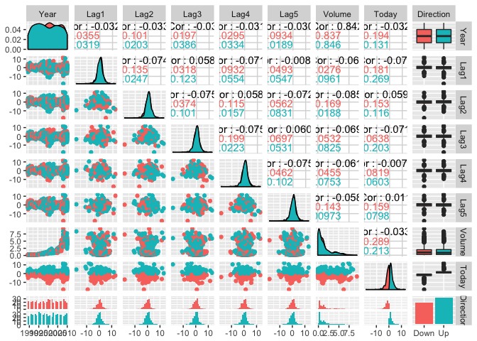
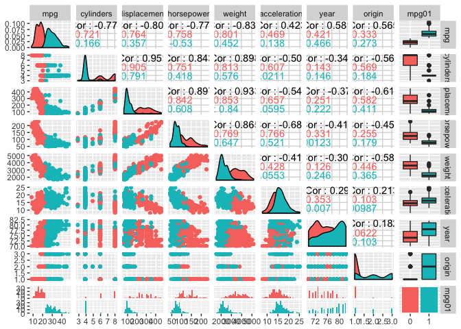

### 6. Suppose we collect data for a group of students in a statistics class with variables X1 = hours studied, X2 = undergrad GPA, and Y = receive an A. We fit a logistic regression and produce estimated coefficient, βˆ0 = −6, βˆ1 = 0.05, βˆ2 = 1.

(a) Estimate the probability that a student who studies for 40 h and has an undergrad GPA of 3.5 gets an A in the class.

(b) How many hours would the student in part (a) need to study to have a 50 % chance of getting an A in the class?

  
  


```r
# a) 
exp(-6 + 0.05*40 +1*3.5) / (1 + exp(-6 + 0.05*40 +1*3.5) )
```

```
## [1] 0.3775407
```

```r
# b) 
# log(0.5/0.5) = -6 + hours * 0.05 + 3.5 
log(0.5/0.5) 
```

```
## [1] 0
```

```r
(6 - 3.5 )/0.05 # 50 hours 
```

```
## [1] 50
```

### 10. This question should be answered using the Weekly data set, which is part of the ISLR package. This data is similar in nature to the Smarket data from this chapter’s lab, except that it contains 1,089 weekly returns for 21 years, from the beginning of 1990 to the end of 2010.

(a) Produce some numerical and graphical summaries of the Weekly data. Do there appear to be any patterns?

(b) Use the full data set to perform a logistic regression with Direction as the response and the five lag variables plus Volume as predictors. Use the summary function to print the results. Do any of the predictors appear to be statistically significant? If so, which ones?

(c) Compute the confusion matrix and overall fraction of correct predictions. Explain what the confusion matrix is telling you about the types of mistakes made by logistic regression.

(d) Now fit the logistic regression model using a training data period from 1990 to 2008, with Lag2 as the only predictor. Compute the confusion matrix and the overall fraction of correct predictions for the held out data (that is, the data from 2009 and 2010).


```r
# a) 
library(GGally)
```

```
## Warning: package 'GGally' was built under R version 3.2.5
```

```r
library(tidyverse)
```

```
## ── Attaching packages ────────────────────────────────── tidyverse 1.2.1 ──
```

```
## ✔ ggplot2 2.2.1     ✔ purrr   0.2.4
## ✔ tibble  1.3.4     ✔ dplyr   0.7.4
## ✔ tidyr   0.7.2     ✔ stringr 1.2.0
## ✔ readr   1.1.1     ✔ forcats 0.2.0
```

```
## Warning: package 'ggplot2' was built under R version 3.2.5
```

```
## Warning: package 'tibble' was built under R version 3.2.5
```

```
## Warning: package 'tidyr' was built under R version 3.2.5
```

```
## Warning: package 'readr' was built under R version 3.2.5
```

```
## Warning: package 'purrr' was built under R version 3.2.5
```

```
## Warning: package 'dplyr' was built under R version 3.2.5
```

```
## Warning: package 'stringr' was built under R version 3.2.5
```

```
## Warning: package 'forcats' was built under R version 3.2.5
```

```
## ── Conflicts ───────────────────────────────────── tidyverse_conflicts() ──
## ✖ dplyr::filter() masks stats::filter()
## ✖ dplyr::lag()    masks stats::lag()
```

```r
library(MASS)
```

```
## Warning: package 'MASS' was built under R version 3.2.5
```

```
## 
## Attaching package: 'MASS'
```

```
## The following object is masked from 'package:dplyr':
## 
##     select
```

```r
library(ISLR)
```

```
## Warning: package 'ISLR' was built under R version 3.2.5
```

```r
summary(Weekly)
```

```
##       Year           Lag1               Lag2               Lag3         
##  Min.   :1990   Min.   :-18.1950   Min.   :-18.1950   Min.   :-18.1950  
##  1st Qu.:1995   1st Qu.: -1.1540   1st Qu.: -1.1540   1st Qu.: -1.1580  
##  Median :2000   Median :  0.2410   Median :  0.2410   Median :  0.2410  
##  Mean   :2000   Mean   :  0.1506   Mean   :  0.1511   Mean   :  0.1472  
##  3rd Qu.:2005   3rd Qu.:  1.4050   3rd Qu.:  1.4090   3rd Qu.:  1.4090  
##  Max.   :2010   Max.   : 12.0260   Max.   : 12.0260   Max.   : 12.0260  
##       Lag4               Lag5              Volume       
##  Min.   :-18.1950   Min.   :-18.1950   Min.   :0.08747  
##  1st Qu.: -1.1580   1st Qu.: -1.1660   1st Qu.:0.33202  
##  Median :  0.2380   Median :  0.2340   Median :1.00268  
##  Mean   :  0.1458   Mean   :  0.1399   Mean   :1.57462  
##  3rd Qu.:  1.4090   3rd Qu.:  1.4050   3rd Qu.:2.05373  
##  Max.   : 12.0260   Max.   : 12.0260   Max.   :9.32821  
##      Today          Direction 
##  Min.   :-18.1950   Down:484  
##  1st Qu.: -1.1540   Up  :605  
##  Median :  0.2410             
##  Mean   :  0.1499             
##  3rd Qu.:  1.4050             
##  Max.   : 12.0260
```

```r
dim(Weekly) # 1089 
```

```
## [1] 1089    9
```

```r
attach(Weekly)
ggpairs(Weekly, aes(color = Direction)) # seems like not obvious correlation with direction for any of the possible predictors here 
```

```
## `stat_bin()` using `bins = 30`. Pick better value with `binwidth`.
```

```
## `stat_bin()` using `bins = 30`. Pick better value with `binwidth`.
## `stat_bin()` using `bins = 30`. Pick better value with `binwidth`.
## `stat_bin()` using `bins = 30`. Pick better value with `binwidth`.
## `stat_bin()` using `bins = 30`. Pick better value with `binwidth`.
## `stat_bin()` using `bins = 30`. Pick better value with `binwidth`.
## `stat_bin()` using `bins = 30`. Pick better value with `binwidth`.
## `stat_bin()` using `bins = 30`. Pick better value with `binwidth`.
```

<!-- -->

```r
# b) 
glm.fits.1=glm(Direction ~ Lag1+Lag2+Lag3+Lag4+Lag5+Volume, data=Weekly ,family=binomial)
summary(glm.fits.1) # 
```

```
## 
## Call:
## glm(formula = Direction ~ Lag1 + Lag2 + Lag3 + Lag4 + Lag5 + 
##     Volume, family = binomial, data = Weekly)
## 
## Deviance Residuals: 
##     Min       1Q   Median       3Q      Max  
## -1.6949  -1.2565   0.9913   1.0849   1.4579  
## 
## Coefficients:
##             Estimate Std. Error z value Pr(>|z|)   
## (Intercept)  0.26686    0.08593   3.106   0.0019 **
## Lag1        -0.04127    0.02641  -1.563   0.1181   
## Lag2         0.05844    0.02686   2.175   0.0296 * 
## Lag3        -0.01606    0.02666  -0.602   0.5469   
## Lag4        -0.02779    0.02646  -1.050   0.2937   
## Lag5        -0.01447    0.02638  -0.549   0.5833   
## Volume      -0.02274    0.03690  -0.616   0.5377   
## ---
## Signif. codes:  0 '***' 0.001 '**' 0.01 '*' 0.05 '.' 0.1 ' ' 1
## 
## (Dispersion parameter for binomial family taken to be 1)
## 
##     Null deviance: 1496.2  on 1088  degrees of freedom
## Residual deviance: 1486.4  on 1082  degrees of freedom
## AIC: 1500.4
## 
## Number of Fisher Scoring iterations: 4
```

```r
# c) 
glm.probs=predict(glm.fits.1,type="response")

glm.pred=rep("Down",1089)
glm.pred[glm.probs >.5]="Up"

table(glm.pred,Direction) 
```

```
##         Direction
## glm.pred Down  Up
##     Down   54  48
##     Up    430 557
```

```r
48 + 430 / 1089 # 48% error rate, which the model does not have the right prediction 
```

```
## [1] 48.39486
```

```r
# d) 
train =( Year >= 1990 & Year <= 2008)
Weekly.test= Weekly[!train ,]
dim(Weekly.test) # 104 
```

```
## [1] 104   9
```

```r
train %>% sum()
```

```
## [1] 985
```

```r
Direction.test=Direction[!train]

glm.fits.2=glm(Direction ~ Lag2, data=Weekly,family=binomial,subset=train)

glm.probs=predict(glm.fits.2,Weekly.test,type="response")

glm.pred=rep("Down",104)
glm.pred[glm.probs >.5]="Up"
table(glm.pred,Direction.test)
```

```
##         Direction.test
## glm.pred Down Up
##     Down    9  5
##     Up     34 56
```

```r
(5+34)/104  # 37.5 test error rate 
```

```
## [1] 0.375
```

### 11. In this problem, you will develop a model to predict whether a given car gets high or low gas mileage based on the Auto data set.

(a) Create a binary variable, mpg01, that contains a 1 if mpg contains a value above its median, and a 0 if mpg contains a value below its median. You can compute the median using the median() function. Note you may find it helpful to use the data.frame() function to create a single data set containing both mpg01 and the other Auto variables.

(b) Explore the data graphically in order to investigate the association between mpg01 and the other features. Which of the other features seem most likely to be useful in predicting mpg01? Scat- terplots and boxplots may be useful tools to answer this ques- tion. Describe your findings.

(c) Split the data into a training set and a test set.

(f) Perform logistic regression on the training data in order to pre- dict mpg01 using the variables that seemed most associated with mpg01 in (b). What is the test error of the model obtained? 


```r
# a) 
Auto2 <- 
Auto %>% 
  mutate(mpg01 = as.factor(ifelse(mpg > median(mpg), 1, 0))) 
```

```
## Warning: package 'bindrcpp' was built under R version 3.2.5
```

```r
# b) 
Auto2 %>% 
  dplyr::select(-name) %>% 
  ggpairs(aes(color = mpg01)) # mpg, displacement, horsepower, weight 
```

```
## `stat_bin()` using `bins = 30`. Pick better value with `binwidth`.
## `stat_bin()` using `bins = 30`. Pick better value with `binwidth`.
## `stat_bin()` using `bins = 30`. Pick better value with `binwidth`.
## `stat_bin()` using `bins = 30`. Pick better value with `binwidth`.
## `stat_bin()` using `bins = 30`. Pick better value with `binwidth`.
## `stat_bin()` using `bins = 30`. Pick better value with `binwidth`.
## `stat_bin()` using `bins = 30`. Pick better value with `binwidth`.
## `stat_bin()` using `bins = 30`. Pick better value with `binwidth`.
```

<!-- -->

```r
# c) 
# decided to use 80% as training set 
Auto %>% nrow() * 0.8
```

```
## [1] 313.6
```

```r
set.seed(1)
train_ID <- sample(rownames(Auto), size = round(nrow(Auto) * 0.8), replace = F) 
train <- Auto2[rownames(Auto) %in% train_ID,]
test <- Auto2[!(rownames(Auto) %in% train_ID),] 

dim(train)
```

```
## [1] 314  10
```

```r
dim(test) # 78
```

```
## [1] 78 10
```

```r
# d) 
glm.fits.3=glm(mpg01 ~ displacement + horsepower + weight, data=train,family=binomial) 
glm.probs=predict(glm.fits.3,test,type="response")

glm.pred=rep(0,78)
glm.pred[glm.probs >.5]=1
table(glm.pred,test$mpg01)
```

```
##         
## glm.pred  0  1
##        0 30  3
##        1  4 41
```

```r
(3 + 5) / 78 
```

```
## [1] 0.1025641
```

```r
# error rate is very low, 10% 
```


