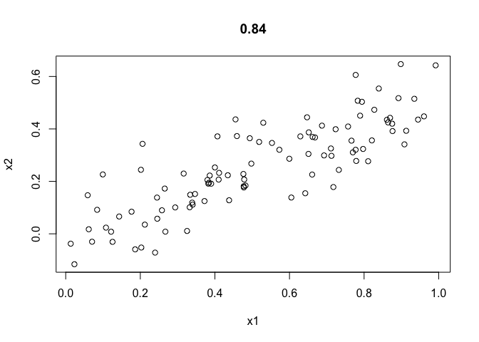
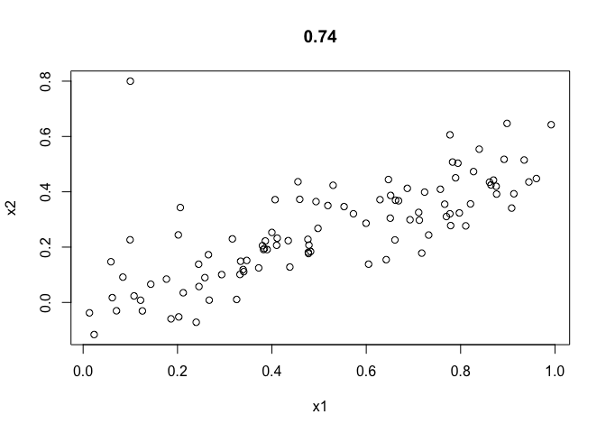
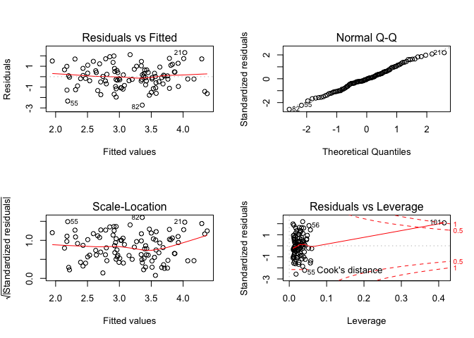
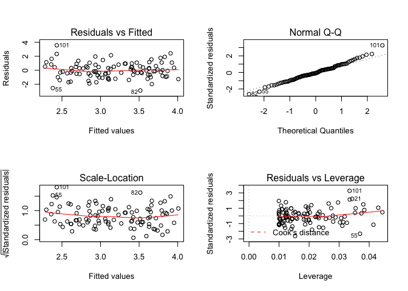
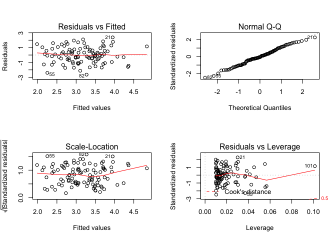

#### 2. Carefully explain the differences between the KNN classifier and KNN regression methods.

KNN (K-nearest neighbors) is a non-parametric method used for classification and regression, which is the among the simpliest of all machine learning algorithms.  

In kNN classification, the output is a class membership. An object is classified by a majority vote of its neighbors, with the object being assigned to the class most common among its k nearest neighbors (k is a positive integer, typically small). If k = 1, then the object is simply assigned to the class of that single nearest neighbor. 

In kNN regression, the output is the property value for the object. This value is the average of the values of its k nearest neighbors.

#### 14. This problem focuses on the collinearity problem.

(a) Perform the following commands in R:


```r
set.seed(1)
x1=runif(100) # randomly generate 100 numbers with uniform distribution with min of 0 and max of 1
x2=0.5*x1+rnorm(100)/10 
y=2+2*x1+0.3*x2+rnorm(100) 
```

The last line corresponds to creating a linear model in which y is a function of x1 and x2. Write out the form of the linear model. What are the regression coefficients?

2 is the coeffciient for x1, and 0.3 is the coeffcient for x2.

(b) What is the correlation between x1 and x2? Create a scatterplot displaying the relationship between the variables.


```r
plot(x1, x2, main = round(cor(x1, x2), 2))
```

<!-- -->

(c) Using this data, fit a least squares regression to predict y using x1 and x2. Describe the results obtained. What are βˆ0, βˆ1, and βˆ2? How do these relate to the true β0, β1, and β2? Can you reject the null hypothesis H0 : β1 = 0? How about the null hypothesis H0 : β2 = 0?


```r
fit.m1 <- lm(y ~ x1 + x2)
summary(fit.m1)
```

```
## 
## Call:
## lm(formula = y ~ x1 + x2)
## 
## Residuals:
##     Min      1Q  Median      3Q     Max 
## -2.8311 -0.7273 -0.0537  0.6338  2.3359 
## 
## Coefficients:
##             Estimate Std. Error t value Pr(>|t|)    
## (Intercept)   2.1305     0.2319   9.188 7.61e-15 ***
## x1            1.4396     0.7212   1.996   0.0487 *  
## x2            1.0097     1.1337   0.891   0.3754    
## ---
## Signif. codes:  0 '***' 0.001 '**' 0.01 '*' 0.05 '.' 0.1 ' ' 1
## 
## Residual standard error: 1.056 on 97 degrees of freedom
## Multiple R-squared:  0.2088,	Adjusted R-squared:  0.1925 
## F-statistic:  12.8 on 2 and 97 DF,  p-value: 1.164e-05
```

```r
# b0 is 2.1305, b1 is 1.4396, b2 is 1.0097. b1=1 cannot be rejected, b2=0 can be rejected. 
```

(d) Now fit a least squares regression to predict y using only x1. Comment on your results. Can you reject the null hypothesis H0 :β1 =0?


```r
fit.m2 <- lm(y ~ x1)
summary(fit.m2)
```

```
## 
## Call:
## lm(formula = y ~ x1)
## 
## Residuals:
##      Min       1Q   Median       3Q      Max 
## -2.89495 -0.66874 -0.07785  0.59221  2.45560 
## 
## Coefficients:
##             Estimate Std. Error t value Pr(>|t|)    
## (Intercept)   2.1124     0.2307   9.155 8.27e-15 ***
## x1            1.9759     0.3963   4.986 2.66e-06 ***
## ---
## Signif. codes:  0 '***' 0.001 '**' 0.01 '*' 0.05 '.' 0.1 ' ' 1
## 
## Residual standard error: 1.055 on 98 degrees of freedom
## Multiple R-squared:  0.2024,	Adjusted R-squared:  0.1942 
## F-statistic: 24.86 on 1 and 98 DF,  p-value: 2.661e-06
```

```r
# b1=0 cannnot rejected 
```

(e) Now fit a least squares regression to predict y using only x2. Comment on your results. Can you reject the null hypothesis H0 :β1 =0?


```r
fit.m3 <- lm(y ~ x2)
summary(fit.m3)
```

```
## 
## Call:
## lm(formula = y ~ x2)
## 
## Residuals:
##      Min       1Q   Median       3Q      Max 
## -2.62687 -0.75156 -0.03598  0.72383  2.44890 
## 
## Coefficients:
##             Estimate Std. Error t value Pr(>|t|)    
## (Intercept)   2.3899     0.1949   12.26  < 2e-16 ***
## x2            2.8996     0.6330    4.58 1.37e-05 ***
## ---
## Signif. codes:  0 '***' 0.001 '**' 0.01 '*' 0.05 '.' 0.1 ' ' 1
## 
## Residual standard error: 1.072 on 98 degrees of freedom
## Multiple R-squared:  0.1763,	Adjusted R-squared:  0.1679 
## F-statistic: 20.98 on 1 and 98 DF,  p-value: 1.366e-05
```

```r
# cannot reject b1=0
```

(f) Do the results obtained in (c)–(e) contradict each other? Explain your answer.
no, because x1 and x2 are highly correlated. 

(g) Now suppose we obtain one additional observation, which was unfortunately mismeasured.


```r
x1=c(x1, 0.1) 
x2=c(x2, 0.8) 
y=c(y,6)
```

Re-fit the linear models from (c) to (e) using this new data. What effect does this new observation have on the each of the models? In each model, is this observation an outlier? A high-leverage point? Both? Explain your answers. 


```r
fit.m1.2 <- lm(y ~ x1 + x2)
summary(fit.m1.2) # b1=0 can be rejected now whereas b2=0 cannot be rejected, which are different fromt the 1st fit when the new data points were not added. 
```

```
## 
## Call:
## lm(formula = y ~ x1 + x2)
## 
## Residuals:
##      Min       1Q   Median       3Q      Max 
## -2.73348 -0.69318 -0.05263  0.66385  2.30619 
## 
## Coefficients:
##             Estimate Std. Error t value Pr(>|t|)    
## (Intercept)   2.2267     0.2314   9.624 7.91e-16 ***
## x1            0.5394     0.5922   0.911  0.36458    
## x2            2.5146     0.8977   2.801  0.00614 ** 
## ---
## Signif. codes:  0 '***' 0.001 '**' 0.01 '*' 0.05 '.' 0.1 ' ' 1
## 
## Residual standard error: 1.075 on 98 degrees of freedom
## Multiple R-squared:  0.2188,	Adjusted R-squared:  0.2029 
## F-statistic: 13.72 on 2 and 98 DF,  p-value: 5.564e-06
```

```r
fit.m2.2 <- lm(y ~ x1)
summary(fit.m2.2)
```

```
## 
## Call:
## lm(formula = y ~ x1)
## 
## Residuals:
##     Min      1Q  Median      3Q     Max 
## -2.8897 -0.6556 -0.0909  0.5682  3.5665 
## 
## Coefficients:
##             Estimate Std. Error t value Pr(>|t|)    
## (Intercept)   2.2569     0.2390   9.445 1.78e-15 ***
## x1            1.7657     0.4124   4.282 4.29e-05 ***
## ---
## Signif. codes:  0 '***' 0.001 '**' 0.01 '*' 0.05 '.' 0.1 ' ' 1
## 
## Residual standard error: 1.111 on 99 degrees of freedom
## Multiple R-squared:  0.1562,	Adjusted R-squared:  0.1477 
## F-statistic: 18.33 on 1 and 99 DF,  p-value: 4.295e-05
```

```r
fit.m3.2 <- lm(y ~ x2)
summary(fit.m3.2)
```

```
## 
## Call:
## lm(formula = y ~ x2)
## 
## Residuals:
##      Min       1Q   Median       3Q      Max 
## -2.64729 -0.71021 -0.06899  0.72699  2.38074 
## 
## Coefficients:
##             Estimate Std. Error t value Pr(>|t|)    
## (Intercept)   2.3451     0.1912  12.264  < 2e-16 ***
## x2            3.1190     0.6040   5.164 1.25e-06 ***
## ---
## Signif. codes:  0 '***' 0.001 '**' 0.01 '*' 0.05 '.' 0.1 ' ' 1
## 
## Residual standard error: 1.074 on 99 degrees of freedom
## Multiple R-squared:  0.2122,	Adjusted R-squared:  0.2042 
## F-statistic: 26.66 on 1 and 99 DF,  p-value: 1.253e-06
```

```r
plot(x1, x2, main = round(cor(x1, x2), 2))
```

<!-- -->

```r
par(mfrow=c(2,2))
plot(fit.m1.2) # outlier no, high leverage point yes. 
```

<!-- -->

```r
plot(fit.m2.2) # outlier yes? (observations whose studentized residuals are greater than 3 in absolute value are possible outliers), high leverage point no. 
```

<!-- -->

```r
plot(fit.m3.2) # outlier no, high leverage point yes.  
```

<!-- -->

```r
# average leverage should be (p+1)/n, which is 1+1/100 (0.02) for fit.m2.2 and fit.m3.2, and 0/03 for fit.m1.2. so for fit.m1.2, there is obviously observation with high-leverage. 
```


