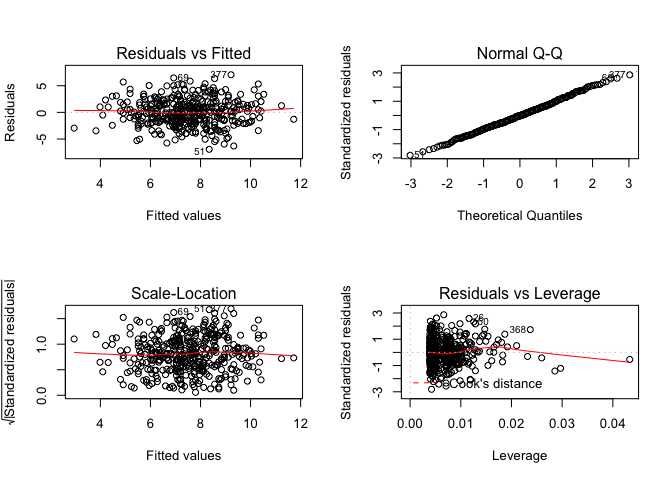

```r
library(tidyverse)
```

```
## Loading tidyverse: ggplot2
## Loading tidyverse: tibble
## Loading tidyverse: tidyr
## Loading tidyverse: readr
## Loading tidyverse: purrr
## Loading tidyverse: dplyr
```

```
## Warning: package 'ggplot2' was built under R version 3.2.5
```

```
## Warning: package 'tibble' was built under R version 3.2.5
```

```
## Warning: package 'tidyr' was built under R version 3.2.5
```

```
## Warning: package 'readr' was built under R version 3.2.5
```

```
## Warning: package 'purrr' was built under R version 3.2.5
```

```
## Warning: package 'dplyr' was built under R version 3.2.5
```

```
## Conflicts with tidy packages ----------------------------------------------
```

```
## filter(): dplyr, stats
## lag():    dplyr, stats
```

```r
library(MASS)
```

```
## Warning: package 'MASS' was built under R version 3.2.5
```

```
## 
## Attaching package: 'MASS'
```

```
## The following object is masked from 'package:dplyr':
## 
##     select
```

```r
library(ISLR)
```

```
## Warning: package 'ISLR' was built under R version 3.2.5
```

### 3. 
Suppose we have a data set with five predictors, X1 = GPA, X2 = IQ, X3 = Gender (1 for Female and 0 for Male), X4 = Interaction between GPA and IQ, and X5 = Interaction between GPA and Gender. The response is starting salary after graduation (in thousands of dollars). Suppose we use least squares to fit the model, and get βˆ0=50, βˆ1=20 , βˆ2=0.07 , βˆ3=35 , βˆ4=0.01 , βˆ5=−10.

(a) Which answer is correct, and why?

i. For a fixed value of IQ and GPA, males earn more on average than females.

ii. For a fixed value of IQ and GPA, females earn more on average than males.

iii. For a fixed value of IQ and GPA,males earn more on average than females provided that the GPA is high enough.

iv. For a fixed value of IQ and GPA, females earn more on average than males provided that the GPA is high enough.

iv is correct, the coefficient indicates that when GPA is greater than 3.5, female earn more on average than male for a fixed value of IQ. 

(b) Predict the salary of a female with IQ of 110 and a GPA of 4.0.


```r
50 + 20*4.0 + 0.07*110 + 35*1 + 0.01*4.0*110 + (-10)*4.0*1 
```

```
## [1] 137.1
```

```r
# this is calculating the averaged salary for female with IQ of 110 and GPA of 4.0 w/o confidence interval.  
```

(c) True or false: Since the coefficient for the GPA/IQ interaction term is very small, there is very little evidence of an interaction effect. Justify your answer.

False, the coeffcient being small doesn't mean the term it is associated with is non-significant, need to check its SE, t statistics, and p-value. 

### 9. 
This question involves the use of multiple linear regression on the Auto data set.

(d) Use the plot() function to produce diagnostic plots of the linear regression fit. Comment on any problems you see with the fit. Do the residual plots suggest any unusually large outliers? Does the leverage plot identify any observations with unusually high leverage?

The first several question was answered last time 
https://github.com/UCD-pbio-rclub/ISLR_Ruijuan.Li/blob/master/R-club-Dec-13/Assignment_12_13_2017.md

```r
fit.m1 <- lm(mpg ~ .-name, data = Auto)
summary(fit.m1)
```

```
## 
## Call:
## lm(formula = mpg ~ . - name, data = Auto)
## 
## Residuals:
##     Min      1Q  Median      3Q     Max 
## -9.5903 -2.1565 -0.1169  1.8690 13.0604 
## 
## Coefficients:
##                Estimate Std. Error t value Pr(>|t|)    
## (Intercept)  -17.218435   4.644294  -3.707  0.00024 ***
## cylinders     -0.493376   0.323282  -1.526  0.12780    
## displacement   0.019896   0.007515   2.647  0.00844 ** 
## horsepower    -0.016951   0.013787  -1.230  0.21963    
## weight        -0.006474   0.000652  -9.929  < 2e-16 ***
## acceleration   0.080576   0.098845   0.815  0.41548    
## year           0.750773   0.050973  14.729  < 2e-16 ***
## origin         1.426141   0.278136   5.127 4.67e-07 ***
## ---
## Signif. codes:  0 '***' 0.001 '**' 0.01 '*' 0.05 '.' 0.1 ' ' 1
## 
## Residual standard error: 3.328 on 384 degrees of freedom
## Multiple R-squared:  0.8215,	Adjusted R-squared:  0.8182 
## F-statistic: 252.4 on 7 and 384 DF,  p-value: < 2.2e-16
```

```r
par(mfrow=c(2,2)) 
plot(fit.m1)
```

<!-- -->

```r
# plot 1 indicates the non-linearity of the response-predictor relationship, plot 2 indicates the distribution of residuals does not follow a normal distribution where at the tail it deviate from from the theoretical quantiles. plot 3 indicates there while several points have relatively higher standadized residuals, being under 3, they should be fine. plot 4 indicates there is observations with high leverage. 
```

(e) Use the * and : symbols to fit linear regression models with interaction effects. Do any interactions appear to be statistically significant?


```r
colnames(Auto)
```

```
## [1] "mpg"          "cylinders"    "displacement" "horsepower"  
## [5] "weight"       "acceleration" "year"         "origin"      
## [9] "name"
```

```r
fit.m2 <- lm(mpg ~ (.-name)^2, data = Auto) 
# displacement:year, acceleration:year, acceleration:origin are significant 
```

(f) Try a few different transformations of the variables, such as log(X), √X, X2. Comment on your findings.


```r
fit.m3 <- lm(mpg ~ polym(cylinders, displacement, horsepower, weight, acceleration, year, origin, degree= 2), data = Auto)
summary(fit.m3)
```

```
## 
## Call:
## lm(formula = mpg ~ polym(cylinders, displacement, horsepower, 
##     weight, acceleration, year, origin, degree = 2), data = Auto)
## 
## Residuals:
##     Min      1Q  Median      3Q     Max 
## -8.4117 -1.4049  0.0791  1.2998 11.2459 
## 
## Coefficients:
##                                                                                                         Estimate
## (Intercept)                                                                                               19.764
## polym(cylinders, displacement, horsepower, weight, acceleration, year, origin, degree = 2)1.0.0.0.0.0.0    3.208
## polym(cylinders, displacement, horsepower, weight, acceleration, year, origin, degree = 2)2.0.0.0.0.0.0  -17.363
## polym(cylinders, displacement, horsepower, weight, acceleration, year, origin, degree = 2)0.1.0.0.0.0.0  -29.402
## polym(cylinders, displacement, horsepower, weight, acceleration, year, origin, degree = 2)1.1.0.0.0.0.0  773.044
## polym(cylinders, displacement, horsepower, weight, acceleration, year, origin, degree = 2)0.2.0.0.0.0.0  -22.974
## polym(cylinders, displacement, horsepower, weight, acceleration, year, origin, degree = 2)0.0.1.0.0.0.0  -55.112
## polym(cylinders, displacement, horsepower, weight, acceleration, year, origin, degree = 2)1.0.1.0.0.0.0   53.817
## polym(cylinders, displacement, horsepower, weight, acceleration, year, origin, degree = 2)0.1.1.0.0.0.0  733.264
## polym(cylinders, displacement, horsepower, weight, acceleration, year, origin, degree = 2)0.0.2.0.0.0.0   -9.148
## polym(cylinders, displacement, horsepower, weight, acceleration, year, origin, degree = 2)0.0.0.1.0.0.0  -77.127
## polym(cylinders, displacement, horsepower, weight, acceleration, year, origin, degree = 2)1.0.0.1.0.0.0  366.925
## polym(cylinders, displacement, horsepower, weight, acceleration, year, origin, degree = 2)0.1.0.1.0.0.0  404.362
## polym(cylinders, displacement, horsepower, weight, acceleration, year, origin, degree = 2)0.0.1.1.0.0.0 -338.084
## polym(cylinders, displacement, horsepower, weight, acceleration, year, origin, degree = 2)0.0.0.2.0.0.0    3.193
## polym(cylinders, displacement, horsepower, weight, acceleration, year, origin, degree = 2)0.0.0.0.1.0.0   -6.826
## polym(cylinders, displacement, horsepower, weight, acceleration, year, origin, degree = 2)1.0.0.0.1.0.0  381.188
## polym(cylinders, displacement, horsepower, weight, acceleration, year, origin, degree = 2)0.1.0.0.1.0.0   65.408
## polym(cylinders, displacement, horsepower, weight, acceleration, year, origin, degree = 2)0.0.1.0.1.0.0 -190.718
## polym(cylinders, displacement, horsepower, weight, acceleration, year, origin, degree = 2)0.0.0.1.1.0.0   -4.628
## polym(cylinders, displacement, horsepower, weight, acceleration, year, origin, degree = 2)0.0.0.0.2.0.0    8.187
## polym(cylinders, displacement, horsepower, weight, acceleration, year, origin, degree = 2)0.0.0.0.0.1.0   51.895
## polym(cylinders, displacement, horsepower, weight, acceleration, year, origin, degree = 2)1.0.0.0.0.1.0 -341.820
## polym(cylinders, displacement, horsepower, weight, acceleration, year, origin, degree = 2)0.1.0.0.0.1.0  894.500
## polym(cylinders, displacement, horsepower, weight, acceleration, year, origin, degree = 2)0.0.1.0.0.1.0 -129.230
## polym(cylinders, displacement, horsepower, weight, acceleration, year, origin, degree = 2)0.0.0.1.0.1.0 -400.302
## polym(cylinders, displacement, horsepower, weight, acceleration, year, origin, degree = 2)0.0.0.0.1.1.0  237.756
## polym(cylinders, displacement, horsepower, weight, acceleration, year, origin, degree = 2)0.0.0.0.0.2.0   13.662
## polym(cylinders, displacement, horsepower, weight, acceleration, year, origin, degree = 2)0.0.0.0.0.0.1   31.782
## polym(cylinders, displacement, horsepower, weight, acceleration, year, origin, degree = 2)1.0.0.0.0.0.1  257.669
## polym(cylinders, displacement, horsepower, weight, acceleration, year, origin, degree = 2)0.1.0.0.0.0.1  622.715
## polym(cylinders, displacement, horsepower, weight, acceleration, year, origin, degree = 2)0.0.1.0.0.0.1   84.313
## polym(cylinders, displacement, horsepower, weight, acceleration, year, origin, degree = 2)0.0.0.1.0.0.1 -165.452
## polym(cylinders, displacement, horsepower, weight, acceleration, year, origin, degree = 2)0.0.0.0.1.0.1  436.593
## polym(cylinders, displacement, horsepower, weight, acceleration, year, origin, degree = 2)0.0.0.0.0.1.1  161.293
## polym(cylinders, displacement, horsepower, weight, acceleration, year, origin, degree = 2)0.0.0.0.0.0.2   -1.414
##                                                                                                         Std. Error
## (Intercept)                                                                                                  3.263
## polym(cylinders, displacement, horsepower, weight, acceleration, year, origin, degree = 2)1.0.0.0.0.0.0     14.294
## polym(cylinders, displacement, horsepower, weight, acceleration, year, origin, degree = 2)2.0.0.0.0.0.0     15.303
## polym(cylinders, displacement, horsepower, weight, acceleration, year, origin, degree = 2)0.1.0.0.0.0.0     41.733
## polym(cylinders, displacement, horsepower, weight, acceleration, year, origin, degree = 2)1.1.0.0.0.0.0   1302.445
## polym(cylinders, displacement, horsepower, weight, acceleration, year, origin, degree = 2)0.2.0.0.0.0.0     41.559
## polym(cylinders, displacement, horsepower, weight, acceleration, year, origin, degree = 2)0.0.1.0.0.0.0     20.113
## polym(cylinders, displacement, horsepower, weight, acceleration, year, origin, degree = 2)1.0.1.0.0.0.0    672.963
## polym(cylinders, displacement, horsepower, weight, acceleration, year, origin, degree = 2)0.1.1.0.0.0.0    650.553
## polym(cylinders, displacement, horsepower, weight, acceleration, year, origin, degree = 2)0.0.2.0.0.0.0     21.230
## polym(cylinders, displacement, horsepower, weight, acceleration, year, origin, degree = 2)0.0.0.1.0.0.0     15.727
## polym(cylinders, displacement, horsepower, weight, acceleration, year, origin, degree = 2)1.0.0.1.0.0.0    645.673
## polym(cylinders, displacement, horsepower, weight, acceleration, year, origin, degree = 2)0.1.0.1.0.0.0    823.129
## polym(cylinders, displacement, horsepower, weight, acceleration, year, origin, degree = 2)0.0.1.1.0.0.0    562.654
## polym(cylinders, displacement, horsepower, weight, acceleration, year, origin, degree = 2)0.0.0.2.0.0.0     14.858
## polym(cylinders, displacement, horsepower, weight, acceleration, year, origin, degree = 2)0.0.0.0.1.0.0      6.236
## polym(cylinders, displacement, horsepower, weight, acceleration, year, origin, degree = 2)1.0.0.0.1.0.0    320.562
## polym(cylinders, displacement, horsepower, weight, acceleration, year, origin, degree = 2)0.1.0.0.1.0.0    447.877
## polym(cylinders, displacement, horsepower, weight, acceleration, year, origin, degree = 2)0.0.1.0.1.0.0    334.668
## polym(cylinders, displacement, horsepower, weight, acceleration, year, origin, degree = 2)0.0.0.1.1.0.0    312.956
## polym(cylinders, displacement, horsepower, weight, acceleration, year, origin, degree = 2)0.0.0.0.2.0.0      8.092
## polym(cylinders, displacement, horsepower, weight, acceleration, year, origin, degree = 2)0.0.0.0.0.1.0      3.680
## polym(cylinders, displacement, horsepower, weight, acceleration, year, origin, degree = 2)1.0.0.0.0.1.0    239.083
## polym(cylinders, displacement, horsepower, weight, acceleration, year, origin, degree = 2)0.1.0.0.0.1.0    361.577
## polym(cylinders, displacement, horsepower, weight, acceleration, year, origin, degree = 2)0.0.1.0.0.1.0    234.055
## polym(cylinders, displacement, horsepower, weight, acceleration, year, origin, degree = 2)0.0.0.1.0.1.0    266.958
## polym(cylinders, displacement, horsepower, weight, acceleration, year, origin, degree = 2)0.0.0.0.1.1.0    104.486
## polym(cylinders, displacement, horsepower, weight, acceleration, year, origin, degree = 2)0.0.0.0.0.2.0      3.317
## polym(cylinders, displacement, horsepower, weight, acceleration, year, origin, degree = 2)0.0.0.0.0.0.1     13.398
## polym(cylinders, displacement, horsepower, weight, acceleration, year, origin, degree = 2)1.0.0.0.0.0.1    300.703
## polym(cylinders, displacement, horsepower, weight, acceleration, year, origin, degree = 2)0.1.0.0.0.0.1    704.350
## polym(cylinders, displacement, horsepower, weight, acceleration, year, origin, degree = 2)0.0.1.0.0.0.1    365.712
## polym(cylinders, displacement, horsepower, weight, acceleration, year, origin, degree = 2)0.0.0.1.0.0.1    440.908
## polym(cylinders, displacement, horsepower, weight, acceleration, year, origin, degree = 2)0.0.0.0.1.0.1    136.320
## polym(cylinders, displacement, horsepower, weight, acceleration, year, origin, degree = 2)0.0.0.0.0.1.1     84.692
## polym(cylinders, displacement, horsepower, weight, acceleration, year, origin, degree = 2)0.0.0.0.0.0.2      3.595
##                                                                                                         t value
## (Intercept)                                                                                               6.057
## polym(cylinders, displacement, horsepower, weight, acceleration, year, origin, degree = 2)1.0.0.0.0.0.0   0.224
## polym(cylinders, displacement, horsepower, weight, acceleration, year, origin, degree = 2)2.0.0.0.0.0.0  -1.135
## polym(cylinders, displacement, horsepower, weight, acceleration, year, origin, degree = 2)0.1.0.0.0.0.0  -0.705
## polym(cylinders, displacement, horsepower, weight, acceleration, year, origin, degree = 2)1.1.0.0.0.0.0   0.594
## polym(cylinders, displacement, horsepower, weight, acceleration, year, origin, degree = 2)0.2.0.0.0.0.0  -0.553
## polym(cylinders, displacement, horsepower, weight, acceleration, year, origin, degree = 2)0.0.1.0.0.0.0  -2.740
## polym(cylinders, displacement, horsepower, weight, acceleration, year, origin, degree = 2)1.0.1.0.0.0.0   0.080
## polym(cylinders, displacement, horsepower, weight, acceleration, year, origin, degree = 2)0.1.1.0.0.0.0   1.127
## polym(cylinders, displacement, horsepower, weight, acceleration, year, origin, degree = 2)0.0.2.0.0.0.0  -0.431
## polym(cylinders, displacement, horsepower, weight, acceleration, year, origin, degree = 2)0.0.0.1.0.0.0  -4.904
## polym(cylinders, displacement, horsepower, weight, acceleration, year, origin, degree = 2)1.0.0.1.0.0.0   0.568
## polym(cylinders, displacement, horsepower, weight, acceleration, year, origin, degree = 2)0.1.0.1.0.0.0   0.491
## polym(cylinders, displacement, horsepower, weight, acceleration, year, origin, degree = 2)0.0.1.1.0.0.0  -0.601
## polym(cylinders, displacement, horsepower, weight, acceleration, year, origin, degree = 2)0.0.0.2.0.0.0   0.215
## polym(cylinders, displacement, horsepower, weight, acceleration, year, origin, degree = 2)0.0.0.0.1.0.0  -1.095
## polym(cylinders, displacement, horsepower, weight, acceleration, year, origin, degree = 2)1.0.0.0.1.0.0   1.189
## polym(cylinders, displacement, horsepower, weight, acceleration, year, origin, degree = 2)0.1.0.0.1.0.0   0.146
## polym(cylinders, displacement, horsepower, weight, acceleration, year, origin, degree = 2)0.0.1.0.1.0.0  -0.570
## polym(cylinders, displacement, horsepower, weight, acceleration, year, origin, degree = 2)0.0.0.1.1.0.0  -0.015
## polym(cylinders, displacement, horsepower, weight, acceleration, year, origin, degree = 2)0.0.0.0.2.0.0   1.012
## polym(cylinders, displacement, horsepower, weight, acceleration, year, origin, degree = 2)0.0.0.0.0.1.0  14.101
## polym(cylinders, displacement, horsepower, weight, acceleration, year, origin, degree = 2)1.0.0.0.0.1.0  -1.430
## polym(cylinders, displacement, horsepower, weight, acceleration, year, origin, degree = 2)0.1.0.0.0.1.0   2.474
## polym(cylinders, displacement, horsepower, weight, acceleration, year, origin, degree = 2)0.0.1.0.0.1.0  -0.552
## polym(cylinders, displacement, horsepower, weight, acceleration, year, origin, degree = 2)0.0.0.1.0.1.0  -1.499
## polym(cylinders, displacement, horsepower, weight, acceleration, year, origin, degree = 2)0.0.0.0.1.1.0   2.275
## polym(cylinders, displacement, horsepower, weight, acceleration, year, origin, degree = 2)0.0.0.0.0.2.0   4.119
## polym(cylinders, displacement, horsepower, weight, acceleration, year, origin, degree = 2)0.0.0.0.0.0.1   2.372
## polym(cylinders, displacement, horsepower, weight, acceleration, year, origin, degree = 2)1.0.0.0.0.0.1   0.857
## polym(cylinders, displacement, horsepower, weight, acceleration, year, origin, degree = 2)0.1.0.0.0.0.1   0.884
## polym(cylinders, displacement, horsepower, weight, acceleration, year, origin, degree = 2)0.0.1.0.0.0.1   0.231
## polym(cylinders, displacement, horsepower, weight, acceleration, year, origin, degree = 2)0.0.0.1.0.0.1  -0.375
## polym(cylinders, displacement, horsepower, weight, acceleration, year, origin, degree = 2)0.0.0.0.1.0.1   3.203
## polym(cylinders, displacement, horsepower, weight, acceleration, year, origin, degree = 2)0.0.0.0.0.1.1   1.904
## polym(cylinders, displacement, horsepower, weight, acceleration, year, origin, degree = 2)0.0.0.0.0.0.2  -0.393
##                                                                                                         Pr(>|t|)
## (Intercept)                                                                                             3.54e-09
## polym(cylinders, displacement, horsepower, weight, acceleration, year, origin, degree = 2)1.0.0.0.0.0.0  0.82252
## polym(cylinders, displacement, horsepower, weight, acceleration, year, origin, degree = 2)2.0.0.0.0.0.0  0.25730
## polym(cylinders, displacement, horsepower, weight, acceleration, year, origin, degree = 2)0.1.0.0.0.0.0  0.48156
## polym(cylinders, displacement, horsepower, weight, acceleration, year, origin, degree = 2)1.1.0.0.0.0.0  0.55320
## polym(cylinders, displacement, horsepower, weight, acceleration, year, origin, degree = 2)0.2.0.0.0.0.0  0.58075
## polym(cylinders, displacement, horsepower, weight, acceleration, year, origin, degree = 2)0.0.1.0.0.0.0  0.00645
## polym(cylinders, displacement, horsepower, weight, acceleration, year, origin, degree = 2)1.0.1.0.0.0.0  0.93631
## polym(cylinders, displacement, horsepower, weight, acceleration, year, origin, degree = 2)0.1.1.0.0.0.0  0.26044
## polym(cylinders, displacement, horsepower, weight, acceleration, year, origin, degree = 2)0.0.2.0.0.0.0  0.66683
## polym(cylinders, displacement, horsepower, weight, acceleration, year, origin, degree = 2)0.0.0.1.0.0.0 1.43e-06
## polym(cylinders, displacement, horsepower, weight, acceleration, year, origin, degree = 2)1.0.0.1.0.0.0  0.57020
## polym(cylinders, displacement, horsepower, weight, acceleration, year, origin, degree = 2)0.1.0.1.0.0.0  0.62355
## polym(cylinders, displacement, horsepower, weight, acceleration, year, origin, degree = 2)0.0.1.1.0.0.0  0.54831
## polym(cylinders, displacement, horsepower, weight, acceleration, year, origin, degree = 2)0.0.0.2.0.0.0  0.82997
## polym(cylinders, displacement, horsepower, weight, acceleration, year, origin, degree = 2)0.0.0.0.1.0.0  0.27438
## polym(cylinders, displacement, horsepower, weight, acceleration, year, origin, degree = 2)1.0.0.0.1.0.0  0.23518
## polym(cylinders, displacement, horsepower, weight, acceleration, year, origin, degree = 2)0.1.0.0.1.0.0  0.88397
## polym(cylinders, displacement, horsepower, weight, acceleration, year, origin, degree = 2)0.0.1.0.1.0.0  0.56912
## polym(cylinders, displacement, horsepower, weight, acceleration, year, origin, degree = 2)0.0.0.1.1.0.0  0.98821
## polym(cylinders, displacement, horsepower, weight, acceleration, year, origin, degree = 2)0.0.0.0.2.0.0  0.31235
## polym(cylinders, displacement, horsepower, weight, acceleration, year, origin, degree = 2)0.0.0.0.0.1.0  < 2e-16
## polym(cylinders, displacement, horsepower, weight, acceleration, year, origin, degree = 2)1.0.0.0.0.1.0  0.15368
## polym(cylinders, displacement, horsepower, weight, acceleration, year, origin, degree = 2)0.1.0.0.0.1.0  0.01383
## polym(cylinders, displacement, horsepower, weight, acceleration, year, origin, degree = 2)0.0.1.0.0.1.0  0.58120
## polym(cylinders, displacement, horsepower, weight, acceleration, year, origin, degree = 2)0.0.0.1.0.1.0  0.13463
## polym(cylinders, displacement, horsepower, weight, acceleration, year, origin, degree = 2)0.0.0.0.1.1.0  0.02347
## polym(cylinders, displacement, horsepower, weight, acceleration, year, origin, degree = 2)0.0.0.0.0.2.0 4.73e-05
## polym(cylinders, displacement, horsepower, weight, acceleration, year, origin, degree = 2)0.0.0.0.0.0.1  0.01821
## polym(cylinders, displacement, horsepower, weight, acceleration, year, origin, degree = 2)1.0.0.0.0.0.1  0.39208
## polym(cylinders, displacement, horsepower, weight, acceleration, year, origin, degree = 2)0.1.0.0.0.0.1  0.37724
## polym(cylinders, displacement, horsepower, weight, acceleration, year, origin, degree = 2)0.0.1.0.0.0.1  0.81780
## polym(cylinders, displacement, horsepower, weight, acceleration, year, origin, degree = 2)0.0.0.1.0.0.1  0.70770
## polym(cylinders, displacement, horsepower, weight, acceleration, year, origin, degree = 2)0.0.0.0.1.0.1  0.00148
## polym(cylinders, displacement, horsepower, weight, acceleration, year, origin, degree = 2)0.0.0.0.0.1.1  0.05766
## polym(cylinders, displacement, horsepower, weight, acceleration, year, origin, degree = 2)0.0.0.0.0.0.2  0.69438
##                                                                                                            
## (Intercept)                                                                                             ***
## polym(cylinders, displacement, horsepower, weight, acceleration, year, origin, degree = 2)1.0.0.0.0.0.0    
## polym(cylinders, displacement, horsepower, weight, acceleration, year, origin, degree = 2)2.0.0.0.0.0.0    
## polym(cylinders, displacement, horsepower, weight, acceleration, year, origin, degree = 2)0.1.0.0.0.0.0    
## polym(cylinders, displacement, horsepower, weight, acceleration, year, origin, degree = 2)1.1.0.0.0.0.0    
## polym(cylinders, displacement, horsepower, weight, acceleration, year, origin, degree = 2)0.2.0.0.0.0.0    
## polym(cylinders, displacement, horsepower, weight, acceleration, year, origin, degree = 2)0.0.1.0.0.0.0 ** 
## polym(cylinders, displacement, horsepower, weight, acceleration, year, origin, degree = 2)1.0.1.0.0.0.0    
## polym(cylinders, displacement, horsepower, weight, acceleration, year, origin, degree = 2)0.1.1.0.0.0.0    
## polym(cylinders, displacement, horsepower, weight, acceleration, year, origin, degree = 2)0.0.2.0.0.0.0    
## polym(cylinders, displacement, horsepower, weight, acceleration, year, origin, degree = 2)0.0.0.1.0.0.0 ***
## polym(cylinders, displacement, horsepower, weight, acceleration, year, origin, degree = 2)1.0.0.1.0.0.0    
## polym(cylinders, displacement, horsepower, weight, acceleration, year, origin, degree = 2)0.1.0.1.0.0.0    
## polym(cylinders, displacement, horsepower, weight, acceleration, year, origin, degree = 2)0.0.1.1.0.0.0    
## polym(cylinders, displacement, horsepower, weight, acceleration, year, origin, degree = 2)0.0.0.2.0.0.0    
## polym(cylinders, displacement, horsepower, weight, acceleration, year, origin, degree = 2)0.0.0.0.1.0.0    
## polym(cylinders, displacement, horsepower, weight, acceleration, year, origin, degree = 2)1.0.0.0.1.0.0    
## polym(cylinders, displacement, horsepower, weight, acceleration, year, origin, degree = 2)0.1.0.0.1.0.0    
## polym(cylinders, displacement, horsepower, weight, acceleration, year, origin, degree = 2)0.0.1.0.1.0.0    
## polym(cylinders, displacement, horsepower, weight, acceleration, year, origin, degree = 2)0.0.0.1.1.0.0    
## polym(cylinders, displacement, horsepower, weight, acceleration, year, origin, degree = 2)0.0.0.0.2.0.0    
## polym(cylinders, displacement, horsepower, weight, acceleration, year, origin, degree = 2)0.0.0.0.0.1.0 ***
## polym(cylinders, displacement, horsepower, weight, acceleration, year, origin, degree = 2)1.0.0.0.0.1.0    
## polym(cylinders, displacement, horsepower, weight, acceleration, year, origin, degree = 2)0.1.0.0.0.1.0 *  
## polym(cylinders, displacement, horsepower, weight, acceleration, year, origin, degree = 2)0.0.1.0.0.1.0    
## polym(cylinders, displacement, horsepower, weight, acceleration, year, origin, degree = 2)0.0.0.1.0.1.0    
## polym(cylinders, displacement, horsepower, weight, acceleration, year, origin, degree = 2)0.0.0.0.1.1.0 *  
## polym(cylinders, displacement, horsepower, weight, acceleration, year, origin, degree = 2)0.0.0.0.0.2.0 ***
## polym(cylinders, displacement, horsepower, weight, acceleration, year, origin, degree = 2)0.0.0.0.0.0.1 *  
## polym(cylinders, displacement, horsepower, weight, acceleration, year, origin, degree = 2)1.0.0.0.0.0.1    
## polym(cylinders, displacement, horsepower, weight, acceleration, year, origin, degree = 2)0.1.0.0.0.0.1    
## polym(cylinders, displacement, horsepower, weight, acceleration, year, origin, degree = 2)0.0.1.0.0.0.1    
## polym(cylinders, displacement, horsepower, weight, acceleration, year, origin, degree = 2)0.0.0.1.0.0.1    
## polym(cylinders, displacement, horsepower, weight, acceleration, year, origin, degree = 2)0.0.0.0.1.0.1 ** 
## polym(cylinders, displacement, horsepower, weight, acceleration, year, origin, degree = 2)0.0.0.0.0.1.1 .  
## polym(cylinders, displacement, horsepower, weight, acceleration, year, origin, degree = 2)0.0.0.0.0.0.2    
## ---
## Signif. codes:  0 '***' 0.001 '**' 0.01 '*' 0.05 '.' 0.1 ' ' 1
## 
## Residual standard error: 2.647 on 356 degrees of freedom
## Multiple R-squared:  0.8953,	Adjusted R-squared:  0.885 
## F-statistic: 86.99 on 35 and 356 DF,  p-value: < 2.2e-16
```

```r
anova(fit.m1, fit.m3) # more variance explained 
```

```
## Analysis of Variance Table
## 
## Model 1: mpg ~ (cylinders + displacement + horsepower + weight + acceleration + 
##     year + origin + name) - name
## Model 2: mpg ~ polym(cylinders, displacement, horsepower, weight, acceleration, 
##     year, origin, degree = 2)
##   Res.Df    RSS Df Sum of Sq      F    Pr(>F)    
## 1    384 4252.2                                  
## 2    356 2493.5 28    1758.7 8.9676 < 2.2e-16 ***
## ---
## Signif. codes:  0 '***' 0.001 '**' 0.01 '*' 0.05 '.' 0.1 ' ' 1
```

```r
# or 
Auto.poly <- sapply(Auto[,2:8], function(i) i^2) %>% as.data.frame()
Auto.log <- sapply(Auto[,2:8], function(i) log(i)) %>% as.data.frame()
Auto.sqrt <- sapply(Auto[,2:8], function(i) sqrt(i)) %>% as.data.frame()

Auto[1:10, 2:8]
```

```
##    cylinders displacement horsepower weight acceleration year origin
## 1          8          307        130   3504         12.0   70      1
## 2          8          350        165   3693         11.5   70      1
## 3          8          318        150   3436         11.0   70      1
## 4          8          304        150   3433         12.0   70      1
## 5          8          302        140   3449         10.5   70      1
## 6          8          429        198   4341         10.0   70      1
## 7          8          454        220   4354          9.0   70      1
## 8          8          440        215   4312          8.5   70      1
## 9          8          455        225   4425         10.0   70      1
## 10         8          390        190   3850          8.5   70      1
```

```r
Auto.poly[1:10, 1:7]
```

```
##    cylinders displacement horsepower   weight acceleration year origin
## 1         64        94249      16900 12278016       144.00 4900      1
## 2         64       122500      27225 13638249       132.25 4900      1
## 3         64       101124      22500 11806096       121.00 4900      1
## 4         64        92416      22500 11785489       144.00 4900      1
## 5         64        91204      19600 11895601       110.25 4900      1
## 6         64       184041      39204 18844281       100.00 4900      1
## 7         64       206116      48400 18957316        81.00 4900      1
## 8         64       193600      46225 18593344        72.25 4900      1
## 9         64       207025      50625 19580625       100.00 4900      1
## 10        64       152100      36100 14822500        72.25 4900      1
```

```r
Auto.poly$mpg <- Auto$mpg
Auto.log[1:10, 1:7]
```

```
##    cylinders displacement horsepower   weight acceleration     year origin
## 1   2.079442     5.726848   4.867534 8.161660     2.484907 4.248495      0
## 2   2.079442     5.857933   5.105945 8.214194     2.442347 4.248495      0
## 3   2.079442     5.762051   5.010635 8.142063     2.397895 4.248495      0
## 4   2.079442     5.717028   5.010635 8.141190     2.484907 4.248495      0
## 5   2.079442     5.710427   4.941642 8.145840     2.351375 4.248495      0
## 6   2.079442     6.061457   5.288267 8.375860     2.302585 4.248495      0
## 7   2.079442     6.118097   5.393628 8.378850     2.197225 4.248495      0
## 8   2.079442     6.086775   5.370638 8.369157     2.140066 4.248495      0
## 9   2.079442     6.120297   5.416100 8.395026     2.302585 4.248495      0
## 10  2.079442     5.966147   5.247024 8.255828     2.140066 4.248495      0
```

```r
Auto.log$mpg <- Auto$mpg
Auto.sqrt[1:10, 1:7]
```

```
##    cylinders displacement horsepower   weight acceleration   year origin
## 1   2.828427     17.52142   11.40175 59.19459     3.464102 8.3666      1
## 2   2.828427     18.70829   12.84523 60.77006     3.391165 8.3666      1
## 3   2.828427     17.83255   12.24745 58.61740     3.316625 8.3666      1
## 4   2.828427     17.43560   12.24745 58.59181     3.464102 8.3666      1
## 5   2.828427     17.37815   11.83216 58.72819     3.240370 8.3666      1
## 6   2.828427     20.71232   14.07125 65.88627     3.162278 8.3666      1
## 7   2.828427     21.30728   14.83240 65.98485     3.000000 8.3666      1
## 8   2.828427     20.97618   14.66288 65.66582     2.915476 8.3666      1
## 9   2.828427     21.33073   15.00000 66.52067     3.162278 8.3666      1
## 10  2.828427     19.74842   13.78405 62.04837     2.915476 8.3666      1
```

```r
Auto.sqrt$mpg <- Auto$mpg

fit.m4 <- lm(mpg ~ ., data = Auto.poly)
fit.m5 <- lm(mpg ~ ., data = Auto.log)
fit.m6 <- lm(mpg ~ ., data = Auto.sqrt)

summary(fit.m4)
```

```
## 
## Call:
## lm(formula = mpg ~ ., data = Auto.poly)
## 
## Residuals:
##     Min      1Q  Median      3Q     Max 
## -9.6786 -2.3227 -0.0582  1.9073 12.9807 
## 
## Coefficients:
##                Estimate Std. Error t value Pr(>|t|)    
## (Intercept)   1.208e+00  2.356e+00   0.513 0.608382    
## cylinders    -8.829e-02  2.521e-02  -3.502 0.000515 ***
## displacement  5.680e-05  1.382e-05   4.109 4.87e-05 ***
## horsepower   -3.621e-05  4.975e-05  -0.728 0.467201    
## weight       -9.351e-07  8.978e-08 -10.416  < 2e-16 ***
## acceleration  6.278e-03  2.690e-03   2.334 0.020130 *  
## year          4.999e-03  3.530e-04  14.160  < 2e-16 ***
## origin        4.129e-01  6.914e-02   5.971 5.37e-09 ***
## ---
## Signif. codes:  0 '***' 0.001 '**' 0.01 '*' 0.05 '.' 0.1 ' ' 1
## 
## Residual standard error: 3.539 on 384 degrees of freedom
## Multiple R-squared:  0.7981,	Adjusted R-squared:  0.7944 
## F-statistic: 216.8 on 7 and 384 DF,  p-value: < 2.2e-16
```

```r
summary(fit.m5)
```

```
## 
## Call:
## lm(formula = mpg ~ ., data = Auto.log)
## 
## Residuals:
##     Min      1Q  Median      3Q     Max 
## -9.5987 -1.8172 -0.0181  1.5906 12.8132 
## 
## Coefficients:
##              Estimate Std. Error t value Pr(>|t|)    
## (Intercept)  -66.5643    17.5053  -3.803 0.000167 ***
## cylinders      1.4818     1.6589   0.893 0.372273    
## displacement  -1.0551     1.5385  -0.686 0.493230    
## horsepower    -6.9657     1.5569  -4.474 1.01e-05 ***
## weight       -12.5728     2.2251  -5.650 3.12e-08 ***
## acceleration  -4.9831     1.6078  -3.099 0.002082 ** 
## year          54.9857     3.5555  15.465  < 2e-16 ***
## origin         1.5822     0.5083   3.113 0.001991 ** 
## ---
## Signif. codes:  0 '***' 0.001 '**' 0.01 '*' 0.05 '.' 0.1 ' ' 1
## 
## Residual standard error: 3.069 on 384 degrees of freedom
## Multiple R-squared:  0.8482,	Adjusted R-squared:  0.8454 
## F-statistic: 306.5 on 7 and 384 DF,  p-value: < 2.2e-16
```

```r
summary(fit.m6) 
```

```
## 
## Call:
## lm(formula = mpg ~ ., data = Auto.sqrt)
## 
## Residuals:
##     Min      1Q  Median      3Q     Max 
## -9.5250 -1.9822 -0.1111  1.7347 13.0681 
## 
## Coefficients:
##               Estimate Std. Error t value Pr(>|t|)    
## (Intercept)  -49.79814    9.17832  -5.426 1.02e-07 ***
## cylinders     -0.23699    1.53753  -0.154   0.8776    
## displacement   0.22580    0.22940   0.984   0.3256    
## horsepower    -0.77976    0.30788  -2.533   0.0117 *  
## weight        -0.62172    0.07898  -7.872 3.59e-14 ***
## acceleration  -0.82529    0.83443  -0.989   0.3233    
## year          12.79030    0.85891  14.891  < 2e-16 ***
## origin         3.26036    0.76767   4.247 2.72e-05 ***
## ---
## Signif. codes:  0 '***' 0.001 '**' 0.01 '*' 0.05 '.' 0.1 ' ' 1
## 
## Residual standard error: 3.21 on 384 degrees of freedom
## Multiple R-squared:  0.8338,	Adjusted R-squared:  0.8308 
## F-statistic: 275.3 on 7 and 384 DF,  p-value: < 2.2e-16
```

```r
anova(fit.m1, fit.m4)
```

```
## Analysis of Variance Table
## 
## Model 1: mpg ~ (cylinders + displacement + horsepower + weight + acceleration + 
##     year + origin + name) - name
## Model 2: mpg ~ cylinders + displacement + horsepower + weight + acceleration + 
##     year + origin
##   Res.Df    RSS Df Sum of Sq F Pr(>F)
## 1    384 4252.2                      
## 2    384 4809.8  0   -557.59
```

```r
anova(fit.m1, fit.m5)
```

```
## Analysis of Variance Table
## 
## Model 1: mpg ~ (cylinders + displacement + horsepower + weight + acceleration + 
##     year + origin + name) - name
## Model 2: mpg ~ cylinders + displacement + horsepower + weight + acceleration + 
##     year + origin
##   Res.Df    RSS Df Sum of Sq F Pr(>F)
## 1    384 4252.2                      
## 2    384 3615.8  0    636.44
```

```r
anova(fit.m1, fit.m6)
```

```
## Analysis of Variance Table
## 
## Model 1: mpg ~ (cylinders + displacement + horsepower + weight + acceleration + 
##     year + origin + name) - name
## Model 2: mpg ~ cylinders + displacement + horsepower + weight + acceleration + 
##     year + origin
##   Res.Df    RSS Df Sum of Sq F Pr(>F)
## 1    384 4252.2                      
## 2    384 3957.6  0    294.65
```

```r
# none of them is significantly better or different compared to the original multiple linear model. 
```

### 10. 
This question should be answered using the Carseats data set.

(h) Is there evidence of outliers or high leverage observations in the model from (e)? 


```r
dim(Carseats)
```

```
## [1] 400  11
```

```r
fit.m7 <- lm(Sales ~ Price + US, data = Carseats)
par(mfrow=c(2,2)) 
plot(fit.m7) # outlier no, average leverage should be (p+1)/n, which is 2+1/400 (0.0075), it looks like there are high leverage observations.  
```

<!-- -->

