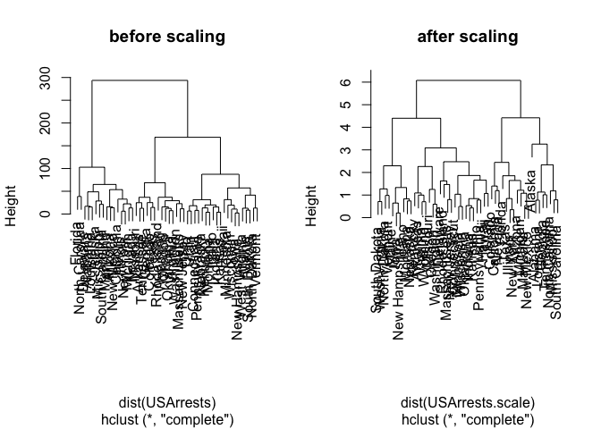
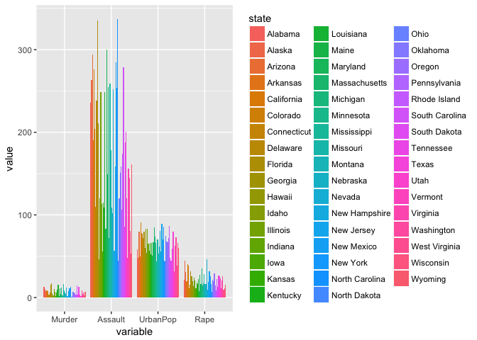
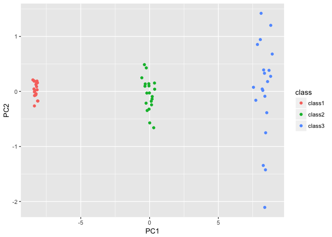
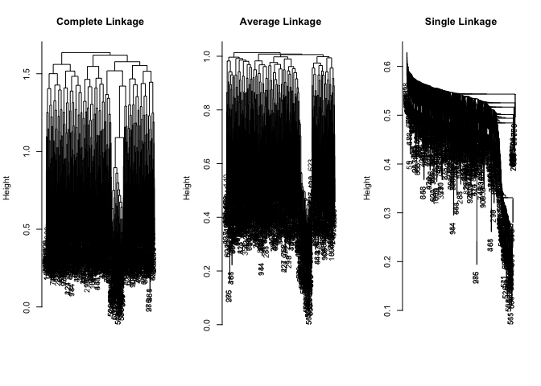

### Q6

A researcher collects expression measurements for 1,000 genes in 100 tissue samples. The data can be written as a 1,000 × 100 matrix, which we call X, in which each row represents a gene and each column a tissue sample. Each tissue sample was processed on a different day, and the columns of X are ordered so that the samples that were processed earliest are on the left, and the samples that were processed later are on the right. The tissue samples belong to two groups: control (C) and treatment (T). The C and T samples were processed in a random order across the days. The researcher wishes to determine whether each gene’s expression measurements differ between the treatment and control groups.
As a pre-analysis (before comparing T versus C), the researcher performs a principal component analysis of the data, and finds that the first principal component (a vector of length 100) has a strong linear trend from left to right, and explains 10% of the variation. The researcher now remembers that each patient sample was run on one of two machines, A and B, and machine A was used more often in the earlier times while B was used more often later. The researcher has a record of which sample was run on which machine.

(a) Explain what it means that the first principal component “explains 10 % of the variation”.

10% of the tissue sample variation was due to the 1st PC, which comes from expression level differences among difference genes.  

(b) The researcher decides to replace the (j, i)th element of X with xji − φj1zi1 
where zi1 is the ith score, and φj1 is the jth loading, for the first principal component. He will then perform a two-sample t-test on each gene in this new data set in order to determine whether its expression differs between the two conditions. Critique this idea, and suggest a better approach. (The principal component analysis is performed on XT ).

By replacing the original data with PCA derived data, he wanted to decompose the time and machine effect so that he can compare T and C. There are two problems, 1) the way he did it extracted variations due to genes, instead of variation due to time or machine 2) multiple test problem 

I would use edgeR's negative binomial model for this problem, model: expression ~ treatment * machine + time, look for genes significant for treatment effect and then use FDR to account for multiple test problem. 

(c) Design and run a small simulation experiment to demonstrate the superiority of your idea.

skip for now... 

### Q8

In Section 10.2.3, a formula for calculating PVE was given in Equation 10.8. We also saw that the PVE can be obtained using the sdev output of the prcomp() function.

On the USArrests data, calculate PVE in two ways:

(a) Using the sdev output of the prcomp() function, as was done in Section 10.2.3.


```r
names(USArrests)
```

```
## [1] "Murder"   "Assault"  "UrbanPop" "Rape"
```

```r
pr.out=prcomp(USArrests, scale=TRUE)
pr.out$sdev
```

```
## [1] 1.5748783 0.9948694 0.5971291 0.4164494
```

```r
pr.var=pr.out$sdev ^2 
pve=pr.var/sum(pr.var)
pve 
```

```
## [1] 0.62006039 0.24744129 0.08914080 0.04335752
```

(b) By applying Equation 10.8 directly. That is, use the prcomp() function to compute the principal component loadings. Then, use those loadings in Equation 10.8 to obtain the PVE.


These two approaches should give the same results.

Hint: You will only obtain the same results in (a) and (b) if the same data is used in both cases. For instance, if in (a) you performed prcomp() using centered and scaled variables, then you must center and scale the variables before applying Equation 10.3 in (b).

### Q9 
Consider the USArrests data. We will now perform hierarchical clustering on the states.

(a) Using hierarchical clustering with complete linkage and Euclidean distance, cluster the states.


```r
hc.complete=hclust(dist(USArrests), method="complete")
```

(b) Cut the dendrogram at a height that results in three distinct clusters. Which states belong to which clusters?


```r
cutree(hc.complete, 3)
```

```
##        Alabama         Alaska        Arizona       Arkansas     California 
##              1              1              1              2              1 
##       Colorado    Connecticut       Delaware        Florida        Georgia 
##              2              3              1              1              2 
##         Hawaii          Idaho       Illinois        Indiana           Iowa 
##              3              3              1              3              3 
##         Kansas       Kentucky      Louisiana          Maine       Maryland 
##              3              3              1              3              1 
##  Massachusetts       Michigan      Minnesota    Mississippi       Missouri 
##              2              1              3              1              2 
##        Montana       Nebraska         Nevada  New Hampshire     New Jersey 
##              3              3              1              3              2 
##     New Mexico       New York North Carolina   North Dakota           Ohio 
##              1              1              1              3              3 
##       Oklahoma         Oregon   Pennsylvania   Rhode Island South Carolina 
##              2              2              3              2              1 
##   South Dakota      Tennessee          Texas           Utah        Vermont 
##              3              2              2              3              3 
##       Virginia     Washington  West Virginia      Wisconsin        Wyoming 
##              2              2              3              3              2
```

(c) Hierarchically cluster the states using complete linkage and Euclidean distance, after scaling the variables to have standard deviation one.


```r
USArrests.scale=scale(USArrests)
hc.complete.scale=hclust(dist(USArrests.scale), method="complete")
cutree(hc.complete.scale, 4)
```

```
##        Alabama         Alaska        Arizona       Arkansas     California 
##              1              1              2              3              2 
##       Colorado    Connecticut       Delaware        Florida        Georgia 
##              2              3              3              2              1 
##         Hawaii          Idaho       Illinois        Indiana           Iowa 
##              3              4              2              3              4 
##         Kansas       Kentucky      Louisiana          Maine       Maryland 
##              3              3              1              4              2 
##  Massachusetts       Michigan      Minnesota    Mississippi       Missouri 
##              3              2              3              1              3 
##        Montana       Nebraska         Nevada  New Hampshire     New Jersey 
##              4              4              2              4              3 
##     New Mexico       New York North Carolina   North Dakota           Ohio 
##              2              2              1              4              3 
##       Oklahoma         Oregon   Pennsylvania   Rhode Island South Carolina 
##              3              3              3              3              1 
##   South Dakota      Tennessee          Texas           Utah        Vermont 
##              4              1              2              3              4 
##       Virginia     Washington  West Virginia      Wisconsin        Wyoming 
##              3              3              4              3              3
```

(d) What effect does scaling the variables have on the hierarchical clustering obtained? In your opinion, should the variables be scaled before the inter-observation dissimilarities are computed? Provide a justification for your answer.


```r
library(reshape2)
```

```
## Warning: package 'reshape2' was built under R version 3.2.5
```

```r
library(tidyverse) 
```

```
## ── Attaching packages ────────────────────────────────── tidyverse 1.2.1 ──
```

```
## ✔ ggplot2 2.2.1     ✔ purrr   0.2.4
## ✔ tibble  1.4.2     ✔ dplyr   0.7.4
## ✔ tidyr   0.8.0     ✔ stringr 1.3.0
## ✔ readr   1.1.1     ✔ forcats 0.3.0
```

```
## Warning: package 'ggplot2' was built under R version 3.2.5
```

```
## Warning: package 'readr' was built under R version 3.2.5
```

```
## Warning: package 'purrr' was built under R version 3.2.5
```

```
## Warning: package 'dplyr' was built under R version 3.2.5
```

```
## ── Conflicts ───────────────────────────────────── tidyverse_conflicts() ──
## ✖ dplyr::filter() masks stats::filter()
## ✖ dplyr::lag()    masks stats::lag()
```

```r
par(mfrow=c(1,2))
plot(hclust(dist(USArrests), method="complete"), main = "before scaling")
plot(hclust(dist(USArrests.scale), method="complete"), main = "after scaling")
```

<!-- -->

```r
# before scaling, looks like 3 major branches formed, after scaline, looks like four major branches formed. I think it should be scaled, because otherwise assult will be have a large effect on the final result compared to other variables. 
summary(USArrests)
```

```
##      Murder          Assault         UrbanPop          Rape      
##  Min.   : 0.800   Min.   : 45.0   Min.   :32.00   Min.   : 7.30  
##  1st Qu.: 4.075   1st Qu.:109.0   1st Qu.:54.50   1st Qu.:15.07  
##  Median : 7.250   Median :159.0   Median :66.00   Median :20.10  
##  Mean   : 7.788   Mean   :170.8   Mean   :65.54   Mean   :21.23  
##  3rd Qu.:11.250   3rd Qu.:249.0   3rd Qu.:77.75   3rd Qu.:26.18  
##  Max.   :17.400   Max.   :337.0   Max.   :91.00   Max.   :46.00
```

```r
USArrests$state <- rownames(USArrests)
USArrests  %>% 
  melt() %>% 
  ggplot() + 
  geom_bar(aes(x = variable, y = value, fill = state), stat = "identity", position=position_dodge())
```

```
## Using state as id variables
```

<!-- -->

### Q10

In this problem, you will generate simulated data, and then perform PCA and K-means clustering on the data.

(a) Generate a simulated data set with 20 observations in each of three classes (i.e. 60 observations total), and 50 variables.

Hint: There are a number of functions in R that you can use to generate data. One example is the rnorm() function; runif() is another option. Be sure to add a mean shift to the observations in each class so that there are three distinct classes.


```r
data <- 
sapply(1:50, function(i) c(rnorm(20, mean = 10, sd = 1), rnorm(20, mean = 20, sd = 2), rnorm(20, mean = 30, sd = 3))) %>% as.data.frame() 
data[1:10, 1:10]
```

```
##           V1        V2        V3        V4        V5        V6        V7
## 1  10.800836  8.016089 11.037026  9.520450  9.569767 11.397523  9.368718
## 2   9.343956 10.330080 10.250444 10.362834  9.974996 12.950189 10.129730
## 3   9.897141  7.844541  9.731943 10.014172  8.640762 10.136088  9.258046
## 4   9.807689 10.947678 10.086055 12.340313  9.387588  8.695970 11.140224
## 5  10.550432  8.797356 10.373735 11.630398  7.955057 11.015893 12.394719
## 6  10.547622  7.982915  9.178583 10.166068  9.536069  9.426640  9.639223
## 7  11.861230  9.510798 10.638736  9.391135 11.577906 12.944881  9.799511
## 8   9.314732  8.537242  8.093635 11.659404 11.449869  9.371430 11.494405
## 9  11.573779 10.113620  9.168735  9.967236 10.740851  9.984328  8.231450
## 10  9.665308  7.388557 11.132886 10.401220  9.362567  7.974734  9.527127
##           V8        V9       V10
## 1  10.916994 10.781446 10.144148
## 2   9.511440  9.947487  8.815694
## 3  11.155363  7.993890  7.200754
## 4   9.891202 10.802417 10.192697
## 5  10.205337  9.096315 11.341566
## 6  10.253512  9.559972 10.638581
## 7  11.142116  9.845743 10.739883
## 8  12.317448  9.769048  9.237157
## 9  10.685212  9.903413 11.858794
## 10 10.897323 11.388144  9.477923
```

```r
dim(data) 
```

```
## [1] 60 50
```

(b) Perform PCA on the 60 observations and plot the first two principal component score vectors. Use a different color to indicate the observations in each of the three classes. If the three classes appear separated in this plot, then continue on to part (c). If not, then return to part (a) and modify the simulation so that there is greater separation between the three classes. Do not continue to part (c) until the three classes show at least some separation in the first two principal component score vectors.


```r
pr.out=prcomp(data, scale=TRUE)
pc <-
pr.out$x %>% as.data.frame() %>%
  dplyr::select(PC1, PC2)

data$class[1:20] <- rep("class1", 20)
data$class[21:40] <- rep("class2", 20)
data$class[41:60] <- rep("class3", 20)

pc$class <- data$class

pc %>%
  ggplot() +
  geom_point(aes(x = PC1, y = PC2, color = class))
```

<!-- -->

(c) Perform K-means clustering of the observations with K = 3. How well do the clusters that you obtained in K-means clustering compare to the true class labels?

Hint: You can use the table() function in R to compare the true class labels to the class labels obtained by clustering. Be careful how you interpret the results: K-means clustering will arbitrarily number the clusters, so you cannot simply check whether the true class labels and clustering labels are the same.


```r
km.out <- 
data %>% 
  dplyr::select(-class) %>% 
  kmeans(3,nstart=20) 

km.out$cluster 
```

```
##  [1] 2 2 2 2 2 2 2 2 2 2 2 2 2 2 2 2 2 2 2 2 3 3 3 3 3 3 3 3 3 3 3 3 3 3 3
## [36] 3 3 3 3 3 1 1 1 1 1 1 1 1 1 1 1 1 1 1 1 1 1 1 1 1
```

```r
table(km.out$cluster, data$class) 
```

```
##    
##     class1 class2 class3
##   1      0      0     20
##   2     20      0      0
##   3      0     20      0
```

(d) Perform K-means clustering with K = 2. Describe your results.


```r
km.out <- 
data %>% 
  dplyr::select(-class) %>% 
  kmeans(2,nstart=20) 

km.out$cluster 
```

```
##  [1] 2 2 2 2 2 2 2 2 2 2 2 2 2 2 2 2 2 2 2 2 2 2 2 2 2 2 2 2 2 2 2 2 2 2 2
## [36] 2 2 2 2 2 1 1 1 1 1 1 1 1 1 1 1 1 1 1 1 1 1 1 1 1
```

```r
table(km.out$cluster, data$class) 
```

```
##    
##     class1 class2 class3
##   1      0      0     20
##   2     20     20      0
```

```r
# class 1 and 2 are more similar 
```

(e) Now perform K-means clustering with K = 4, and describe your results.


```r
km.out <- 
data %>% 
  dplyr::select(-class) %>% 
  kmeans(4,nstart=20) 

km.out$cluster 
```

```
##  [1] 2 2 2 2 2 2 2 2 2 2 2 2 2 2 2 2 2 2 2 2 1 1 1 1 1 1 1 1 1 1 1 1 1 1 1
## [36] 1 1 1 1 1 4 4 4 3 4 3 4 4 3 3 4 4 4 3 4 4 4 4 4 4
```

```r
table(km.out$cluster, data$class) 
```

```
##    
##     class1 class2 class3
##   1      0     20      0
##   2     20      0      0
##   3      0      0      5
##   4      0      0     15
```

```r
# class 3 were split to two classes  
```

(f) Now perform K-means clustering with K = 3 on the first two principal component score vectors, rather than on the raw data. That is, perform K-means clustering on the 60 × 2 matrix of which the first column is the first principal component score vector, and the second column is the second principal component score vector. Comment on the results.


```r
km.out <- 
pc %>% 
  dplyr::select(-class) %>% 
  kmeans(3,nstart=20) 

km.out$cluster 
```

```
##  [1] 1 1 1 1 1 1 1 1 1 1 1 1 1 1 1 1 1 1 1 1 2 2 2 2 2 2 2 2 2 2 2 2 2 2 2
## [36] 2 2 2 2 2 3 3 3 3 3 3 3 3 3 3 3 3 3 3 3 3 3 3 3 3
```

```r
table(km.out$cluster, data$class) 
```

```
##    
##     class1 class2 class3
##   1     20      0      0
##   2      0     20      0
##   3      0      0     20
```

```r
# same result as using the raw data 
```

(g) Using the scale() function, perform K-means clustering with K = 3 on the data after scaling each variable to have standard deviation one. How do these results compare to those obtained in (b)? Explain.


```r
km.out <- 
data %>% 
  dplyr::select(-class) %>% 
  scale() %>% 
  kmeans(3,nstart=20) 

km.out$cluster 
```

```
##  [1] 2 2 2 2 2 2 2 2 2 2 2 2 2 2 2 2 2 2 2 2 1 1 1 1 1 1 1 1 1 1 1 1 1 1 1
## [36] 1 1 1 1 1 3 3 3 3 3 3 3 3 3 3 3 3 3 3 3 3 3 3 3 3
```

```r
table(km.out$cluster, data$class) 
```

```
##    
##     class1 class2 class3
##   1      0     20      0
##   2     20      0      0
##   3      0      0     20
```

```r
# same as (b)   
```

### Q11

On the book website, www.StatLearning.com, there is a gene expression data set (Ch10Ex11.csv) that consists of 40 tissue samples with measurements on 1,000 genes. The first 20 samples are from healthy patients, while the second 20 are from a diseased group.

(a) Load in the data using read.csv(). You will need to select header=F.


```r
Ex11 <- read.csv("~/Desktop/2018_spring/ISLR_Ruijuan.Li/chapter_10/Ch10Ex11.csv", header = F)
Ex11 %>% dim()
```

```
## [1] 1000   40
```

(b) Apply hierarchical clustering to the samples using correlation- based distance, and plot the dendrogram. Do the genes separate the samples into the two groups? Do your results depend on the type of linkage used?


```r
hc.complete=hclust(as.dist(1-cor(t(Ex11))), method="complete")
hc.average=hclust(as.dist(1-cor(t(Ex11))), method="average") 
hc.single=hclust(as.dist(1-cor(t(Ex11))), method="single") 

par(mfrow=c(1,3))
plot(hc.complete,main="Complete Linkage", xlab="", sub="",
cex =.9)
plot(hc.average , main="Average Linkage", xlab="", sub="",
cex =.9)
plot(hc.single , main="Single Linkage", xlab="", sub="",
cex =.9)
```

<!-- -->

```r
# yes, linkage has a big effect, and none of them has the right split 

# scale doesn't have effect on correlation based clustering.
```

(c) Your collaborator wants to know which genes differ the most across the two groups. Suggest a way to answer this question, and apply it here.


```r
# two approaches: 
# John did it by firstly doing PCA on the sample data, then check the 1st PC loading, extract the genes with the largest loading https://github.com/UCD-pbio-rclub/ISLR_John.Davis/blob/master/R-club-May-25/2018_05_25.md 


# Julin did it by using lasso, and extract the top genes with the highest coefficient.  https://github.com/UCD-pbio-rclub/ISLR_Julin.Maloof/blob/master/chapter_10/Chapter_10.md
```


