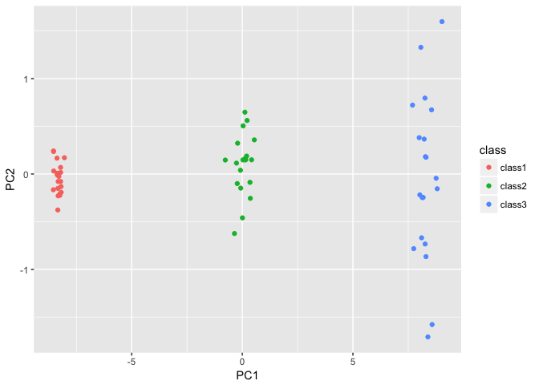

### Q6

A researcher collects expression measurements for 1,000 genes in 100 tissue samples. The data can be written as a 1,000 × 100 matrix, which we call X, in which each row represents a gene and each column a tissue sample. Each tissue sample was processed on a different day, and the columns of X are ordered so that the samples that were processed earliest are on the left, and the samples that were processed later are on the right. The tissue samples belong to two groups: control (C) and treatment (T). The C and T samples were processed in a random order across the days. The researcher wishes to determine whether each gene’s expression measurements differ between the treatment and control groups.
As a pre-analysis (before comparing T versus C), the researcher performs a principal component analysis of the data, and finds that the first principal component (a vector of length 100) has a strong linear trend from left to right, and explains 10% of the variation. The researcher now remembers that each patient sample was run on one of two machines, A and B, and machine A was used more often in the earlier times while B was used more often later. The researcher has a record of which sample was run on which machine.

(a) Explain what it means that the first principal component “explains 10 % of the variation”.

10% of the tissue sample variation was due to the 1st PC, which comes from expression level differences among difference genes.  

(b) The researcher decides to replace the (j, i)th element of X with xji − φj1zi1 
where zi1 is the ith score, and φj1 is the jth loading, for the first principal component. He will then perform a two-sample t-test on each gene in this new data set in order to determine whether its expression differs between the two conditions. Critique this idea, and suggest a better approach. (The principal component analysis is performed on XT ).

By replacing the original data with PCA derived data, he wanted to decompose the time and machine effect so that he can compare T and C. There are two problems, 1) the way he did it extracted variations due to genes, instead of variation due to time or machine 2) multiple test problem 

I would use edgeR's negative binomial model for this problem, model: expression ~ treatment * machine + time, look for genes significant for treatment effect and then use FDR to account for multiple test problem. 

(c) Design and run a small simulation experiment to demonstrate the superiority of your idea.

skip for now... 

### Q8

In Section 10.2.3, a formula for calculating PVE was given in Equation 10.8. We also saw that the PVE can be obtained using the sdev output of the prcomp() function.

On the USArrests data, calculate PVE in two ways:

(a) Using the sdev output of the prcomp() function, as was done in Section 10.2.3.


```r
names(USArrests)
```

```
## [1] "Murder"   "Assault"  "UrbanPop" "Rape"
```

```r
pr.out=prcomp(USArrests, scale=TRUE)
pr.out$sdev
```

```
## [1] 1.5748783 0.9948694 0.5971291 0.4164494
```

```r
pr.var=pr.out$sdev ^2 
pve=pr.var/sum(pr.var)
pve 
```

```
## [1] 0.62006039 0.24744129 0.08914080 0.04335752
```

(b) By applying Equation 10.8 directly. That is, use the prcomp() function to compute the principal component loadings. Then, use those loadings in Equation 10.8 to obtain the PVE.


These two approaches should give the same results.

Hint: You will only obtain the same results in (a) and (b) if the same data is used in both cases. For instance, if in (a) you performed prcomp() using centered and scaled variables, then you must center and scale the variables before applying Equation 10.3 in (b).

### Q10

In this problem, you will generate simulated data, and then perform PCA and K-means clustering on the data.

(a) Generate a simulated data set with 20 observations in each of three classes (i.e. 60 observations total), and 50 variables.

Hint: There are a number of functions in R that you can use to generate data. One example is the rnorm() function; runif() is another option. Be sure to add a mean shift to the observations in each class so that there are three distinct classes.


```r
library(tidyverse)
```

```
## ── Attaching packages ────────────────────────────────── tidyverse 1.2.1 ──
```

```
## ✔ ggplot2 2.2.1     ✔ purrr   0.2.4
## ✔ tibble  1.4.2     ✔ dplyr   0.7.4
## ✔ tidyr   0.8.0     ✔ stringr 1.3.0
## ✔ readr   1.1.1     ✔ forcats 0.3.0
```

```
## Warning: package 'ggplot2' was built under R version 3.2.5
```

```
## Warning: package 'readr' was built under R version 3.2.5
```

```
## Warning: package 'purrr' was built under R version 3.2.5
```

```
## Warning: package 'dplyr' was built under R version 3.2.5
```

```
## ── Conflicts ───────────────────────────────────── tidyverse_conflicts() ──
## ✖ dplyr::filter() masks stats::filter()
## ✖ dplyr::lag()    masks stats::lag()
```

```r
data <- 
sapply(1:50, function(i) c(rnorm(20, mean = 10, sd = 1), rnorm(20, mean = 20, sd = 2), rnorm(20, mean = 30, sd = 3))) %>% as.data.frame() 
data[1:10, 1:10]
```

```
##           V1        V2        V3        V4        V5        V6        V7
## 1   9.650277  8.643926 10.933925 11.840260  9.579166 10.338160 11.835362
## 2   9.277006  8.862029  8.561211  9.997479  9.825255 10.827551  8.749139
## 3   8.325762  8.461460  9.984632 10.534361  9.923814 11.012053 10.888868
## 4  11.624102 10.794536 10.671491 10.244363 12.027446 10.027127  9.241382
## 5   8.830336  8.358138 10.707814 10.110941 10.943385  8.770614  9.784536
## 6   8.984552  9.549437  7.729354 11.357780  9.122747  7.829582  8.994130
## 7  11.873620 10.009315 11.113467 11.701891 11.282754  9.431821 10.682694
## 8  10.499565 10.353670  9.469842 10.976721 11.437187  8.957853 10.615496
## 9   9.956441 11.235719 11.257758  8.948092  9.255877 10.164968  9.599112
## 10  9.437925  9.103304  9.501402  9.725360  8.950612 11.086921 10.340125
##           V8        V9       V10
## 1  10.567768  8.663927  9.611233
## 2  10.173719  9.292470  8.353100
## 3  10.579822  9.725960 10.074044
## 4  10.511329 10.426539  9.644316
## 5   9.834549  9.104669 10.816335
## 6   8.445736 10.748245 10.618372
## 7   8.890348 11.639693 10.873078
## 8   6.563225 10.312158 10.350579
## 9   9.505856  9.075824 10.758189
## 10  9.943551  8.154229  9.537045
```

```r
dim(data) 
```

```
## [1] 60 50
```

(b) Perform PCA on the 60 observations and plot the first two principal component score vectors. Use a different color to indicate the observations in each of the three classes. If the three classes appear separated in this plot, then continue on to part (c). If not, then return to part (a) and modify the simulation so that there is greater separation between the three classes. Do not continue to part (c) until the three classes show at least some separation in the first two principal component score vectors.


```r
pr.out=prcomp(data, scale=TRUE)
pc <-
pr.out$x %>% as.data.frame() %>%
  dplyr::select(PC1, PC2)

data$class[1:20] <- rep("class1", 20)
data$class[21:40] <- rep("class2", 20)
data$class[41:60] <- rep("class3", 20)

pc$class <- data$class

pc %>%
  ggplot() +
  geom_point(aes(x = PC1, y = PC2, color = class))
```

<!-- -->

 
