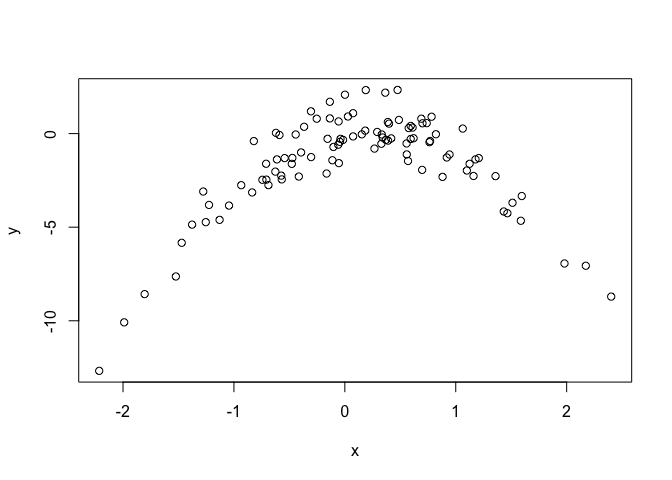
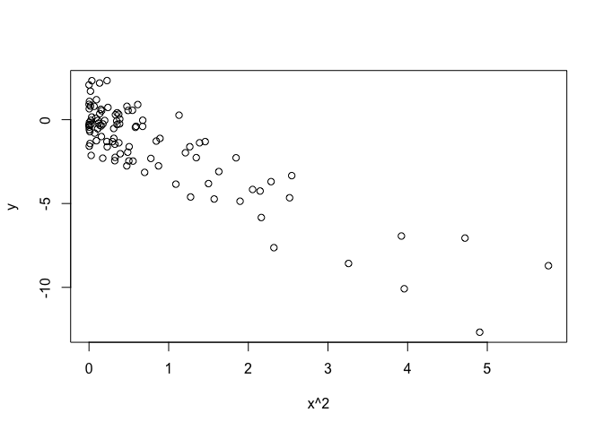

### 3 

We now review k-fold cross-validation.

(a) Explain how k-fold cross-validation is implemented.

randomly dividing the set of observations into K groups, or folds of approximately equal size. The 1st fold is treated as a validation set, and the method is fit on the remaining  k-1 folds. The MSE1 is then computed on the observation in the held-out fold. This procedure is repeated for k times; each time, a different group of observation is treated as a validation set. The process resulted in k estimates of the test error, MSE1... MSEk. The k-fold CV estiamte is computed by avaraging these values. 

(b) What are the advantages and disadvantages of k-fold cross-validation relative to: i. The validation set approach? ii. LOOCV. 

low bias and low variance compared to validation set approach, however, more computationally expensive. Compared to LOOCV, low variance and has computational advantage. 

### 5 

In Chapter 4, we used logistic regression to predict the probability of default using income and balance on the Default data set. We will now estimate the test error of this logistic regression model using the validation set approach. Do not forget to set a random seed before beginning your analysis.

(a) Fit a logistic regression model that uses income and balance to predict default.

(b) Using the validation set approach, estimate the test error of this model. In order to do this, you must perform the following steps:

i. Split the sample set into a training set and a validation set.

ii. Fit a multiple logistic regression model using only the training observations.

iii. Obtain a prediction of default status for each individual in the validation set by computing the posterior probability of default for that individual, and classifying the individual to the default category if the posterior probability is greater than 0.5.

iv. Compute the validation set error, which is the fraction of the observations in the validation set that are misclassified.

(c) Repeat the process in (b) three times, using three different splits of the observations into a training set and a validation set. Comment on the results obtained.

(d) Now consider a logistic regression model that predicts the prob- ability of default using income, balance, and a dummy variable for student. Estimate the test error for this model using the val- idation set approach. Comment on whether or not including a dummy variable for student leads to a reduction in the test error rate. 


```r
library(tidyverse)
```

```
## ── Attaching packages ────────────────────────────────── tidyverse 1.2.1 ──
```

```
## ✔ ggplot2 2.2.1     ✔ purrr   0.2.4
## ✔ tibble  1.3.4     ✔ dplyr   0.7.4
## ✔ tidyr   0.7.2     ✔ stringr 1.2.0
## ✔ readr   1.1.1     ✔ forcats 0.2.0
```

```
## Warning: package 'ggplot2' was built under R version 3.2.5
```

```
## Warning: package 'tibble' was built under R version 3.2.5
```

```
## Warning: package 'tidyr' was built under R version 3.2.5
```

```
## Warning: package 'readr' was built under R version 3.2.5
```

```
## Warning: package 'purrr' was built under R version 3.2.5
```

```
## Warning: package 'dplyr' was built under R version 3.2.5
```

```
## Warning: package 'stringr' was built under R version 3.2.5
```

```
## Warning: package 'forcats' was built under R version 3.2.5
```

```
## ── Conflicts ───────────────────────────────────── tidyverse_conflicts() ──
## ✖ dplyr::filter() masks stats::filter()
## ✖ dplyr::lag()    masks stats::lag()
```

```r
library(boot)
```

```
## Warning: package 'boot' was built under R version 3.2.5
```

```r
library(ISLR)
```

```
## Warning: package 'ISLR' was built under R version 3.2.5
```

```r
# a) 
attach(Default)
head(Default)
```

```
##   default student   balance    income
## 1      No      No  729.5265 44361.625
## 2      No     Yes  817.1804 12106.135
## 3      No      No 1073.5492 31767.139
## 4      No      No  529.2506 35704.494
## 5      No      No  785.6559 38463.496
## 6      No     Yes  919.5885  7491.559
```

```r
glm.fits.1=glm(default ~ balance + income, data=Default ,family=binomial)
summary(glm.fits.1)
```

```
## 
## Call:
## glm(formula = default ~ balance + income, family = binomial, 
##     data = Default)
## 
## Deviance Residuals: 
##     Min       1Q   Median       3Q      Max  
## -2.4725  -0.1444  -0.0574  -0.0211   3.7245  
## 
## Coefficients:
##               Estimate Std. Error z value Pr(>|z|)    
## (Intercept) -1.154e+01  4.348e-01 -26.545  < 2e-16 ***
## balance      5.647e-03  2.274e-04  24.836  < 2e-16 ***
## income       2.081e-05  4.985e-06   4.174 2.99e-05 ***
## ---
## Signif. codes:  0 '***' 0.001 '**' 0.01 '*' 0.05 '.' 0.1 ' ' 1
## 
## (Dispersion parameter for binomial family taken to be 1)
## 
##     Null deviance: 2920.6  on 9999  degrees of freedom
## Residual deviance: 1579.0  on 9997  degrees of freedom
## AIC: 1585
## 
## Number of Fisher Scoring iterations: 8
```

```r
glm.probs = predict(glm.fits.1, type = "response")
glm.pred = rep("No", nrow(Default))
glm.pred[glm.probs > .5] = "yes"
table(glm.pred, default)
```

```
##         default
## glm.pred   No  Yes
##      No  9629  225
##      yes   38  108
```

```r
(225 + 38)/ nrow(Default) # 2% training set error 
```

```
## [1] 0.0263
```

```r
# b) 
set.seed(1)
train_ID <- sample(rownames(Default), size = round(nrow(Default) * 0.5), replace = F) 
train <- Default[rownames(Default) %in% train_ID,]
test <- Default[!(rownames(Default) %in% train_ID),] 

glm.fits.2<-glm(default~balance + income ,data=train, family = binomial)
summary(glm.fits.2)
```

```
## 
## Call:
## glm(formula = default ~ balance + income, family = binomial, 
##     data = train)
## 
## Deviance Residuals: 
##     Min       1Q   Median       3Q      Max  
## -2.3583  -0.1268  -0.0475  -0.0165   3.8116  
## 
## Coefficients:
##               Estimate Std. Error z value Pr(>|z|)    
## (Intercept) -1.208e+01  6.658e-01 -18.148   <2e-16 ***
## balance      6.053e-03  3.467e-04  17.457   <2e-16 ***
## income       1.858e-05  7.573e-06   2.454   0.0141 *  
## ---
## Signif. codes:  0 '***' 0.001 '**' 0.01 '*' 0.05 '.' 0.1 ' ' 1
## 
## (Dispersion parameter for binomial family taken to be 1)
## 
##     Null deviance: 1457.0  on 4999  degrees of freedom
## Residual deviance:  734.4  on 4997  degrees of freedom
## AIC: 740.4
## 
## Number of Fisher Scoring iterations: 8
```

```r
glm.probs = predict(glm.fits.2, test, type = "response")
glm.pred = rep("No", nrow(Default)/2)
glm.pred[glm.probs > .5] = "yes"
table(glm.pred, test$default)
```

```
##         
## glm.pred   No  Yes
##      No  4805  115
##      yes   28   52
```

```r
(100 + 18)/ (nrow(Default)/2) # 2% training set error 
```

```
## [1] 0.0236
```

```r
# c) 
set.seed(2)
train_ID <- sample(rownames(Default), size = round(nrow(Default) * 0.5), replace = F) 
train <- Default[rownames(Default) %in% train_ID,]
test <- Default[!(rownames(Default) %in% train_ID),] 

glm.fits.2<-glm(default~balance + income ,data=train, family = binomial)
summary(glm.fits.2)
```

```
## 
## Call:
## glm(formula = default ~ balance + income, family = binomial, 
##     data = train)
## 
## Deviance Residuals: 
##     Min       1Q   Median       3Q      Max  
## -2.2043  -0.1385  -0.0552  -0.0203   3.7058  
## 
## Coefficients:
##               Estimate Std. Error z value Pr(>|z|)    
## (Intercept) -1.184e+01  6.403e-01 -18.492  < 2e-16 ***
## balance      5.703e-03  3.266e-04  17.460  < 2e-16 ***
## income       2.717e-05  7.183e-06   3.783 0.000155 ***
## ---
## Signif. codes:  0 '***' 0.001 '**' 0.01 '*' 0.05 '.' 0.1 ' ' 1
## 
## (Dispersion parameter for binomial family taken to be 1)
## 
##     Null deviance: 1443.44  on 4999  degrees of freedom
## Residual deviance:  776.64  on 4997  degrees of freedom
## AIC: 782.64
## 
## Number of Fisher Scoring iterations: 8
```

```r
glm.probs = predict(glm.fits.2, test, type = "response")
glm.pred = rep("No", nrow(Default)/2)
glm.pred[glm.probs > .5] = "yes"
table(glm.pred, test$default)
```

```
##         
## glm.pred   No  Yes
##      No  4811  118
##      yes   20   51
```

```r
(118 + 20)/ (nrow(Default)/2) # 2% training set error 
```

```
## [1] 0.0276
```

```r
set.seed(3)
train_ID <- sample(rownames(Default), size = round(nrow(Default) * 0.5), replace = F) 
train <- Default[rownames(Default) %in% train_ID,]
test <- Default[!(rownames(Default) %in% train_ID),] 

glm.fits.2<-glm(default~balance + income ,data=train, family = binomial)
summary(glm.fits.2)
```

```
## 
## Call:
## glm(formula = default ~ balance + income, family = binomial, 
##     data = train)
## 
## Deviance Residuals: 
##     Min       1Q   Median       3Q      Max  
## -2.1014  -0.1433  -0.0569  -0.0206   3.7241  
## 
## Coefficients:
##               Estimate Std. Error z value Pr(>|z|)    
## (Intercept) -1.160e+01  6.055e-01 -19.162  < 2e-16 ***
## balance      5.660e-03  3.131e-04  18.079  < 2e-16 ***
## income       2.254e-05  6.972e-06   3.233  0.00123 ** 
## ---
## Signif. codes:  0 '***' 0.001 '**' 0.01 '*' 0.05 '.' 0.1 ' ' 1
## 
## (Dispersion parameter for binomial family taken to be 1)
## 
##     Null deviance: 1530.39  on 4999  degrees of freedom
## Residual deviance:  812.77  on 4997  degrees of freedom
## AIC: 818.77
## 
## Number of Fisher Scoring iterations: 8
```

```r
glm.probs = predict(glm.fits.2, test, type = "response")
glm.pred = rep("No", nrow(Default)/2)
glm.pred[glm.probs > .5] = "yes"
table(glm.pred, test$default)
```

```
##         
## glm.pred   No  Yes
##      No  4828  108
##      yes   16   48
```

```r
(108 + 16)/ (nrow(Default)/2) # 2% training set error 
```

```
## [1] 0.0248
```

```r
### not much different, probably because the training set is big enough. 

# d) 
set.seed(1)
train_ID <- sample(rownames(Default), size = round(nrow(Default) * 0.5), replace = F) 
train <- Default[rownames(Default) %in% train_ID,]
test <- Default[!(rownames(Default) %in% train_ID),] 

glm.fits.2<-glm(default~balance + income + student,data=train, family = binomial)
summary(glm.fits.2)
```

```
## 
## Call:
## glm(formula = default ~ balance + income + student, family = binomial, 
##     data = train)
## 
## Deviance Residuals: 
##     Min       1Q   Median       3Q      Max  
## -2.2905  -0.1260  -0.0465  -0.0161   3.7715  
## 
## Coefficients:
##               Estimate Std. Error z value Pr(>|z|)    
## (Intercept) -1.147e+01  7.562e-01 -15.164   <2e-16 ***
## balance      6.124e-03  3.525e-04  17.373   <2e-16 ***
## income       2.433e-06  1.256e-05   0.194    0.846    
## studentYes  -5.608e-01  3.473e-01  -1.615    0.106    
## ---
## Signif. codes:  0 '***' 0.001 '**' 0.01 '*' 0.05 '.' 0.1 ' ' 1
## 
## (Dispersion parameter for binomial family taken to be 1)
## 
##     Null deviance: 1456.95  on 4999  degrees of freedom
## Residual deviance:  731.81  on 4996  degrees of freedom
## AIC: 739.81
## 
## Number of Fisher Scoring iterations: 8
```

```r
glm.probs = predict(glm.fits.2, test, type = "response")
glm.pred = rep("No", nrow(Default)/2)
glm.pred[glm.probs > .5] = "yes"
table(glm.pred, test$default)
```

```
##         
## glm.pred   No  Yes
##      No  4803  114
##      yes   30   53
```

```r
(110 + 14)/ (nrow(Default)/2) # 2% training set error 
```

```
## [1] 0.0248
```

```r
# not much difference, did I do something wrong? 
```

### 7 

In Sections 5.3.2 and 5.3.3, we saw that the cv.glm() function can be used in order to compute the LOOCV test error estimate. Alterna- tively, one could compute those quantities using just the glm() and predict.glm() functions, and a for loop. You will now take this ap- proach in order to compute the LOOCV error for a simple logistic regression model on the Weekly data set. Recall that in the context of classification problems, the LOOCV error is given in (5.4).

(a) Fit a logistic regression model that predicts Direction using Lag1 and Lag2.

(b) Fit a logistic regression model that predicts Direction using Lag1 and Lag2 using all but the first observation.

(c) Use the model from (b) to predict the direction of the first obser- vation. You can do this by predicting that the first observation will go up if P(Direction="Up"|Lag1, Lag2) > 0.5. Was this ob- servation correctly classified?

(d) Write a for loop from i=1 to i=n,where n is the number of observations in the data set, that performs each of the following steps:

i. Fit a logistic regression model using all but the ith obser- vation to predict Direction using Lag1 and Lag2.

ii. Compute the posterior probability of the market moving up for the ith observation.

iii. Use the posterior probability for the ith observation in order to predict whether or not the market moves up.

iv. Determine whether or not an error was made in predicting the direction for the ith observation. If an error was made, then indicate this as a 1, and otherwise indicate it as a 0.

(e) Take the average of the n numbers obtained in (d)iv in order to obtain the LOOCV estimate for the test error. Comment on the results.


```r
attach(Weekly)

# a) 
glm.fits.1=glm(Direction ~ Lag1+Lag2, data=Weekly ,family=binomial)
summary(glm.fits.1)
```

```
## 
## Call:
## glm(formula = Direction ~ Lag1 + Lag2, family = binomial, data = Weekly)
## 
## Deviance Residuals: 
##    Min      1Q  Median      3Q     Max  
## -1.623  -1.261   1.001   1.083   1.506  
## 
## Coefficients:
##             Estimate Std. Error z value Pr(>|z|)    
## (Intercept)  0.22122    0.06147   3.599 0.000319 ***
## Lag1        -0.03872    0.02622  -1.477 0.139672    
## Lag2         0.06025    0.02655   2.270 0.023232 *  
## ---
## Signif. codes:  0 '***' 0.001 '**' 0.01 '*' 0.05 '.' 0.1 ' ' 1
## 
## (Dispersion parameter for binomial family taken to be 1)
## 
##     Null deviance: 1496.2  on 1088  degrees of freedom
## Residual deviance: 1488.2  on 1086  degrees of freedom
## AIC: 1494.2
## 
## Number of Fisher Scoring iterations: 4
```

```r
# b) 
glm.fits.1=glm(Direction ~ Lag1+Lag2, data=Weekly[-1,] ,family=binomial)
summary(glm.fits.1)
```

```
## 
## Call:
## glm(formula = Direction ~ Lag1 + Lag2, family = binomial, data = Weekly[-1, 
##     ])
## 
## Deviance Residuals: 
##     Min       1Q   Median       3Q      Max  
## -1.6258  -1.2617   0.9999   1.0819   1.5071  
## 
## Coefficients:
##             Estimate Std. Error z value Pr(>|z|)    
## (Intercept)  0.22324    0.06150   3.630 0.000283 ***
## Lag1        -0.03843    0.02622  -1.466 0.142683    
## Lag2         0.06085    0.02656   2.291 0.021971 *  
## ---
## Signif. codes:  0 '***' 0.001 '**' 0.01 '*' 0.05 '.' 0.1 ' ' 1
## 
## (Dispersion parameter for binomial family taken to be 1)
## 
##     Null deviance: 1494.6  on 1087  degrees of freedom
## Residual deviance: 1486.5  on 1085  degrees of freedom
## AIC: 1492.5
## 
## Number of Fisher Scoring iterations: 4
```

```r
# c) 
glm.probs=predict(glm.fits.1,Weekly[1,],type="response")

glm.probs # greater than 0.5, goes up 
```

```
##         1 
## 0.5713923
```

```r
glm.probs <- ifelse(glm.probs > 0.5, "Up", "Down")
glm.probs == Weekly[1,]$Direction # down # wrong prediction 
```

```
##     1 
## FALSE
```

```r
ifelse(glm.probs == Weekly[1,]$Direction, 0, 1) 
```

```
## 1 
## 1
```

```r
# d) 
output <- 
sapply(seq_along(1:nrow(Weekly)), function(i) {
  fit <- glm(Direction ~ Lag1+Lag2, data=Weekly[-i,] ,family=binomial) 
  probs<- predict(fit,Weekly[i,],type="response")
  probs <- ifelse(probs > 0.5, "Up", "Down")
  as.numeric(ifelse(probs == Weekly[i,]$Direction, 0, 1))
})

output 
```

```
##    [1] 1 1 0 1 0 1 0 0 0 1 1 0 1 0 1 0 1 0 1 0 0 0 1 1 1 1 1 1 0 1 1 1 1 0
##   [35] 1 0 0 0 1 0 1 0 0 1 0 1 1 1 0 1 0 0 0 1 0 0 1 1 0 0 0 0 1 0 1 1 0 0
##   [69] 1 0 1 1 0 0 0 1 0 1 1 0 0 1 1 0 1 1 0 0 1 0 0 1 1 1 0 0 0 0 0 1 0 1
##  [103] 1 0 0 1 0 1 0 0 1 1 0 0 1 0 0 1 0 0 1 1 1 1 0 0 0 1 0 1 0 1 1 0 0 0
##  [137] 1 1 1 0 0 0 1 0 0 0 0 0 0 1 1 1 0 1 0 0 1 1 0 1 0 0 1 1 0 0 1 0 0 1
##  [171] 0 0 1 1 1 0 1 0 1 0 0 0 0 0 0 0 0 1 1 0 1 0 1 0 1 0 1 0 0 1 0 0 1 0
##  [205] 0 1 0 1 0 1 1 1 0 0 1 1 0 1 0 0 1 1 0 0 0 1 1 1 0 1 0 1 0 1 0 0 0 1
##  [239] 1 0 1 0 1 0 1 0 1 0 1 1 0 1 0 0 1 0 0 1 0 0 0 0 0 1 0 0 0 1 0 0 1 0
##  [273] 0 0 1 0 0 1 0 0 1 0 0 1 0 1 1 0 0 0 0 0 1 0 1 0 0 1 0 0 0 1 0 0 1 1
##  [307] 0 0 1 0 0 0 0 1 0 1 1 0 0 1 0 1 0 1 1 0 0 0 1 0 1 0 0 1 1 1 1 0 1 0
##  [341] 0 1 0 0 0 1 0 1 0 1 0 0 0 0 0 1 1 0 0 1 0 0 1 0 0 0 1 1 0 1 1 1 1 1
##  [375] 0 0 0 1 0 0 0 0 0 0 1 0 1 1 0 0 1 1 0 0 0 0 0 1 0 0 1 1 1 0 1 0 1 0
##  [409] 1 1 1 0 1 0 0 0 0 0 0 0 0 0 0 1 0 1 0 1 0 1 0 0 1 0 1 0 0 0 0 0 1 1
##  [443] 1 1 0 1 1 0 1 0 1 1 0 1 0 0 1 0 0 1 1 0 0 0 0 1 1 0 0 1 0 1 0 0 0 1
##  [477] 0 0 1 0 0 0 1 1 1 0 1 0 0 0 1 0 1 1 1 0 0 0 0 1 1 1 0 1 1 0 1 0 0 0
##  [511] 1 0 1 0 0 0 1 0 1 1 0 0 1 1 0 0 0 1 1 0 1 0 1 1 1 1 1 0 0 0 1 0 0 0
##  [545] 1 1 0 1 0 0 0 1 1 1 1 1 1 0 1 0 1 0 0 1 0 0 1 1 1 0 0 0 1 1 1 1 1 1
##  [579] 1 1 1 1 0 1 0 0 1 0 0 1 0 1 0 0 1 0 0 1 0 1 1 0 1 1 1 0 1 0 1 0 1 0
##  [613] 0 0 1 0 1 0 1 0 1 1 0 1 1 0 1 0 1 0 1 1 1 1 0 1 1 0 0 0 1 1 1 1 0 1
##  [647] 1 1 0 1 0 0 0 1 1 1 1 1 1 0 1 0 0 1 0 0 0 1 1 0 1 0 1 1 1 1 0 0 0 1
##  [681] 1 0 0 0 0 0 0 0 0 0 0 1 0 0 0 0 1 0 0 1 0 1 1 0 0 0 0 1 0 1 0 1 0 1
##  [715] 0 0 1 1 0 0 0 0 0 0 0 0 0 1 0 0 1 0 0 1 1 1 0 1 1 0 1 1 1 1 0 0 0 1
##  [749] 1 1 1 1 1 0 1 0 0 0 0 0 0 1 0 1 1 1 0 0 0 1 0 0 1 0 0 0 1 1 1 0 0 0
##  [783] 1 0 0 1 1 1 0 0 1 0 1 0 1 0 0 1 0 0 1 0 0 0 0 0 1 0 1 1 0 0 1 1 0 1
##  [817] 1 1 0 0 0 0 0 1 1 0 0 1 0 0 1 0 1 0 0 0 1 1 0 1 1 0 1 0 1 0 1 1 0 0
##  [851] 1 1 1 0 1 1 0 0 0 1 0 1 0 1 0 1 0 0 0 0 0 1 0 0 1 1 0 0 1 0 1 0 1 1
##  [885] 0 1 0 1 1 0 0 0 1 0 0 0 0 0 0 0 1 0 1 0 1 0 0 0 1 1 1 1 1 0 1 1 0 0
##  [919] 0 0 0 1 0 0 1 0 0 0 0 1 0 1 1 1 0 0 1 1 0 1 1 1 1 0 1 0 1 0 1 0 1 0
##  [953] 1 0 0 1 1 1 1 1 0 1 0 0 0 1 1 1 0 1 1 1 1 0 0 0 0 1 1 0 0 0 0 1 0 0
##  [987] 1 1 1 0 0 1 1 1 0 1 0 0 0 0 1 0 0 1 0 1 0 0 1 1 1 1 0 1 0 0 1 0 0 1
## [1021] 0 0 1 1 0 1 1 1 0 1 1 0 0 0 1 0 1 0 1 1 1 1 0 0 1 0 0 0 0 0 0 1 0 1
## [1055] 1 0 0 0 0 0 1 1 1 0 0 0 1 0 1 1 1 0 0 0 0 1 0 0 0 0 0 1 0 1 0 0 0 0
## [1089] 0
```

```r
# e) 
sum(output)/length(output) # 45% test error  
```

```
## [1] 0.4499541
```

### 8 

We will now perform cross-validation on a simulated data set.

(a) Generate a simulated data set as follows:


```r
set.seed(1)
x=rnorm(100)
y=x-2*x^2+rnorm(100)
```

In this data set, what is n and what is p? Write out the model used to generate the data in equation form.

(b) Create a scatterplot of X against Y . Comment on what you find.

(c) Set a random seed, and then compute the LOOCV errors that result from fitting the following four models using least squares:
         
i. Y = β0 + β1X + ε

ii. Y = β0 + β1X + β2X2 + ε

iii. Y = β0 +β1X +β2X2 +β3X3 +ε

iv. Y = β0 +β1X +β2X2 +β3X3 +β4X4 +ε.

Note you may find it helpful to use the data.frame() function to create a single data set containing both X and Y .

(d) Repeat (c) using another random seed, and report your results.
Are your results the same as what you got in (c)? Why?

(e) Which of the models in (c) had the smallest LOOCV error? Is this what you expected? Explain your answer.

(f) Comment on the statistical significance of the coefficient esti- mates that results from fitting each of the models in (c) using least squares. Do these results agree with the conclusions drawn based on the cross-validation results? 


```r
# a) 
# n is 100, the sample size. p is the predictor, here it is x, only one p here.  

# b) 
plot(x, y)
```

<!-- -->

```r
plot(x^2, y) # quadratic relationshop between x and y 
```

<!-- -->

```r
# c) 
set.seed(1)
data <- data.frame(y = y, 
                   x = x)
data %>% dim()
```

```
## [1] 100   2
```

```r
cv.error <- 
sapply(c(1:4), function(i) {
  glm.fit=glm(y~poly(x ,i),data=data)
  cv.glm(data,glm.fit)$delta[1]
})

cv.error
```

```
## [1] 7.2881616 0.9374236 0.9566218 0.9539049
```

```r
# d) 
set.seed(2)
data <- data.frame(y = y, 
                   x = x)
data %>% dim()
```

```
## [1] 100   2
```

```r
cv.error <- 
sapply(c(1:4), function(i) {
  glm.fit=glm(y~poly(x ,i),data=data)
  cv.glm(data,glm.fit)$delta[1]
})

cv.error
```

```
## [1] 7.2881616 0.9374236 0.9566218 0.9539049
```

```r
# e) 
# 2nd, because b) 

# f) least square 

fit.m1 <- lm(y ~ poly(x, degree= 1), data = data) 
summary(fit.m1)
```

```
## 
## Call:
## lm(formula = y ~ poly(x, degree = 1), data = data)
## 
## Residuals:
##     Min      1Q  Median      3Q     Max 
## -9.5161 -0.6800  0.6812  1.5491  3.8183 
## 
## Coefficients:
##                     Estimate Std. Error t value Pr(>|t|)    
## (Intercept)           -1.550      0.260  -5.961 3.95e-08 ***
## poly(x, degree = 1)    6.189      2.600   2.380   0.0192 *  
## ---
## Signif. codes:  0 '***' 0.001 '**' 0.01 '*' 0.05 '.' 0.1 ' ' 1
## 
## Residual standard error: 2.6 on 98 degrees of freedom
## Multiple R-squared:  0.05465,	Adjusted R-squared:  0.045 
## F-statistic: 5.665 on 1 and 98 DF,  p-value: 0.01924
```

```r
fit.m2 <- lm(y ~ poly(x, degree= 2), data = data)
summary(fit.m2)
```

```
## 
## Call:
## lm(formula = y ~ poly(x, degree = 2), data = data)
## 
## Residuals:
##     Min      1Q  Median      3Q     Max 
## -1.9650 -0.6254 -0.1288  0.5803  2.2700 
## 
## Coefficients:
##                      Estimate Std. Error t value Pr(>|t|)    
## (Intercept)           -1.5500     0.0958  -16.18  < 2e-16 ***
## poly(x, degree = 2)1   6.1888     0.9580    6.46 4.18e-09 ***
## poly(x, degree = 2)2 -23.9483     0.9580  -25.00  < 2e-16 ***
## ---
## Signif. codes:  0 '***' 0.001 '**' 0.01 '*' 0.05 '.' 0.1 ' ' 1
## 
## Residual standard error: 0.958 on 97 degrees of freedom
## Multiple R-squared:  0.873,	Adjusted R-squared:  0.8704 
## F-statistic: 333.3 on 2 and 97 DF,  p-value: < 2.2e-16
```

```r
fit.m3 <- lm(y ~ poly(x, degree= 3), data = data)
summary(fit.m3)
```

```
## 
## Call:
## lm(formula = y ~ poly(x, degree = 3), data = data)
## 
## Residuals:
##     Min      1Q  Median      3Q     Max 
## -1.9765 -0.6302 -0.1227  0.5545  2.2843 
## 
## Coefficients:
##                       Estimate Std. Error t value Pr(>|t|)    
## (Intercept)           -1.55002    0.09626 -16.102  < 2e-16 ***
## poly(x, degree = 3)1   6.18883    0.96263   6.429 4.97e-09 ***
## poly(x, degree = 3)2 -23.94830    0.96263 -24.878  < 2e-16 ***
## poly(x, degree = 3)3   0.26411    0.96263   0.274    0.784    
## ---
## Signif. codes:  0 '***' 0.001 '**' 0.01 '*' 0.05 '.' 0.1 ' ' 1
## 
## Residual standard error: 0.9626 on 96 degrees of freedom
## Multiple R-squared:  0.8731,	Adjusted R-squared:  0.8691 
## F-statistic: 220.1 on 3 and 96 DF,  p-value: < 2.2e-16
```

```r
fit.m4 <- lm(y ~ poly(x, degree= 4), data = data)
summary(fit.m4)
```

```
## 
## Call:
## lm(formula = y ~ poly(x, degree = 4), data = data)
## 
## Residuals:
##     Min      1Q  Median      3Q     Max 
## -2.0550 -0.6212 -0.1567  0.5952  2.2267 
## 
## Coefficients:
##                       Estimate Std. Error t value Pr(>|t|)    
## (Intercept)           -1.55002    0.09591 -16.162  < 2e-16 ***
## poly(x, degree = 4)1   6.18883    0.95905   6.453 4.59e-09 ***
## poly(x, degree = 4)2 -23.94830    0.95905 -24.971  < 2e-16 ***
## poly(x, degree = 4)3   0.26411    0.95905   0.275    0.784    
## poly(x, degree = 4)4   1.25710    0.95905   1.311    0.193    
## ---
## Signif. codes:  0 '***' 0.001 '**' 0.01 '*' 0.05 '.' 0.1 ' ' 1
## 
## Residual standard error: 0.9591 on 95 degrees of freedom
## Multiple R-squared:  0.8753,	Adjusted R-squared:  0.8701 
## F-statistic: 166.7 on 4 and 95 DF,  p-value: < 2.2e-16
```

```r
### forget how to get the best model using least squre method... the model with the highest adjusted R square value should be the best model.  
```

