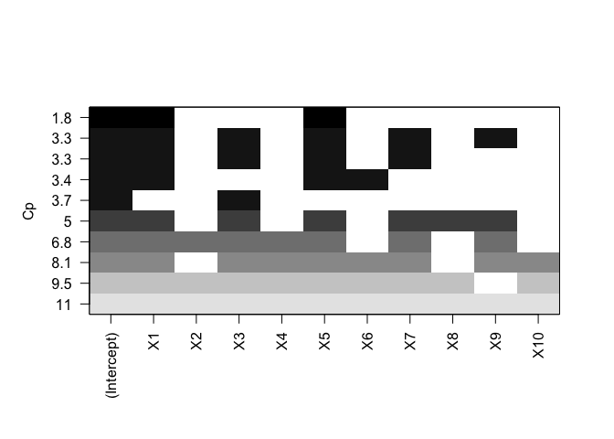
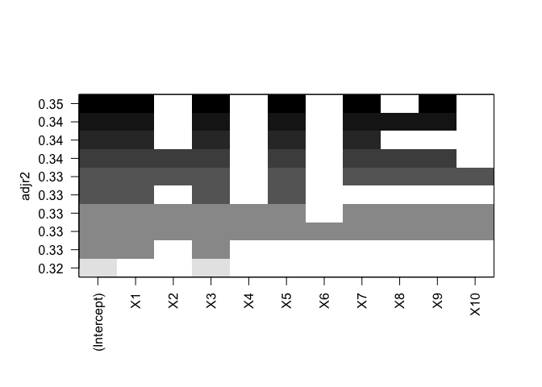
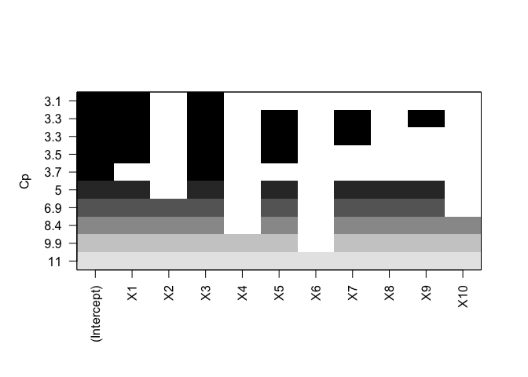
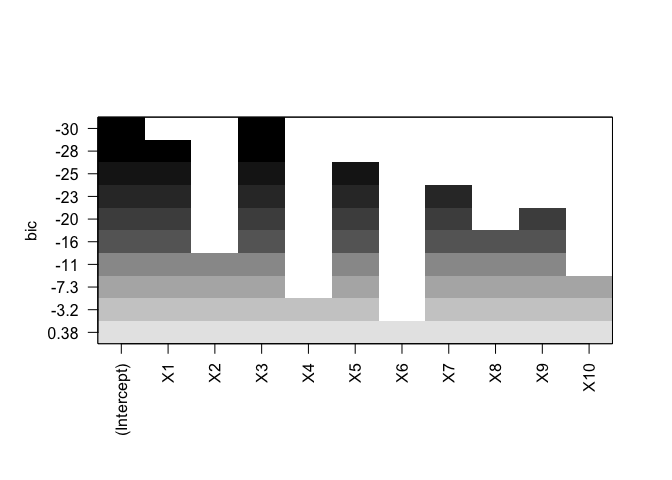
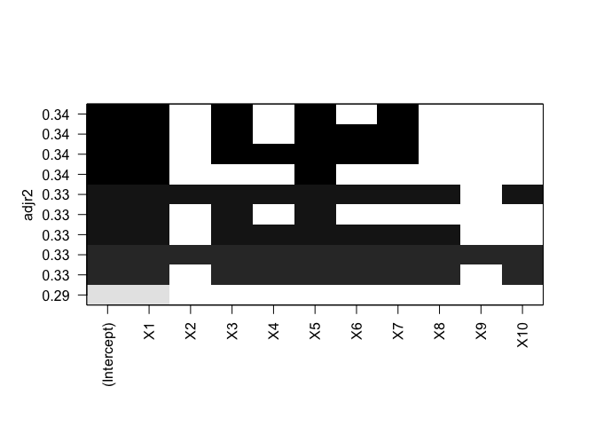
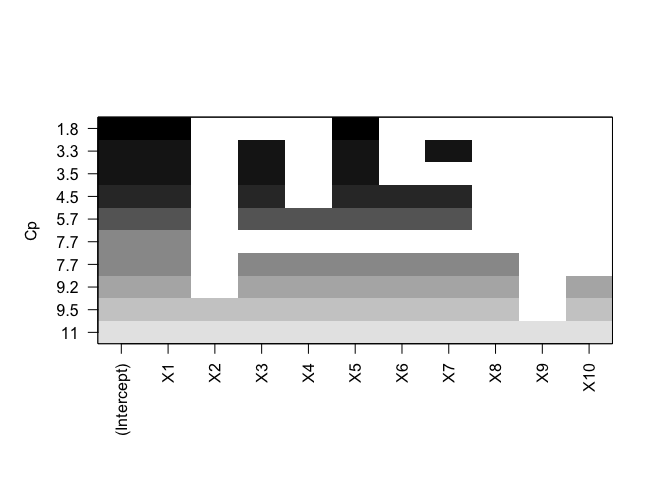
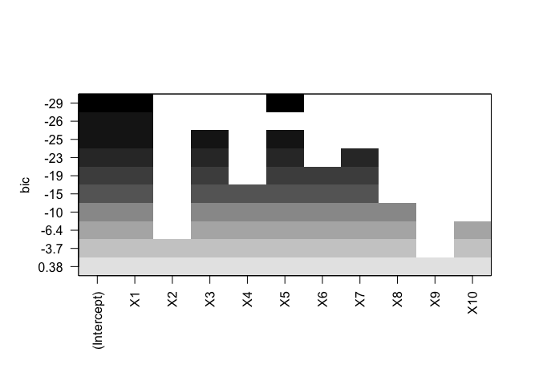

1. We perform best subset, forward stepwise, and backward stepwise selection on a single data set. For each approach, we obtain p + 1 models, containing 0, 1, 2, . . . , p predictors. Explain your answers:

(a) Which of the three models with k predictors has the smallest training RSS?

best subset appoach, because compared to forward and backward approach, it compares RSS for all different combinations of k and pick the one that has the smallest training RSS. 

(b) Which of the three models with k predictors has the smallest test RSS?

still best subset approach, because it looks for all combinations of k. 

(c) True or False:

i. The predictors in the k-variable model identified by forward stepwise are a subset of the predictors in the (k+1)-variable model identified by forward stepwise selection.

True  

ii. The predictors in the k-variable model identified by back- ward stepwise are a subset of the predictors in the (k + 1)- variable model identified by backward stepwise selection.

True  

iii. The predictors in the k-variable model identified by back- ward stepwise are a subset of the predictors in the (k + 1)- variable model identified by forward stepwise selection.

False 

iv. The predictors in the k-variable model identified by forward stepwise are a subset of the predictors in the (k+1)-variable model identified by backward stepwise selection.

False 

v. The predictors in the k-variable model identified by best subset are a subset of the predictors in the (k + 1)-variable model identified by best subset selection.

False 

8. In this exercise, we will generate simulated data, and will then use this data to perform best subset selection.

(a) Use the rnorm() function to generate a predictor X of length n = 100, as well as a noise vector ε of length n = 100.


```r
X <- rnorm(n = 100)
e <- rnorm(n = 100)
```

(b) Generate a response vector Y of length n = 100 according to the model
Y = β0 +β1X +β2X2 +β3X3 +ε, where β0, β1, β2, and β3 are constants of your choice.


```r
Y <- 1 + 0.3 * X + 0.2 * (X ^ 2) + 0.1 * (X ^ 3) + e
```

(c) Use the regsubsets() function to perform best subset selection in order to choose the best model containing the predictors X, X2, . . . , X10. What is the best model obtained according to Cp, BIC, and adjusted R2? Show some plots to provide evidence for your answer, and report the coefficients of the best model ob- tained. Note you will need to use the data.frame() function to create a single data set containing both X and Y .


```r
library(tidyverse)
```

```
## ── Attaching packages ────────────────────────────────── tidyverse 1.2.1 ──
```

```
## ✔ ggplot2 2.2.1     ✔ purrr   0.2.4
## ✔ tibble  1.3.4     ✔ dplyr   0.7.4
## ✔ tidyr   0.7.2     ✔ stringr 1.2.0
## ✔ readr   1.1.1     ✔ forcats 0.2.0
```

```
## Warning: package 'ggplot2' was built under R version 3.2.5
```

```
## Warning: package 'tibble' was built under R version 3.2.5
```

```
## Warning: package 'tidyr' was built under R version 3.2.5
```

```
## Warning: package 'readr' was built under R version 3.2.5
```

```
## Warning: package 'purrr' was built under R version 3.2.5
```

```
## Warning: package 'dplyr' was built under R version 3.2.5
```

```
## Warning: package 'stringr' was built under R version 3.2.5
```

```
## Warning: package 'forcats' was built under R version 3.2.5
```

```
## ── Conflicts ───────────────────────────────────── tidyverse_conflicts() ──
## ✖ dplyr::filter() masks stats::filter()
## ✖ dplyr::lag()    masks stats::lag()
```

```r
library(ISLR) 
```

```
## Warning: package 'ISLR' was built under R version 3.2.5
```

```r
library(leaps)
```

```
## Warning: package 'leaps' was built under R version 3.2.5
```

```r
data.1 <- data.frame(Y = Y, 
                     X1 = X, 
                     X2 = X^2,
                     X3 = X^3,
                     X4 = X^4,
                     X5 = X^5,
                     X6 = X^6,
                     X7 = X^7,
                     X8 = X^8, 
                     X9 = X^9, 
                     X10 = X^10) 

regfit.full=regsubsets(Y~.,data.1, nvmax = 11)
summary(regfit.full)
```

```
## Subset selection object
## Call: regsubsets.formula(Y ~ ., data.1, nvmax = 11)
## 10 Variables  (and intercept)
##     Forced in Forced out
## X1      FALSE      FALSE
## X2      FALSE      FALSE
## X3      FALSE      FALSE
## X4      FALSE      FALSE
## X5      FALSE      FALSE
## X6      FALSE      FALSE
## X7      FALSE      FALSE
## X8      FALSE      FALSE
## X9      FALSE      FALSE
## X10     FALSE      FALSE
## 1 subsets of each size up to 10
## Selection Algorithm: exhaustive
##           X1  X2  X3  X4  X5  X6  X7  X8  X9  X10
## 1  ( 1 )  "*" " " " " " " " " " " " " " " " " " "
## 2  ( 1 )  "*" " " "*" " " " " " " " " " " " " " "
## 3  ( 1 )  " " " " "*" " " " " " " "*" " " " " "*"
## 4  ( 1 )  " " "*" "*" " " " " " " "*" " " "*" " "
## 5  ( 1 )  "*" "*" " " " " "*" " " "*" " " "*" " "
## 6  ( 1 )  " " "*" "*" "*" " " "*" " " "*" " " "*"
## 7  ( 1 )  " " "*" "*" "*" " " "*" "*" "*" "*" " "
## 8  ( 1 )  "*" "*" " " "*" "*" "*" "*" "*" "*" " "
## 9  ( 1 )  "*" "*" "*" "*" "*" "*" "*" "*" "*" " "
## 10  ( 1 ) "*" "*" "*" "*" "*" "*" "*" "*" "*" "*"
```

```r
plot(regfit.full,scale="adjr2") 
```

<!-- -->

```r
plot(regfit.full,scale="Cp")
```

<!-- -->

```r
plot(regfit.full,scale="bic")   
```

<!-- -->

```r
# according to BIC, the model with X5, X7, and X9 is the best model. adjusted R square and cp gave different model based on their stats  
coef(regfit.full ,3) 
```

```
##   (Intercept)            X3            X7           X10 
##  1.2957368455  0.4392652090 -0.0201964687  0.0007005078
```

(d) Repeat (c), using forward stepwise selection and also using back- wards stepwise selection. How does your answer compare to the results in (c)?


```r
regfit.fwd=regsubsets(Y~.,data=data.1,nvmax=11, method ="forward")
regfit.bwd=regsubsets(Y~.,data=data.1,nvmax=11, method ="backward") 

plot(regfit.fwd,scale="adjr2")  
```

<!-- -->

```r
plot(regfit.fwd,scale="Cp")
```

<!-- -->

```r
plot(regfit.fwd,scale="bic")   
```

<!-- -->

```r
coef(regfit.fwd ,1) # based on bic, the model with X1 is the best fit model 
```

```
## (Intercept)          X1 
##   1.3412324   0.6889625
```

```r
plot(regfit.bwd,scale="adjr2") 
```

<!-- -->

```r
plot(regfit.bwd,scale="Cp")
```

<!-- -->

```r
plot(regfit.bwd,scale="bic") 
```

<!-- -->

```r
coef(regfit.bwd ,5) # based on bic, this model is the best 
```

```
##  (Intercept)           X2           X5           X6           X7 
##  1.221546185  0.085561338  0.348208736  0.002919731 -0.108943143 
##           X9 
##  0.008296917
```

```r
# both forward and backward gave different model compared to best subset approach. 
```

### next time 
(e) Now fit a lasso model to the simulated data, again using X,X2, . . . , X 10 as predictors. Use cross-validation to select the optimal value of λ. Create plots of the cross-validation error as a function of λ. Report the resulting coefficient estimates, and discuss the results obtained.

(f) Now generate a response vector Y according to the model Y = β0 + β7X7 + ε,
and perform best subset selection and the lasso. Discuss the results obtained. 

