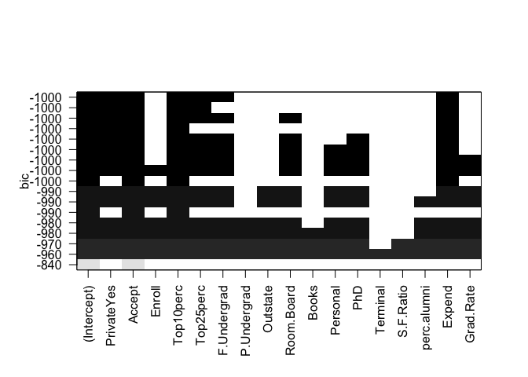
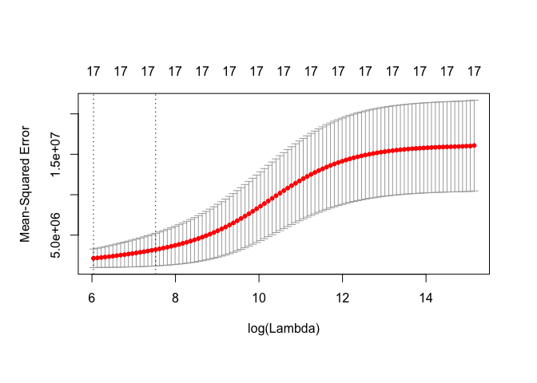
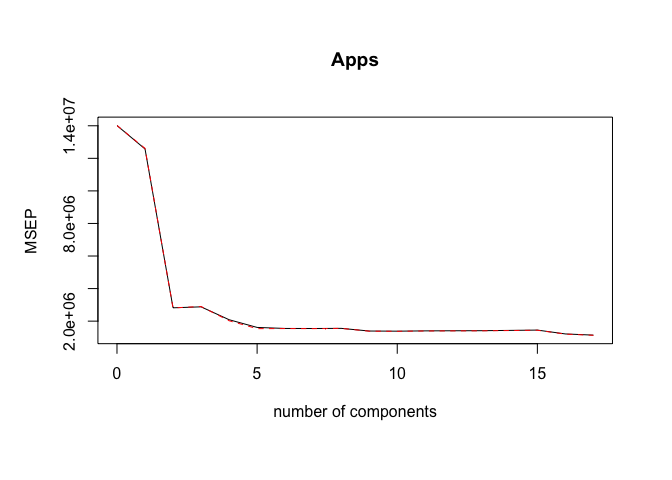
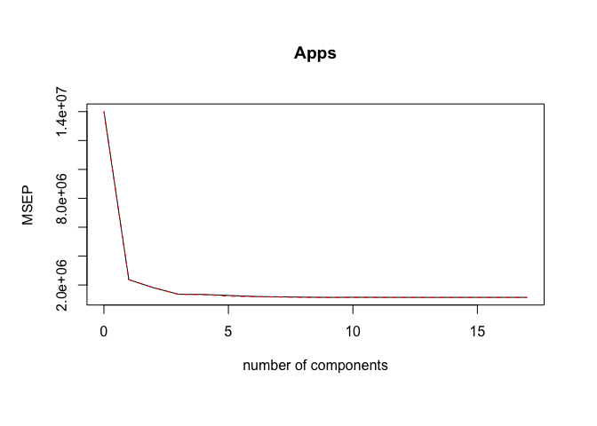
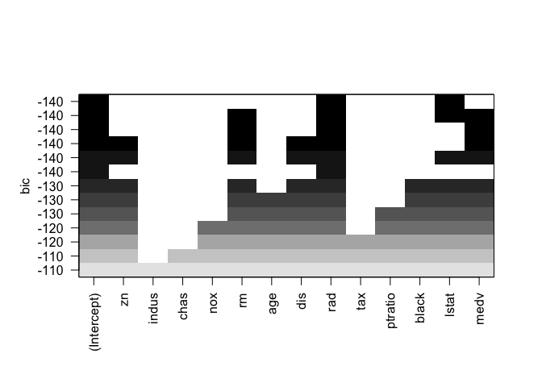
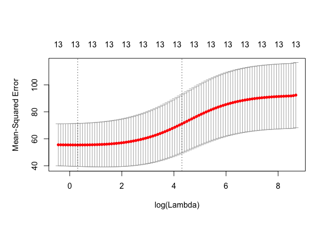
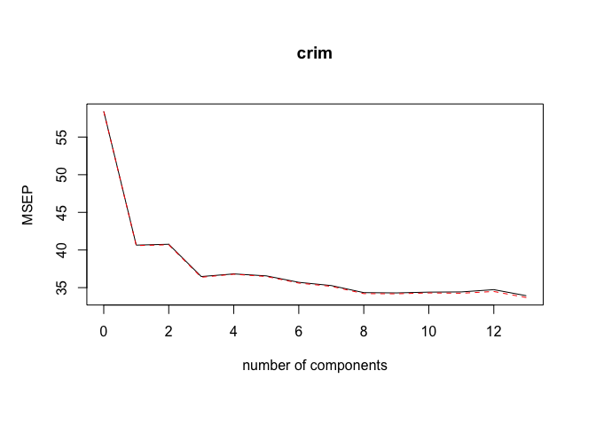
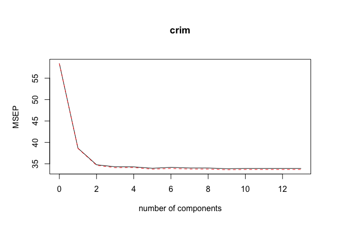

### 3

a) think this as the RSS for linear regression, as s is increased from 0, more and more predictors can be added to the model, so training error will decrease steadily and flatten out. 

b) test RSS will decrease and then flattern out almost, as training RSS. 

c) variance: Variance refers to your algorithm's sensitivity to specific sets of training data. is an error from sensitivity to small fluctuations in the training set. as s is increased from 0, more predictors are added to the model, variance will increase (sensitivity increase --> overfitting)   

d) (squared) bias: Bias is the difference between your model's expected predictions and the true values. The bias is an error from erroneous assumptions in the learning algorithm. High bias can cause an algorithm to miss the relevant relations between features and target outputs (underfitting). As more and more predictors added, bias will decrease (generalization decrease --> underfitting) 

e) irreducible error: is also known as "noise," and it can't be reduced by your choice in algorithm. It typically comes from inherent randomness, a mis-framed problem, or an incomplete feature set. so it remaines constant.  

### 4 

This is the case for ridge regression 

a) training RSS. as lambda is increasing, the impact of the shrinkage penalty grows, and the ridge regression coefficient estimates will approach zero, training RSS will increase and then flatten out (as the model is becoming less and less sensitive to the training data, less and less flexible) 

b) test RSS will decrease (as model is becoming more and more generalized to fit on the test dataset) and then increase (as many predictors are shrinked to have coefficient of zero), form a U shape.  

c) variance will decrease as lamba increases, because the sensitivity decreases. 

d) bias will increase because the model is more generalized. 

e) irreducible error doesn't change 

### 5 

a) (y1 − β1x11 − β2x12)^2 + (y2 − β1x21 − β2x22)^2 + λ(β1^2 + β2^2).

b) see https://www.mathstat.dal.ca/~aarms2014/StatLearn/assignments/A3sol_2.pdf 

### 9 


```r
library(tidyverse)
```

```
## ── Attaching packages ────────────────────────────────── tidyverse 1.2.1 ──
```

```
## ✔ ggplot2 2.2.1     ✔ purrr   0.2.4
## ✔ tibble  1.4.2     ✔ dplyr   0.7.4
## ✔ tidyr   0.8.0     ✔ stringr 1.3.0
## ✔ readr   1.1.1     ✔ forcats 0.3.0
```

```
## Warning: package 'ggplot2' was built under R version 3.2.5
```

```
## Warning: package 'readr' was built under R version 3.2.5
```

```
## Warning: package 'purrr' was built under R version 3.2.5
```

```
## Warning: package 'dplyr' was built under R version 3.2.5
```

```
## ── Conflicts ───────────────────────────────────── tidyverse_conflicts() ──
## ✖ dplyr::filter() masks stats::filter()
## ✖ dplyr::lag()    masks stats::lag()
```

```r
library(ISLR)
```

```
## Warning: package 'ISLR' was built under R version 3.2.5
```

```r
library(leaps)
```

```
## Warning: package 'leaps' was built under R version 3.2.5
```

```r
library(pls)
```

```
## Warning: package 'pls' was built under R version 3.2.5
```

```
## 
## Attaching package: 'pls'
```

```
## The following object is masked from 'package:stats':
## 
##     loadings
```

```r
# a) 
dim(College)
```

```
## [1] 777  18
```

```r
colnames(College)
```

```
##  [1] "Private"     "Apps"        "Accept"      "Enroll"      "Top10perc"  
##  [6] "Top25perc"   "F.Undergrad" "P.Undergrad" "Outstate"    "Room.Board" 
## [11] "Books"       "Personal"    "PhD"         "Terminal"    "S.F.Ratio"  
## [16] "perc.alumni" "Expend"      "Grad.Rate"
```

```r
set.seed(1)
train=sample(c(TRUE,FALSE), nrow(College),rep=TRUE) 
test =(! train )

# b) fit the model using least square on the training set, and report the test error obtained.
# least square (linear regression, using best subset method) 
regfit.best=regsubsets(Apps~.,data=College[train,], nvmax =17) # best subset using only traning data 
plot(regfit.best,scale="bic") # why not using this method??? 
```

<!-- -->

```r
test.mat<-model.matrix(Apps~.,data=College[test,]) 
dim(test.mat)
```

```
## [1] 377  18
```

```r
sum(test)
```

```
## [1] 377
```

```r
val.errors=rep(NA,17) 

for(i in 1:17){
coefi=coef(regfit.best,id=i)
pred=test.mat[,names(coefi)]%*%coefi
val.errors[i]=mean((College$Apps[test]-pred)^2) }

val.errors
```

```
##  [1] 1714544 1542316 1510924 1512552 1492114 1635683 1645549 1610020
##  [9] 1626584 1616854 1555953 1520681 1526317 1519996 1522719 1520481
## [17] 1520331
```

```r
which.min(val.errors) # 5 predictors 
```

```
## [1] 5
```

```r
test.error.bestsubset <- val.errors[which.min(val.errors)] # test error ???  
coef(regfit.best, 5)  
```

```
##   (Intercept)    PrivateYes        Accept     Top10perc     Top25perc 
## -114.81292106 -617.07313758    1.28203523   50.65442163  -16.79622599 
##        Expend 
##    0.05489076
```

```r
# c) Fit a ridge regression model on the training set, with λ chosen by cross-validation. Report the test error obtained. 

library(glmnet) 
```

```
## Warning: package 'glmnet' was built under R version 3.2.5
```

```
## Loading required package: Matrix
```

```
## Warning: package 'Matrix' was built under R version 3.2.5
```

```
## 
## Attaching package: 'Matrix'
```

```
## The following object is masked from 'package:tidyr':
## 
##     expand
```

```
## Loading required package: foreach
```

```
## Warning: package 'foreach' was built under R version 3.2.5
```

```
## 
## Attaching package: 'foreach'
```

```
## The following objects are masked from 'package:purrr':
## 
##     accumulate, when
```

```
## Loaded glmnet 2.0-13
```

```r
### fit ridge regression on training set 
grid=10^seq(10,-2,length=100)
x = model.matrix(Apps~.,data=College)[,-1] # need to understand model.matrix ... 
y = College$Apps
length(y)
```

```
## [1] 777
```

```r
ridge.mod=glmnet(x[train,], y[train], alpha=0,lambda=grid, thresh =1e-12)
dim(coef(ridge.mod))
```

```
## [1]  18 100
```

```r
### cross-validation to choose lamda 
set.seed (1)
cv.out=cv.glmnet(x[test ,],y[test],alpha=0)
plot(cv.out)
```

<!-- -->

```r
bestlam=cv.out$lambda.min
bestlam # 418 
```

```
## [1] 418.4332
```

```r
### test error on test data set 

ridge.pred=predict(ridge.mod,s=bestlam ,newx=x[test,]) 
test.error.ridge <- mean((ridge.pred-y[test])^2) ### very high which might due to the spliting of test and training set.      

# d) skipped, come back later 

# e) Fit a PCR model on the training set, with M chosen by cross- validation. Report the test error obtained, along with the value of M selected by cross-validation.
dim(College) # 777 18 
```

```
## [1] 777  18
```

```r
set.seed(1)
pcr.fit=pcr(Apps~., data=College,subset=train,scale=TRUE, validation ="CV")
summary(pcr.fit)
```

```
## Data: 	X dimension: 400 17 
## 	Y dimension: 400 1
## Fit method: svdpc
## Number of components considered: 17
## 
## VALIDATION: RMSEP
## Cross-validated using 10 random segments.
##        (Intercept)  1 comps  2 comps  3 comps  4 comps  5 comps  6 comps
## CV            3744     3546     1679     1697     1445     1270     1245
## adjCV         3744     3551     1677     1703     1424     1241     1243
##        7 comps  8 comps  9 comps  10 comps  11 comps  12 comps  13 comps
## CV        1244     1248     1180      1176      1184      1187      1189
## adjCV     1241     1248     1176      1173      1182      1184      1186
##        14 comps  15 comps  16 comps  17 comps
## CV         1196      1205      1102      1068
## adjCV      1193      1201      1097      1064
## 
## TRAINING: % variance explained
##       1 comps  2 comps  3 comps  4 comps  5 comps  6 comps  7 comps
## X       32.07    58.34    64.91    70.53    75.95    81.04    84.82
## Apps    11.14    80.28    80.29    86.40    89.31    89.41    89.47
##       8 comps  9 comps  10 comps  11 comps  12 comps  13 comps  14 comps
## X       88.19    91.14     93.51     95.61     97.27     98.31     99.01
## Apps    89.57    90.68     90.77     90.78     90.82     90.88     90.89
##       15 comps  16 comps  17 comps
## X        99.48     99.81    100.00
## Apps     90.93     92.63     93.14
```

```r
validationplot(pcr.fit,val.type="MSEP")
```

<!-- -->

```r
pcr.pred=predict(pcr.fit, x[test,], ncomp=3) 
test.error.pcr <- mean((pcr.pred-y[test])^2) ### doesn't work, due to NA 

pcr.fit=pcr(Apps~., data=College,scale=TRUE,ncomp=3)
summary(pcr.fit) 
```

```
## Data: 	X dimension: 777 17 
## 	Y dimension: 777 1
## Fit method: svdpc
## Number of components considered: 3
## TRAINING: % variance explained
##       1 comps  2 comps  3 comps
## X      31.670    57.30    64.30
## Apps    2.316    73.06    73.07
```

```r
# f) Fit a PLS model on the training set, with M chosen by cross- validation. Report the test error obtained, along with the value of M selected by cross-validation.
set.seed(1)
pls.fit=plsr(Apps~.,data = College, subset=train, scale = T, validation ="CV")
summary(pls.fit)
```

```
## Data: 	X dimension: 400 17 
## 	Y dimension: 400 1
## Fit method: kernelpls
## Number of components considered: 17
## 
## VALIDATION: RMSEP
## Cross-validated using 10 random segments.
##        (Intercept)  1 comps  2 comps  3 comps  4 comps  5 comps  6 comps
## CV            3744     1539     1344     1165     1160     1130     1098
## adjCV         3744     1538     1344     1163     1152     1107     1090
##        7 comps  8 comps  9 comps  10 comps  11 comps  12 comps  13 comps
## CV        1086     1076     1068      1071      1069      1068      1067
## adjCV     1079     1070     1064      1066      1064      1064      1063
##        14 comps  15 comps  16 comps  17 comps
## CV         1068      1069      1068      1068
## adjCV      1063      1064      1064      1064
## 
## TRAINING: % variance explained
##       1 comps  2 comps  3 comps  4 comps  5 comps  6 comps  7 comps
## X       27.28    50.45    63.72    66.60    68.38    72.56    75.63
## Apps    83.57    87.63    90.98    91.71    92.72    92.99    93.06
##       8 comps  9 comps  10 comps  11 comps  12 comps  13 comps  14 comps
## X       79.99    83.33     85.84     88.70     91.51     93.71     96.30
## Apps    93.09    93.11     93.12     93.13     93.13     93.14     93.14
##       15 comps  16 comps  17 comps
## X        97.40     99.20    100.00
## Apps     93.14     93.14     93.14
```

```r
validationplot(pls.fit,val.type="MSEP")
```

<!-- -->

```r
pls.pred=predict(pls.fit, x[test,], ncomp=3) # 3 or 4? 
test.error.PLS <- mean((pls.pred-y[test])^2) ### doesn't work, due to NA 

pls.fit=plsr(Apps~., data=College ,scale=TRUE,ncomp=3) 
summary(pls.fit) 
```

```
## Data: 	X dimension: 777 17 
## 	Y dimension: 777 1
## Fit method: kernelpls
## Number of components considered: 3
## TRAINING: % variance explained
##       1 comps  2 comps  3 comps
## X       25.76    40.33    62.59
## Apps    78.01    85.14    87.67
```

```r
# g) Comment on the results obtained. How accurately can we pre- dict the number of college applications received? Is there much difference among the test errors resulting from these five ap- proaches? 
test.error.bestsubset
```

```
## [1] 1492114
```

```r
test.error.ridge
```

```
## [1] 2628993
```

```r
test.error.pcr
```

```
## [1] 5550505
```

```r
test.error.PLS 
```

```
## [1] 2982036
```

### 11. 
We will now try to predict per capita crime rate in the Boston data set. 

```r
# (a) Try out some of the regression methods explored in this chapter, such as best subset selection, the lasso, ridge regression, and PCR. Present and discuss results for the approaches that you consider.
library(MASS)
```

```
## Warning: package 'MASS' was built under R version 3.2.5
```

```
## 
## Attaching package: 'MASS'
```

```
## The following object is masked from 'package:dplyr':
## 
##     select
```

```r
Boston %>% dim()
```

```
## [1] 506  14
```

```r
Boston %>% colnames()
```

```
##  [1] "crim"    "zn"      "indus"   "chas"    "nox"     "rm"      "age"    
##  [8] "dis"     "rad"     "tax"     "ptratio" "black"   "lstat"   "medv"
```

```r
# model matrix
x = model.matrix(crim~.,data=Boston)[,-1] # need to understand model.matrix ... 
y = Boston$crim
length(y)
```

```
## [1] 506
```

```r
# training & test set 
set.seed(1)
train=sample(c(TRUE,FALSE), nrow(Boston),rep=TRUE) 
test =(! train )

# best subset 
regfit.best=regsubsets(crim~.,data=Boston[train,], nvmax =13) # best subset using only traning data 
plot(regfit.best,scale="bic") # p = 2
```

<!-- -->

```r
# need to calculate test error 

# ridge 
grid=10^seq(10,-2,length=100)
ridge.mod=glmnet(x[train,], y[train], alpha=0,lambda=grid, thresh =1e-12)
dim(coef(ridge.mod))
```

```
## [1]  14 100
```

```r
### cross-validation to choose lamda 
set.seed(1)
cv.out=cv.glmnet(x[test ,],y[test],alpha=0)
plot(cv.out)
```

<!-- -->

```r
bestlam=cv.out$lambda.min
bestlam 
```

```
## [1] 1.358694
```

```r
### test error on test data set 
ridge.pred=predict(ridge.mod,s=bestlam ,newx=x[test,]) 
test.error.ridge <- mean((ridge.pred-y[test])^2) 
test.error.ridge
```

```
## [1] 58.1323
```

```r
# PCR 
pcr.fit=pcr(crim~., data=Boston,subset=train,scale=TRUE, validation ="CV")
summary(pcr.fit)
```

```
## Data: 	X dimension: 271 13 
## 	Y dimension: 271 1
## Fit method: svdpc
## Number of components considered: 13
## 
## VALIDATION: RMSEP
## Cross-validated using 10 random segments.
##        (Intercept)  1 comps  2 comps  3 comps  4 comps  5 comps  6 comps
## CV           7.643    6.375    6.384    6.040    6.068    6.047    5.975
## adjCV        7.643    6.370    6.379    6.031    6.065    6.040    5.967
##        7 comps  8 comps  9 comps  10 comps  11 comps  12 comps  13 comps
## CV       5.939    5.860    5.856     5.865     5.868     5.893     5.824
## adjCV    5.930    5.848    5.846     5.856     5.853     5.873     5.803
## 
## TRAINING: % variance explained
##       1 comps  2 comps  3 comps  4 comps  5 comps  6 comps  7 comps
## X       48.90    62.42    71.23    77.96    84.40    89.39    92.32
## crim    31.95    32.00    39.49    39.49    40.09    41.80    42.79
##       8 comps  9 comps  10 comps  11 comps  12 comps  13 comps
## X        94.3    96.01     97.40     98.56     99.53    100.00
## crim     44.6    44.76     44.92     46.49     47.87     49.18
```

```r
validationplot(pcr.fit,val.type="MSEP")
```

<!-- -->

```r
pcr.pred=predict(pcr.fit, x[test,], ncomp=8) 
test.error.pcr <- mean((pcr.pred-y[test])^2) ### doesn't work, due to NA 
test.error.pcr
```

```
## [1] 56.59548
```

```r
pcr.fit=pcr(crim~., data=Boston,scale=TRUE,ncomp=8)
summary(pcr.fit) 
```

```
## Data: 	X dimension: 506 13 
## 	Y dimension: 506 1
## Fit method: svdpc
## Number of components considered: 8
## TRAINING: % variance explained
##       1 comps  2 comps  3 comps  4 comps  5 comps  6 comps  7 comps
## X       47.70    60.36    69.67    76.45    82.99    88.00    91.14
## crim    30.69    30.87    39.27    39.61    39.61    39.86    40.14
##       8 comps
## X       93.45
## crim    42.47
```

```r
### PLS 
pls.fit=plsr(crim~., data=Boston,subset=train,scale=TRUE, validation ="CV")
summary(pls.fit)
```

```
## Data: 	X dimension: 271 13 
## 	Y dimension: 271 1
## Fit method: kernelpls
## Number of components considered: 13
## 
## VALIDATION: RMSEP
## Cross-validated using 10 random segments.
##        (Intercept)  1 comps  2 comps  3 comps  4 comps  5 comps  6 comps
## CV           7.643    6.217    5.897    5.858    5.856    5.828    5.846
## adjCV        7.643    6.212    5.887    5.839    5.843    5.809    5.824
##        7 comps  8 comps  9 comps  10 comps  11 comps  12 comps  13 comps
## CV       5.833    5.833    5.819     5.824     5.824     5.824     5.824
## adjCV    5.812    5.811    5.798     5.803     5.803     5.803     5.803
## 
## TRAINING: % variance explained
##       1 comps  2 comps  3 comps  4 comps  5 comps  6 comps  7 comps
## X       48.54    57.10    61.79    71.16    77.75    81.24    85.49
## crim    35.41    44.24    47.16    48.04    48.64    48.96    49.07
##       8 comps  9 comps  10 comps  11 comps  12 comps  13 comps
## X       87.69    89.37     95.61     97.08     98.56    100.00
## crim    49.15    49.18     49.18     49.18     49.18     49.18
```

```r
validationplot(pls.fit,val.type="MSEP")
```

<!-- -->

```r
pls.pred=predict(pls.fit, x[test,], ncomp=3) 
test.error.pls <- mean((pls.pred-y[test])^2) ### doesn't work, due to NA 
test.error.pls
```

```
## [1] 59.69215
```

```r
pls.fit=plsr(crim~., data=Boston,scale=TRUE,ncomp=3)
summary(pls.fit) 
```

```
## Data: 	X dimension: 506 13 
## 	Y dimension: 506 1
## Fit method: kernelpls
## Number of components considered: 3
## TRAINING: % variance explained
##       1 comps  2 comps  3 comps
## X       47.27    56.79    61.38
## crim    34.32    41.81    44.03
```

```r
# (b) Propose a model (or set of models) that seem to perform well on this data set, and justify your answer. Make sure that you are evaluating model performance using validation set error, cross- validation, or some other reasonable alternative, as opposed to using training error.
test.error.ridge
```

```
## [1] 58.1323
```

```r
test.error.pcr
```

```
## [1] 56.59548
```

```r
test.error.pls
```

```
## [1] 59.69215
```

```r
# PCR because it gave the smallest test error with only 3 components  

# (c) Does your chosen model involve all of the features in the data set? Why or why not? 
# no, only 8 components.   
```

