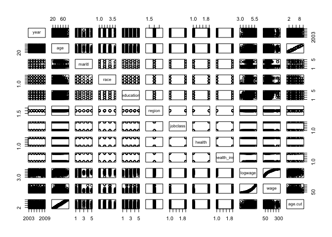
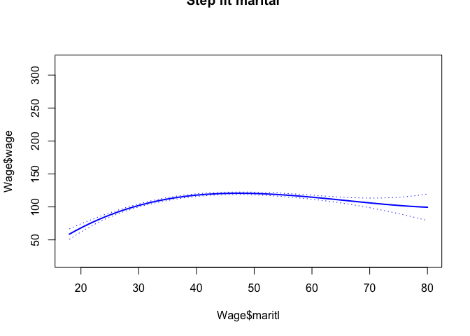
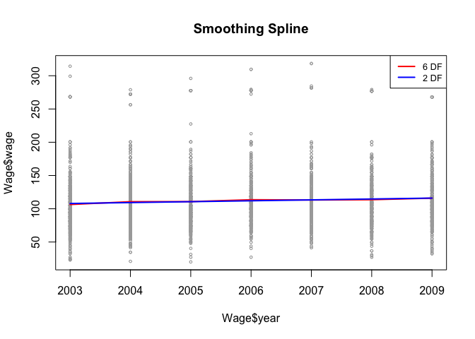
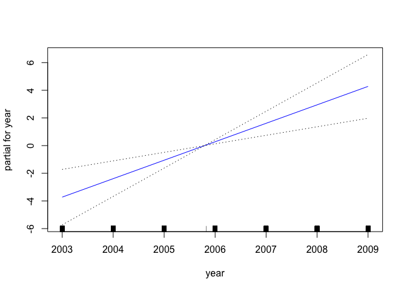
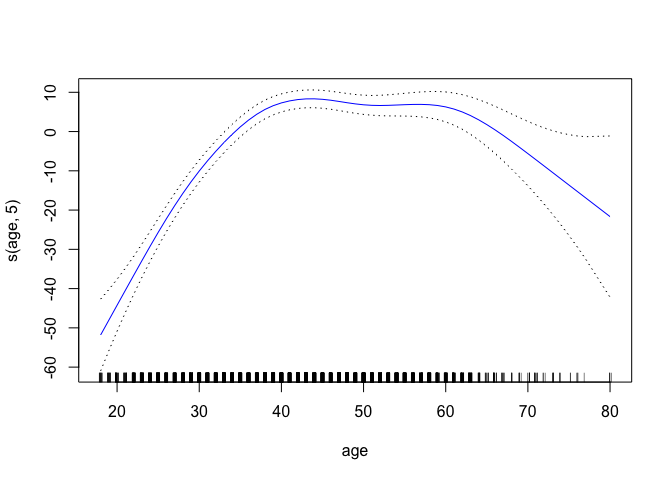
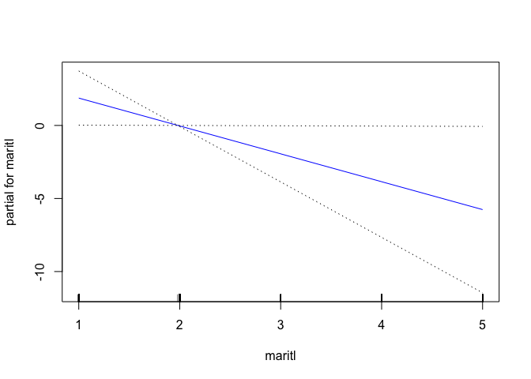

### 6 

6. In this exercise, you will further analyze the Wage data set considered throughout this chapter.

(a) Perform polynomial regression to predict wage using age. Use cross-validation to select the optimal degree d for the polynomial. What degree was chosen, and how does this compare to the results of hypothesis testing using ANOVA? Make a plot of the resulting polynomial fit to the data.


```r
library(tidyverse)
```

```
## ── Attaching packages ────────────────────────────────── tidyverse 1.2.1 ──
```

```
## ✔ ggplot2 2.2.1     ✔ purrr   0.2.4
## ✔ tibble  1.4.2     ✔ dplyr   0.7.4
## ✔ tidyr   0.8.0     ✔ stringr 1.3.0
## ✔ readr   1.1.1     ✔ forcats 0.3.0
```

```
## Warning: package 'ggplot2' was built under R version 3.2.5
```

```
## Warning: package 'readr' was built under R version 3.2.5
```

```
## Warning: package 'purrr' was built under R version 3.2.5
```

```
## Warning: package 'dplyr' was built under R version 3.2.5
```

```
## ── Conflicts ───────────────────────────────────── tidyverse_conflicts() ──
## ✖ dplyr::filter() masks stats::filter()
## ✖ dplyr::lag()    masks stats::lag()
```

```r
library(ISLR)
```

```
## Warning: package 'ISLR' was built under R version 3.2.5
```

```r
library(gam) 
```

```
## Warning: package 'gam' was built under R version 3.2.5
```

```
## Loading required package: splines
```

```
## Loading required package: foreach
```

```
## Warning: package 'foreach' was built under R version 3.2.5
```

```
## 
## Attaching package: 'foreach'
```

```
## The following objects are masked from 'package:purrr':
## 
##     accumulate, when
```

```
## Loaded gam 1.14-4
```

```r
# fit model with different degrees, and use anova 
fit.1=lm(wage~age,data=Wage)
fit.2=lm(wage~poly(age,2),data=Wage) 
fit.3=lm(wage~poly(age,3),data=Wage) 
fit.4=lm(wage~poly(age,4),data=Wage) 
fit.5=lm(wage~poly(age,5),data=Wage) 
anova(fit.1,fit.2,fit.3,fit.4,fit.5) # degree three I prefer 
```

```
## Analysis of Variance Table
## 
## Model 1: wage ~ age
## Model 2: wage ~ poly(age, 2)
## Model 3: wage ~ poly(age, 3)
## Model 4: wage ~ poly(age, 4)
## Model 5: wage ~ poly(age, 5)
##   Res.Df     RSS Df Sum of Sq        F    Pr(>F)    
## 1   2998 5022216                                    
## 2   2997 4793430  1    228786 143.5931 < 2.2e-16 ***
## 3   2996 4777674  1     15756   9.8888  0.001679 ** 
## 4   2995 4771604  1      6070   3.8098  0.051046 .  
## 5   2994 4770322  1      1283   0.8050  0.369682    
## ---
## Signif. codes:  0 '***' 0.001 '**' 0.01 '*' 0.05 '.' 0.1 ' ' 1
```

```r
# use cross validation 
library(boot)
```

```
## Warning: package 'boot' was built under R version 3.2.5
```

```r
set.seed(1)
cv.error.10=rep(0,5) 
for (i in 1:5){
glm.fit=glm(wage~poly(age ,i),data=Wage) 
cv.error.10[i]=cv.glm(Wage,glm.fit,K=10)$delta[1] # 10 fold CV 
} 
cv.error.10 # degree four is the best 
```

```
## [1] 1675.837 1601.012 1598.801 1594.217 1594.625
```

```r
# make a plot for polynomial, I prefer result from cv 
# get predict 
agelims=range(Wage$age)
age.grid=seq(from=agelims[1],to=agelims[2])
preds=predict(fit.3,newdata=list(age=age.grid),se=TRUE) # predict
se.bands=cbind(preds$fit+2*preds$se.fit,preds$fit-2*preds$se.fit ) # predict +/- 2se

# plot 
plot(Wage$age,Wage$wage,xlim=agelims ,cex=.5,col="darkgrey") # plot the value
title("Degree -4 Polynomial ",outer=T) # title 
lines(age.grid,preds$fit,lwd=2,col="blue") # add fit line 
matlines(age.grid,se.bands,lwd=1,col="blue",lty=3) # add CI line 
```

<!-- -->

(b) Fit a step function to predict wage using age, and perform cross- validation to choose the optimal number of cuts. Make a plot of the fit obtained.


```r
# cv, for each cut from 2 to 6, run 10 times validation set test, each validation set start with a different seed 
# make a function 
deltas <- rep(NA, 9)
for (i in 2:10) {
    Wage$age.cut <- cut(Wage$age, i) 
    fit <- glm(wage ~ age.cut, data = Wage)
    deltas[i-1] <- cv.glm(Wage, fit, K = 10)$delta[1] ### 
    names(deltas)[i-1] <- paste0("Cuts = ", i-1)
}
deltas
```

```
## Cuts = 1 Cuts = 2 Cuts = 3 Cuts = 4 Cuts = 5 Cuts = 6 Cuts = 7 Cuts = 8 
## 1733.324 1682.910 1636.728 1634.090 1625.221 1612.427 1602.081 1610.365 
## Cuts = 9 
## 1606.912
```

```r
plot(1:9, deltas, xlab = "Cuts", ylab = "Test MSE", type = "l")
(d.min <- which.min(deltas))
```

```
## Cuts = 7 
##        7
```

```r
points(d.min, deltas[d.min], col = "red", cex = 2, pch = 20)   
```

<!-- -->

```r
# check this  
```

### 7 

The Wage data set contains a number of other features not explored in this chapter, such as marital status (maritl), job class (jobclass), and others. Explore the relationships between some of these other predictors and wage, and use non-linear fitting techniques in order to fit flexible models to the data. Create plots of the results obtained, and write a summary of your findings.


```r
library(ISLR) 
colnames(Wage)  
```

```
##  [1] "year"       "age"        "maritl"     "race"       "education" 
##  [6] "region"     "jobclass"   "health"     "health_ins" "logwage"   
## [11] "wage"       "age.cut"
```

```r
pairs(Wage)
```

<!-- -->

```r
Wage$maritl <- as.numeric(Wage$maritl)  
# use maritial status to predict wage, categorical predictor, I decided to use step function  
table(cut(Wage$maritl,4)) # cut pick cutpoint automatically or specify cut point using breaks 
```

```
## 
## (0.996,2]     (2,3]     (3,4]     (4,5] 
##      2722        19       204        55
```

```r
fit=lm(wage~cut(maritl ,4),data=Wage) 
coef(summary(fit))
```

```
##                      Estimate Std. Error    t value    Pr(>|t|)
## (Intercept)         112.64079  0.7982099 141.116753 0.000000000
## cut(maritl, 4)(2,3] -13.10214  9.5872672  -1.366618 0.171847494
## cut(maritl, 4)(3,4]  -9.48153  3.0230073  -3.136456 0.001726615
## cut(maritl, 4)(4,5] -11.42500  5.6718366  -2.014339 0.044063117
```

```r
# predict 
agelims=range(Wage$age) 
age.grid=seq(from=agelims[1],to=agelims[2])
preds=predict(fit,newdata=list(maritl=age.grid),se=TRUE) # predict
```

```
## Error in model.frame.default(Terms, newdata, na.action = na.action, xlev = object$xlevels): factor cut(maritl, 4) has new levels (17.9,33.5], (33.5,49], (49,64.5], (64.5,80.1]
```

```r
se.bands=cbind(preds$fit+2*preds$se.fit,preds$fit-2*preds$se.fit ) # predict +/- 2se

# plot the fit result 
plot(Wage$maritl,Wage$wage,xlim=agelims ,cex=.5,col="darkgrey") # plot the value
title("Step fit marital ",outer=T) # title 
lines(age.grid,preds$fit,lwd=2,col="blue") # add fit line 
matlines(age.grid,se.bands,lwd=1,col="blue",lty=3) # add CI line  
```

<!-- -->

```r
### update with smooth splines & GAM 
# smooth spline, not be able to fit on factors predictors 
agelims=range(Wage$year) 
age.grid=seq(from=agelims[1],to=agelims[2])
plot(Wage$year,Wage$wage,xlim=agelims ,cex=.5,col="darkgrey")
title (" Smoothing Spline ")
fit=smooth.spline(Wage$year,Wage$wage,df=6)
fit2=smooth.spline(Wage$year,Wage$wage,cv=TRUE)
```

```
## Warning in smooth.spline(Wage$year, Wage$wage, cv = TRUE): cross-validation
## with non-unique 'x' values seems doubtful
```

```r
fit2$df
```

```
## [1] 2.000002
```

```r
lines(fit,col="red",lwd=2) # smooth spline with df of 16 
lines(fit2,col="blue",lwd=2)
legend("topright",legend=c("6 DF","2 DF"), 
col=c("red","blue"),lty=1,lwd=2,cex=.8) # add legend 
```

<!-- -->

```r
# if fit on marital status 
fit=smooth.spline(Wage$maritl,Wage$wage,df=16)
```

```
## Error in smooth.spline(Wage$maritl, Wage$wage, df = 16): 'tol' must be strictly positive and finite
```

```r
# local regression, loess(), not be able to fit on maritl or education...  
plot(Wage$year,Wage$wage,xlim=agelims ,cex=.5,col="darkgrey")
title (" Local Regression ")
fit=loess(wage~year,span=.5,data=Wage)
fit2=loess(wage~year,span=.8,data=Wage)
lines(age.grid,predict(fit,data.frame(year=age.grid)), col="red",lwd=2)
lines(age.grid,predict(fit2,data.frame(year=age.grid)), col="blue",lwd=2)
legend("topright",legend=c("Span=0.5","Span=0.8"), col=c("red","blue"),lty=1,lwd=2,cex=.8) 
```

<!-- -->

```r
# GAM, can replace  
gam.m1=gam(wage~s(age ,5)+maritl ,data=Wage) # model that exclude year 
gam.m2=gam(wage~year+s(age ,5)+maritl ,data=Wage) # model that use linear function 
gam.m3=gam(wage~s(year ,4)+s(age ,5)+maritl ,data=Wage)

anova(gam.m1,gam.m2,gam.m3,test="F") 
```

```
## Analysis of Deviance Table
## 
## Model 1: wage ~ s(age, 5) + maritl
## Model 2: wage ~ year + s(age, 5) + maritl
## Model 3: wage ~ s(year, 4) + s(age, 5) + maritl
##   Resid. Df Resid. Dev Df Deviance       F    Pr(>F)    
## 1      2993    4757094                                  
## 2      2992    4735104  1  21989.3 13.8905 0.0001974 ***
## 3      2989    4731727  3   3377.3  0.7111 0.5452564    
## ---
## Signif. codes:  0 '***' 0.001 '**' 0.01 '*' 0.05 '.' 0.1 ' ' 1
```

```r
plot.gam(gam.m2, se=TRUE,col="blue")  
```

<!-- --><!-- --><!-- -->

### 8 

Fit some of the non-linear models investigated in this chapter to the Auto data set. Is there evidence for non-linear relationships in this data set? Create some informative plots to justify your answer.


```r
colnames(Auto) 
```

```
## [1] "mpg"          "cylinders"    "displacement" "horsepower"  
## [5] "weight"       "acceleration" "year"         "origin"      
## [9] "name"
```

```r
# I would like to invesitigate the relationship between origin and mpg, hypothesis, Japanese car has a higher mpg, origin matters 

# polynomial 
fit=lm(mpg~poly(origin,2),data=Auto) 
summary(fit) # degree of two 
```

```
## 
## Call:
## lm(formula = mpg ~ poly(origin, 2), data = Auto)
## 
## Residuals:
##     Min      1Q  Median      3Q     Max 
## -12.451  -5.034  -1.034   3.649  18.966 
## 
## Coefficients:
##                  Estimate Std. Error t value Pr(>|t|)    
## (Intercept)       23.4459     0.3231  72.575  < 2e-16 ***
## poly(origin, 2)1  87.2309     6.3962  13.638  < 2e-16 ***
## poly(origin, 2)2 -17.1771     6.3962  -2.686  0.00755 ** 
## ---
## Signif. codes:  0 '***' 0.001 '**' 0.01 '*' 0.05 '.' 0.1 ' ' 1
## 
## Residual standard error: 6.396 on 389 degrees of freedom
## Multiple R-squared:  0.3318,	Adjusted R-squared:  0.3284 
## F-statistic:  96.6 on 2 and 389 DF,  p-value: < 2.2e-16
```

```r
# step 
table(cut(Auto$origin, breaks = 4)) # cut pick cutpoint automatically or specify cut point using breaks 
```

```
## 
## (0.998,1.5]     (1.5,2]     (2,2.5]     (2.5,3] 
##         245          68           0          79
```

```r
fit=lm(mpg~cut(origin ,4),data=Auto)  
coef(summary(fit))
```

```
##                        Estimate Std. Error   t value      Pr(>|t|)
## (Intercept)           20.033469  0.4086405 49.024678 1.383741e-168
## cut(origin, 4)(1.5,2]  7.569472  0.8767164  8.633889  1.543152e-16
## cut(origin, 4)(2.5,3] 10.417164  0.8275617 12.587779  1.023502e-30
```

```r
# predict 
agelims=range(Auto$origin)
age.grid=seq(from=agelims[1],to=agelims[2])
preds=predict(fit,newdata=list(origin=age.grid),se=TRUE) # predict
se.bands=cbind(preds$fit+2*preds$se.fit,preds$fit-2*preds$se.fit ) # predict +/- 2se

# plot the fit result 
plot(Auto$origin,Auto$mpg,xlim=agelims ,cex=.5,col="darkgrey") # plot the value
title("Step fit mpg vs. origin ",outer=T) # title 
lines(age.grid,preds$fit,lwd=2,col="blue") # add fit line 
matlines(age.grid,se.bands,lwd=1,col="blue",lty=3) # add CI line, origin matters 
```

<!-- -->

```r
# splines 
library(splines)
fit=lm(mpg~bs(origin,knots=c(1,2,3)),data=Auto) # specify knots at 25, 40, and 60 
pred.splines=predict(fit,newdata=list(origin=age.grid),se=T)
```

```
## Warning in predict.lm(fit, newdata = list(origin = age.grid), se = T):
## prediction from a rank-deficient fit may be misleading
```

```r
pred.splines 
```

```
## $fit
##        1        2        3 
## 20.03347 27.60294 30.45063 
## 
## $se.fit
##         1         2         3 
## 0.4086405 0.7756575 0.7196327 
## 
## $df
## [1] 389
## 
## $residual.scale
## [1] 6.396236
```

```r
plot(Auto$origin,Auto$mpg,col="gray")
lines(age.grid,pred.splines$fit,lwd=2)
lines(age.grid,pred.splines$fit+2*pred.splines$se ,lty="dashed")
lines(age.grid,pred.splines$fit-2*pred.splines$se ,lty="dashed")

# natural splines
fit2=lm(mpg~ns(origin,df=4),data=Auto)
pred2=predict(fit2,newdata=list(origin=age.grid),se=T) 
```

```
## Warning in predict.lm(fit2, newdata = list(origin = age.grid), se = T):
## prediction from a rank-deficient fit may be misleading
```

```r
lines(age.grid, pred2$fit,col="red",lwd=2)  
```

<!-- -->

```r
# smooth spline, local regression, gam, interested in weight, year, and origin's relationship with mpg  
pairs(Auto)
```

<!-- -->

```r
agelims=range(Auto$weight) 
age.grid=seq(from=agelims[1],to=agelims[2])
plot(Auto$weight,Auto$mpg,xlim=agelims ,cex=.5,col="darkgrey")
title (" Smoothing Spline ")
fit=smooth.spline(Auto$weight,Auto$mpg,df=6)
fit2=smooth.spline(Auto$weight,Auto$mpg,cv=TRUE)
```

```
## Warning in smooth.spline(Auto$weight, Auto$mpg, cv = TRUE): cross-
## validation with non-unique 'x' values seems doubtful
```

```r
fit2$df
```

```
## [1] 10.35561
```

```r
lines(fit,col="red",lwd=2) # smooth spline with df of 16 
lines(fit2,col="blue",lwd=2)
legend("topright",legend=c("6 DF","10 DF"), 
col=c("red","blue"),lty=1,lwd=2,cex=.8) # add legend 
```

<!-- -->

```r
# local regression, loess(), not be able to fit on maritl or education...  
plot(Auto$weight,Auto$mpg,xlim=agelims ,cex=.5,col="darkgrey")
title (" Local Regression ")
fit=loess(mpg~weight,span=.2,data=Auto)
fit2=loess(mpg~weight,span=.5,data=Auto)
lines(age.grid,predict(fit,data.frame(weight=age.grid)), col="red",lwd=2)
lines(age.grid,predict(fit2,data.frame(weight=age.grid)), col="blue",lwd=2)
legend("topright",legend=c("Span=0.2","Span=0.5"), col=c("red","blue"),lty=1,lwd=2,cex=.8) 
```

<!-- -->

```r
# GAM, can replace
gam.m3=gam(mpg~s(weight ,4)+s(year ,5)+origin ,data=Auto)
par(mfrow=c(1,3))
plot(gam.m3, se=TRUE,col="blue") # except for year, all linear 
```

<!-- -->

```r
gam.m2=gam(mpg~weight+s(year ,5)+origin ,data=Auto) # model that use linear function 

AIC(gam.m2, gam.m3)
```

```
##        df      AIC
## gam.m2  5 2028.761
## gam.m3  5 1938.449
```

```r
BIC(gam.m2, gam.m3)
```

```
##        df      BIC
## gam.m2  5 2048.618
## gam.m3  5 1958.305
```

```r
plot.gam(gam.m3, se=TRUE,col="blue")   
```

<!-- -->

### 9 

This question uses the variables dis (the weighted mean of distances to five Boston employment centers) and nox (nitrogen oxides concen- tration in parts per 10 million) from the Boston data. We will treat dis as the predictor and nox as the response.

(a) Use the poly() function to fit a cubic polynomial regression to predict nox using dis. Report the regression output, and plot the resulting data and polynomial fits.


```r
library(MASS)
```

```
## Warning: package 'MASS' was built under R version 3.2.5
```

```
## 
## Attaching package: 'MASS'
```

```
## The following object is masked from 'package:dplyr':
## 
##     select
```

```r
colnames(Boston)
```

```
##  [1] "crim"    "zn"      "indus"   "chas"    "nox"     "rm"      "age"    
##  [8] "dis"     "rad"     "tax"     "ptratio" "black"   "lstat"   "medv"
```

```r
fit=lm(nox~poly(dis,3),data=Boston) 
summary(fit) 
```

```
## 
## Call:
## lm(formula = nox ~ poly(dis, 3), data = Boston)
## 
## Residuals:
##       Min        1Q    Median        3Q       Max 
## -0.121130 -0.040619 -0.009738  0.023385  0.194904 
## 
## Coefficients:
##                Estimate Std. Error t value Pr(>|t|)    
## (Intercept)    0.554695   0.002759 201.021  < 2e-16 ***
## poly(dis, 3)1 -2.003096   0.062071 -32.271  < 2e-16 ***
## poly(dis, 3)2  0.856330   0.062071  13.796  < 2e-16 ***
## poly(dis, 3)3 -0.318049   0.062071  -5.124 4.27e-07 ***
## ---
## Signif. codes:  0 '***' 0.001 '**' 0.01 '*' 0.05 '.' 0.1 ' ' 1
## 
## Residual standard error: 0.06207 on 502 degrees of freedom
## Multiple R-squared:  0.7148,	Adjusted R-squared:  0.7131 
## F-statistic: 419.3 on 3 and 502 DF,  p-value: < 2.2e-16
```

```r
lims=range(Boston$dis)
grid=seq(from=lims[1],to=lims[2])
preds=predict(fit,newdata=list(dis=grid),se=TRUE) # predict
se.bands=cbind(preds$fit+2*preds$se.fit,preds$fit-2*preds$se.fit ) # predict +/- 2se

plot(Boston$dis,Boston$nox,xlim=lims ,cex=.5,col="darkgrey") # plot the value
title("Degree -3 Polynomial ",outer=T) # title 
lines(grid,preds$fit,lwd=2,col="blue") # add fit line 
matlines(grid,se.bands,lwd=1,col="blue",lty=3) # add CI line  
```

<!-- -->

(b) Plot the polynomial fits for a range of different polynomial degrees (say, from 1 to 10), and report the associated residual sum of squares.


```r
# what is rss? residual: the difference between the ith observed response value and the ith response value that is predicted by our linear model. RSS is sum of squares of residuals 
set.seed(1)
cv.error.10=rep(0,10) 
for (i in 1:10){
glm.fit=glm(nox~poly(dis ,i),data=Boston) 
cv.error.10[i]= sum((Boston$nox-predict(glm.fit, Boston))^2) 
} 
cv.error.10  
```

```
##  [1] 2.768563 2.035262 1.934107 1.932981 1.915290 1.878257 1.849484
##  [8] 1.835630 1.833331 1.832171
```

```r
plot(cv.error.10) # degree of 3 
```

<!-- -->

(c) Perform cross-validation or another approach to select the opti- mal degree for the polynomial, and explain your results.


```r
cv.error=rep(0,5) 
for (i in 1:5){
glm.fit=glm(nox~poly(dis ,i),data=Boston) # different polynomial levels 
cv.error[i]=cv.glm(Boston,glm.fit, K=10)$delta[1]}  
cv.error  
```

```
## [1] 0.005536329 0.004077147 0.003899587 0.003862127 0.004298590
```

```r
plot(cv.error) # degree of 3 
```

<!-- -->

I will stop here. 

(d) Use the bs() function to fit a regression spline to predict nox using dis. Report the output for the fit using four degrees of freedom. How did you choose the knots? Plot the resulting fit.


(e) Now fit a regression spline for a range of degrees of freedom, and plot the resulting fits and report the resulting RSS. Describe the results obtained.

(f) Perform cross-validation or another approach in order to select the best degrees of freedom for a regression spline on this data. Describe your results.

### 10 

10. This question relates to the College data set.

(a) Split the data into a training set and a test set. Using out-of-state tuition as the response and the other variables as the predictors, perform forward stepwise selection on the training set in order to identify a satisfactory model that uses just a subset of the predictors.


```r
set.seed(1)
train_ID <- sample(rownames(College), size = round(nrow(College) * 0.8), replace = F) 
train <- College[rownames(College) %in% train_ID,]
test <- College[!(rownames(College) %in% train_ID),]

colnames(College)
```

```
##  [1] "Private"     "Apps"        "Accept"      "Enroll"      "Top10perc"  
##  [6] "Top25perc"   "F.Undergrad" "P.Undergrad" "Outstate"    "Room.Board" 
## [11] "Books"       "Personal"    "PhD"         "Terminal"    "S.F.Ratio"  
## [16] "perc.alumni" "Expend"      "Grad.Rate"
```

```r
library(leaps)
```

```
## Warning: package 'leaps' was built under R version 3.2.5
```

```r
regfit.fwd=regsubsets(Outstate~.,data=College,nvmax=18, method ="forward")
summary(regfit.fwd)
```

```
## Subset selection object
## Call: regsubsets.formula(Outstate ~ ., data = College, nvmax = 18, 
##     method = "forward")
## 17 Variables  (and intercept)
##             Forced in Forced out
## PrivateYes      FALSE      FALSE
## Apps            FALSE      FALSE
## Accept          FALSE      FALSE
## Enroll          FALSE      FALSE
## Top10perc       FALSE      FALSE
## Top25perc       FALSE      FALSE
## F.Undergrad     FALSE      FALSE
## P.Undergrad     FALSE      FALSE
## Room.Board      FALSE      FALSE
## Books           FALSE      FALSE
## Personal        FALSE      FALSE
## PhD             FALSE      FALSE
## Terminal        FALSE      FALSE
## S.F.Ratio       FALSE      FALSE
## perc.alumni     FALSE      FALSE
## Expend          FALSE      FALSE
## Grad.Rate       FALSE      FALSE
## 1 subsets of each size up to 17
## Selection Algorithm: forward
##           PrivateYes Apps Accept Enroll Top10perc Top25perc F.Undergrad
## 1  ( 1 )  " "        " "  " "    " "    " "       " "       " "        
## 2  ( 1 )  "*"        " "  " "    " "    " "       " "       " "        
## 3  ( 1 )  "*"        " "  " "    " "    " "       " "       " "        
## 4  ( 1 )  "*"        " "  " "    " "    " "       " "       " "        
## 5  ( 1 )  "*"        " "  " "    " "    " "       " "       " "        
## 6  ( 1 )  "*"        " "  " "    " "    " "       " "       " "        
## 7  ( 1 )  "*"        " "  " "    " "    " "       " "       " "        
## 8  ( 1 )  "*"        " "  " "    " "    " "       " "       " "        
## 9  ( 1 )  "*"        " "  " "    " "    " "       " "       " "        
## 10  ( 1 ) "*"        " "  "*"    " "    " "       " "       " "        
## 11  ( 1 ) "*"        " "  "*"    " "    " "       " "       "*"        
## 12  ( 1 ) "*"        "*"  "*"    " "    " "       " "       "*"        
## 13  ( 1 ) "*"        "*"  "*"    " "    "*"       " "       "*"        
## 14  ( 1 ) "*"        "*"  "*"    "*"    "*"       " "       "*"        
## 15  ( 1 ) "*"        "*"  "*"    "*"    "*"       " "       "*"        
## 16  ( 1 ) "*"        "*"  "*"    "*"    "*"       "*"       "*"        
## 17  ( 1 ) "*"        "*"  "*"    "*"    "*"       "*"       "*"        
##           P.Undergrad Room.Board Books Personal PhD Terminal S.F.Ratio
## 1  ( 1 )  " "         " "        " "   " "      " " " "      " "      
## 2  ( 1 )  " "         " "        " "   " "      " " " "      " "      
## 3  ( 1 )  " "         "*"        " "   " "      " " " "      " "      
## 4  ( 1 )  " "         "*"        " "   " "      " " " "      " "      
## 5  ( 1 )  " "         "*"        " "   " "      "*" " "      " "      
## 6  ( 1 )  " "         "*"        " "   " "      "*" " "      " "      
## 7  ( 1 )  " "         "*"        " "   "*"      "*" " "      " "      
## 8  ( 1 )  " "         "*"        " "   "*"      "*" "*"      " "      
## 9  ( 1 )  " "         "*"        " "   "*"      "*" "*"      "*"      
## 10  ( 1 ) " "         "*"        " "   "*"      "*" "*"      "*"      
## 11  ( 1 ) " "         "*"        " "   "*"      "*" "*"      "*"      
## 12  ( 1 ) " "         "*"        " "   "*"      "*" "*"      "*"      
## 13  ( 1 ) " "         "*"        " "   "*"      "*" "*"      "*"      
## 14  ( 1 ) " "         "*"        " "   "*"      "*" "*"      "*"      
## 15  ( 1 ) " "         "*"        "*"   "*"      "*" "*"      "*"      
## 16  ( 1 ) " "         "*"        "*"   "*"      "*" "*"      "*"      
## 17  ( 1 ) "*"         "*"        "*"   "*"      "*" "*"      "*"      
##           perc.alumni Expend Grad.Rate
## 1  ( 1 )  " "         "*"    " "      
## 2  ( 1 )  " "         "*"    " "      
## 3  ( 1 )  " "         "*"    " "      
## 4  ( 1 )  "*"         "*"    " "      
## 5  ( 1 )  "*"         "*"    " "      
## 6  ( 1 )  "*"         "*"    "*"      
## 7  ( 1 )  "*"         "*"    "*"      
## 8  ( 1 )  "*"         "*"    "*"      
## 9  ( 1 )  "*"         "*"    "*"      
## 10  ( 1 ) "*"         "*"    "*"      
## 11  ( 1 ) "*"         "*"    "*"      
## 12  ( 1 ) "*"         "*"    "*"      
## 13  ( 1 ) "*"         "*"    "*"      
## 14  ( 1 ) "*"         "*"    "*"      
## 15  ( 1 ) "*"         "*"    "*"      
## 16  ( 1 ) "*"         "*"    "*"      
## 17  ( 1 ) "*"         "*"    "*"
```

```r
par(mfrow=c(1,1))
plot(regfit.fwd,scale="bic") # I choosethe model including private, P.undergrad, PhD, perc.alumni, and Expend 
```

<!-- -->

(b) Fit a GAM on the training data, using out-of-state tuition as the response and the features selected in the previous step as the predictors. Plot the results, and explain your findings.


```r
summary(College) 
```

```
##  Private        Apps           Accept          Enroll       Top10perc    
##  No :212   Min.   :   81   Min.   :   72   Min.   :  35   Min.   : 1.00  
##  Yes:565   1st Qu.:  776   1st Qu.:  604   1st Qu.: 242   1st Qu.:15.00  
##            Median : 1558   Median : 1110   Median : 434   Median :23.00  
##            Mean   : 3002   Mean   : 2019   Mean   : 780   Mean   :27.56  
##            3rd Qu.: 3624   3rd Qu.: 2424   3rd Qu.: 902   3rd Qu.:35.00  
##            Max.   :48094   Max.   :26330   Max.   :6392   Max.   :96.00  
##    Top25perc      F.Undergrad     P.Undergrad         Outstate    
##  Min.   :  9.0   Min.   :  139   Min.   :    1.0   Min.   : 2340  
##  1st Qu.: 41.0   1st Qu.:  992   1st Qu.:   95.0   1st Qu.: 7320  
##  Median : 54.0   Median : 1707   Median :  353.0   Median : 9990  
##  Mean   : 55.8   Mean   : 3700   Mean   :  855.3   Mean   :10441  
##  3rd Qu.: 69.0   3rd Qu.: 4005   3rd Qu.:  967.0   3rd Qu.:12925  
##  Max.   :100.0   Max.   :31643   Max.   :21836.0   Max.   :21700  
##    Room.Board       Books           Personal         PhD        
##  Min.   :1780   Min.   :  96.0   Min.   : 250   Min.   :  8.00  
##  1st Qu.:3597   1st Qu.: 470.0   1st Qu.: 850   1st Qu.: 62.00  
##  Median :4200   Median : 500.0   Median :1200   Median : 75.00  
##  Mean   :4358   Mean   : 549.4   Mean   :1341   Mean   : 72.66  
##  3rd Qu.:5050   3rd Qu.: 600.0   3rd Qu.:1700   3rd Qu.: 85.00  
##  Max.   :8124   Max.   :2340.0   Max.   :6800   Max.   :103.00  
##     Terminal       S.F.Ratio      perc.alumni        Expend     
##  Min.   : 24.0   Min.   : 2.50   Min.   : 0.00   Min.   : 3186  
##  1st Qu.: 71.0   1st Qu.:11.50   1st Qu.:13.00   1st Qu.: 6751  
##  Median : 82.0   Median :13.60   Median :21.00   Median : 8377  
##  Mean   : 79.7   Mean   :14.09   Mean   :22.74   Mean   : 9660  
##  3rd Qu.: 92.0   3rd Qu.:16.50   3rd Qu.:31.00   3rd Qu.:10830  
##  Max.   :100.0   Max.   :39.80   Max.   :64.00   Max.   :56233  
##    Grad.Rate     
##  Min.   : 10.00  
##  1st Qu.: 53.00  
##  Median : 65.00  
##  Mean   : 65.46  
##  3rd Qu.: 78.00  
##  Max.   :118.00
```

```r
gam=gam(Outstate~s(P.Undergrad ,4)+s(PhD ,5)+s(perc.alumni ,5) + s(Expend ,5) + Private ,data=train) # should be able to choose the best parameter for s()
par(mfrow=c(2,3))
plot(gam, se=TRUE,col="blue") # except for year, all linear 
```

<!-- -->

(c) Evaluate the model obtained on the test set, and explain the results obtained.


```r
preds=predict(gam,newdata=test)
# MSE of test error 
mean((test$Outstate-preds)^2)  
```

```
## [1] 5383097
```

(d) For which variables, if any, is there evidence of a non-linear relationship with the response?


```r
# all of them? should use cross validation to select the best parameter for s() 
summary(gam) # PhD & Expend 
```

```
## 
## Call: gam(formula = Outstate ~ s(P.Undergrad, 4) + s(PhD, 5) + s(perc.alumni, 
##     5) + s(Expend, 5) + Private, data = train)
## Deviance Residuals:
##     Min      1Q  Median      3Q     Max 
## -9047.9 -1247.0   205.4  1318.7  6244.4 
## 
## (Dispersion Parameter for gaussian family taken to be 4062307)
## 
##     Null Deviance: 9754133995 on 621 degrees of freedom
## Residual Deviance: 2441445938 on 600.9999 degrees of freedom
## AIC: 11252.93 
## 
## Number of Local Scoring Iterations: 2 
## 
## Anova for Parametric Effects
##                    Df     Sum Sq    Mean Sq F value    Pr(>F)    
## s(P.Undergrad, 4)   1  658172419  658172419  162.02 < 2.2e-16 ***
## s(PhD, 5)           1 1254444383 1254444383  308.80 < 2.2e-16 ***
## s(perc.alumni, 5)   1 1153553473 1153553473  283.97 < 2.2e-16 ***
## s(Expend, 5)        1 2054526871 2054526871  505.75 < 2.2e-16 ***
## Private             1  788358352  788358352  194.07 < 2.2e-16 ***
## Residuals         601 2441445938    4062307                      
## ---
## Signif. codes:  0 '***' 0.001 '**' 0.01 '*' 0.05 '.' 0.1 ' ' 1
## 
## Anova for Nonparametric Effects
##                   Npar Df Npar F   Pr(F)    
## (Intercept)                                 
## s(P.Undergrad, 4)       3  2.404 0.06649 .  
## s(PhD, 5)               4  2.154 0.07284 .  
## s(perc.alumni, 5)       4  2.285 0.05898 .  
## s(Expend, 5)            4 35.617 < 2e-16 ***
## Private                                     
## ---
## Signif. codes:  0 '***' 0.001 '**' 0.01 '*' 0.05 '.' 0.1 ' ' 1
```

