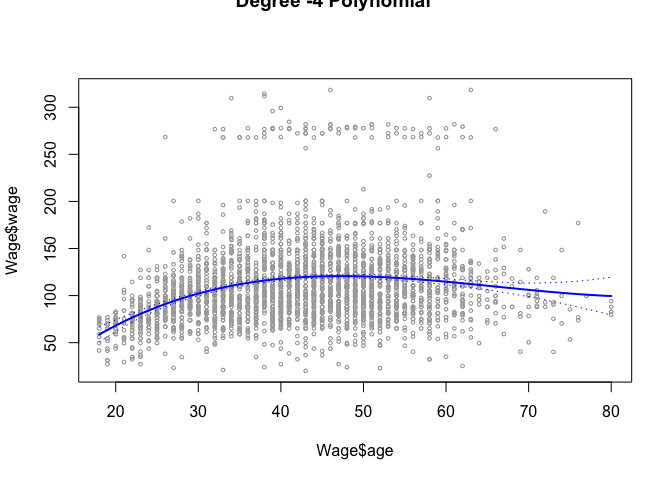

### 6 

6. In this exercise, you will further analyze the Wage data set considered throughout this chapter.

(a) Perform polynomial regression to predict wage using age. Use cross-validation to select the optimal degree d for the polynomial. What degree was chosen, and how does this compare to the results of hypothesis testing using ANOVA? Make a plot of the resulting polynomial fit to the data.


```r
# library(tidyverse)
library(ISLR)
```

```
## Warning: package 'ISLR' was built under R version 3.2.5
```

```r
# fit model with different degrees, and use anova 
fit.1=lm(wage~age,data=Wage)
fit.2=lm(wage~poly(age,2),data=Wage) 
fit.3=lm(wage~poly(age,3),data=Wage) 
fit.4=lm(wage~poly(age,4),data=Wage) 
fit.5=lm(wage~poly(age,5),data=Wage) 
anova(fit.1,fit.2,fit.3,fit.4,fit.5) # degree three I prefer 
```

```
## Analysis of Variance Table
## 
## Model 1: wage ~ age
## Model 2: wage ~ poly(age, 2)
## Model 3: wage ~ poly(age, 3)
## Model 4: wage ~ poly(age, 4)
## Model 5: wage ~ poly(age, 5)
##   Res.Df     RSS Df Sum of Sq        F    Pr(>F)    
## 1   2998 5022216                                    
## 2   2997 4793430  1    228786 143.5931 < 2.2e-16 ***
## 3   2996 4777674  1     15756   9.8888  0.001679 ** 
## 4   2995 4771604  1      6070   3.8098  0.051046 .  
## 5   2994 4770322  1      1283   0.8050  0.369682    
## ---
## Signif. codes:  0 '***' 0.001 '**' 0.01 '*' 0.05 '.' 0.1 ' ' 1
```

```r
# use cross validation 
library(boot)
```

```
## Warning: package 'boot' was built under R version 3.2.5
```

```r
set.seed(1)
cv.error.10=rep(0,5) 
for (i in 1:5){
glm.fit=glm(wage~poly(age ,i),data=Wage) 
cv.error.10[i]=cv.glm(Wage,glm.fit,K=10)$delta[1] # 10 fold CV 
} 
cv.error.10 # degree four is the best 
```

```
## [1] 1675.837 1601.012 1598.801 1594.217 1594.625
```

```r
# make a plot for polynomial, I prefer result from cv 
# get predict 
agelims=range(Wage$age)
age.grid=seq(from=agelims[1],to=agelims[2])
preds=predict(fit.3,newdata=list(age=age.grid),se=TRUE) # predict
se.bands=cbind(preds$fit+2*preds$se.fit,preds$fit-2*preds$se.fit ) # predict +/- 2se

# plot 
plot(Wage$age,Wage$wage,xlim=agelims ,cex=.5,col="darkgrey") # plot the value
title("Degree -4 Polynomial ",outer=T) # title 
lines(age.grid,preds$fit,lwd=2,col="blue") # add fit line 
matlines(age.grid,se.bands,lwd=1,col="blue",lty=3) # add CI line 
```

<!-- -->

(b) Fit a step function to predict wage using age, and perform cross- validation to choose the optimal number of cuts. Make a plot of the fit obtained.


```r
# cv, for each cut from 2 to 6, run 10 times validation set test, each validation set start with a different seed 
# make a function 
cv.k10.step <- function(Wage, cut_number){
for (i in 1:10){ # k level 
set.seed(i)
train_ID <- sample(rownames(Wage), size = round(nrow(Wage) * 0.5), replace = F) 
train <- Wage[rownames(Wage) %in% train_ID,]
test <- Wage[!(rownames(Wage) %in% train_ID),] 

table(cut(train$age,cut_number)) # cut pick cutpoint automatically or specify cut point using breaks 
fit=lm(wage~cut(train$age,cut_number),data=train) 
agelims=range(train$age)
age.grid=seq(from=agelims[1],to=agelims[2])
preds=predict(fit,newdata=list(age=age.grid),se=TRUE) # predict
cv.error[i] <- mean((test$wage-preds$fit)^2)
}  
mean(cv.error)} 

# run cv on step function, cut from 2 to 6
cv.error=rep(0,5)
for (i in 2:6){
cv.error[i]=cv.k10.step(Wage, i)}

cv.error ### doesn't look right.... 
```

```
## [1]    0.000 1724.302 1774.685 1824.554 1830.562 1841.501
```

```r
# fit step function directly using cut number of 4
fit=lm(wage~cut(age ,4),data=Wage) 
coef(summary(fit))
```

```
##                         Estimate Std. Error   t value     Pr(>|t|)
## (Intercept)            94.158392   1.476069 63.789970 0.000000e+00
## cut(age, 4)(33.5,49]   24.053491   1.829431 13.148074 1.982315e-38
## cut(age, 4)(49,64.5]   23.664559   2.067958 11.443444 1.040750e-29
## cut(age, 4)(64.5,80.1]  7.640592   4.987424  1.531972 1.256350e-01
```

```r
# predict 
agelims=range(Wage$age)
age.grid=seq(from=agelims[1],to=agelims[2])
preds=predict(fit,newdata=list(age=age.grid),se=TRUE) # predict
se.bands=cbind(preds$fit+2*preds$se.fit,preds$fit-2*preds$se.fit ) # predict +/- 2se

# plot the fit result 
plot(Wage$age,Wage$wage,xlim=agelims ,cex=.5,col="darkgrey") # plot the value
title("Step fit ",outer=T) # title 
lines(age.grid,preds$fit,lwd=2,col="blue") # add fit line 
matlines(age.grid,se.bands,lwd=1,col="blue",lty=3) # add CI line  
```

<!-- -->

### 7 

The Wage data set contains a number of other features not explored in this chapter, such as marital status (maritl), job class (jobclass), and others. Explore the relationships between some of these other predictors and wage, and use non-linear fitting techniques in order to fit flexible models to the data. Create plots of the results obtained, and write a summary of your findings.


```r
library(ISLR)
colnames(Wage)
```

```
##  [1] "year"       "age"        "maritl"     "race"       "education" 
##  [6] "region"     "jobclass"   "health"     "health_ins" "logwage"   
## [11] "wage"
```

```r
Wage$maritl 
```

```
##    [1] 1. Never Married 1. Never Married 2. Married       2. Married      
##    [5] 4. Divorced      2. Married       2. Married       1. Never Married
##    [9] 1. Never Married 2. Married       4. Divorced      2. Married      
##   [13] 1. Never Married 2. Married       2. Married       2. Married      
##   [17] 1. Never Married 2. Married       2. Married       1. Never Married
##   [21] 2. Married       4. Divorced      2. Married       2. Married      
##   [25] 1. Never Married 2. Married       2. Married       2. Married      
##   [29] 2. Married       1. Never Married 2. Married       2. Married      
##   [33] 1. Never Married 1. Never Married 2. Married       1. Never Married
##   [37] 1. Never Married 1. Never Married 2. Married       2. Married      
##   [41] 2. Married       1. Never Married 1. Never Married 1. Never Married
##   [45] 2. Married       2. Married       2. Married       2. Married      
##   [49] 1. Never Married 1. Never Married 2. Married       2. Married      
##   [53] 2. Married       1. Never Married 1. Never Married 1. Never Married
##   [57] 2. Married       1. Never Married 2. Married       2. Married      
##   [61] 2. Married       2. Married       2. Married       2. Married      
##   [65] 2. Married       2. Married       2. Married       2. Married      
##   [69] 2. Married       1. Never Married 2. Married       1. Never Married
##   [73] 1. Never Married 1. Never Married 1. Never Married 2. Married      
##   [77] 2. Married       1. Never Married 2. Married       1. Never Married
##   [81] 2. Married       2. Married       2. Married       1. Never Married
##   [85] 3. Widowed       2. Married       4. Divorced      2. Married      
##   [89] 2. Married       2. Married       2. Married       2. Married      
##   [93] 4. Divorced      2. Married       1. Never Married 2. Married      
##   [97] 2. Married       2. Married       2. Married       2. Married      
##  [101] 2. Married       2. Married       2. Married       2. Married      
##  [105] 1. Never Married 4. Divorced      2. Married       4. Divorced     
##  [109] 2. Married       2. Married       2. Married       2. Married      
##  [113] 2. Married       2. Married       2. Married       4. Divorced     
##  [117] 2. Married       2. Married       2. Married       2. Married      
##  [121] 2. Married       5. Separated     2. Married       2. Married      
##  [125] 2. Married       1. Never Married 2. Married       2. Married      
##  [129] 2. Married       2. Married       4. Divorced      4. Divorced     
##  [133] 2. Married       2. Married       2. Married       1. Never Married
##  [137] 2. Married       2. Married       2. Married       1. Never Married
##  [141] 1. Never Married 1. Never Married 2. Married       1. Never Married
##  [145] 1. Never Married 4. Divorced      2. Married       2. Married      
##  [149] 2. Married       1. Never Married 2. Married       2. Married      
##  [153] 1. Never Married 2. Married       4. Divorced      2. Married      
##  [157] 2. Married       2. Married       2. Married       2. Married      
##  [161] 2. Married       2. Married       2. Married       2. Married      
##  [165] 4. Divorced      2. Married       2. Married       2. Married      
##  [169] 2. Married       2. Married       2. Married       1. Never Married
##  [173] 2. Married       2. Married       2. Married       4. Divorced     
##  [177] 2. Married       2. Married       2. Married       2. Married      
##  [181] 2. Married       2. Married       2. Married       2. Married      
##  [185] 2. Married       2. Married       1. Never Married 2. Married      
##  [189] 2. Married       1. Never Married 2. Married       2. Married      
##  [193] 2. Married       4. Divorced      2. Married       2. Married      
##  [197] 2. Married       1. Never Married 1. Never Married 2. Married      
##  [201] 2. Married       2. Married       2. Married       1. Never Married
##  [205] 2. Married       2. Married       2. Married       1. Never Married
##  [209] 1. Never Married 1. Never Married 1. Never Married 2. Married      
##  [213] 2. Married       2. Married       2. Married       2. Married      
##  [217] 2. Married       2. Married       2. Married       2. Married      
##  [221] 1. Never Married 2. Married       5. Separated     2. Married      
##  [225] 1. Never Married 2. Married       1. Never Married 2. Married      
##  [229] 2. Married       5. Separated     2. Married       2. Married      
##  [233] 2. Married       2. Married       2. Married       2. Married      
##  [237] 2. Married       2. Married       1. Never Married 2. Married      
##  [241] 1. Never Married 2. Married       4. Divorced      1. Never Married
##  [245] 1. Never Married 1. Never Married 2. Married       2. Married      
##  [249] 1. Never Married 2. Married       2. Married       2. Married      
##  [253] 5. Separated     2. Married       2. Married       2. Married      
##  [257] 3. Widowed       2. Married       2. Married       2. Married      
##  [261] 1. Never Married 2. Married       1. Never Married 2. Married      
##  [265] 2. Married       2. Married       2. Married       2. Married      
##  [269] 2. Married       2. Married       2. Married       2. Married      
##  [273] 2. Married       2. Married       4. Divorced      1. Never Married
##  [277] 2. Married       2. Married       2. Married       2. Married      
##  [281] 1. Never Married 3. Widowed       2. Married       2. Married      
##  [285] 2. Married       1. Never Married 1. Never Married 2. Married      
##  [289] 2. Married       2. Married       2. Married       4. Divorced     
##  [293] 2. Married       2. Married       2. Married       2. Married      
##  [297] 1. Never Married 1. Never Married 2. Married       5. Separated    
##  [301] 2. Married       1. Never Married 1. Never Married 1. Never Married
##  [305] 2. Married       5. Separated     2. Married       1. Never Married
##  [309] 5. Separated     2. Married       2. Married       2. Married      
##  [313] 2. Married       1. Never Married 2. Married       2. Married      
##  [317] 1. Never Married 4. Divorced      1. Never Married 2. Married      
##  [321] 2. Married       1. Never Married 1. Never Married 2. Married      
##  [325] 1. Never Married 4. Divorced      2. Married       1. Never Married
##  [329] 2. Married       2. Married       1. Never Married 2. Married      
##  [333] 2. Married       1. Never Married 2. Married       2. Married      
##  [337] 2. Married       2. Married       1. Never Married 2. Married      
##  [341] 2. Married       2. Married       2. Married       2. Married      
##  [345] 2. Married       2. Married       2. Married       2. Married      
##  [349] 1. Never Married 2. Married       2. Married       2. Married      
##  [353] 1. Never Married 2. Married       2. Married       4. Divorced     
##  [357] 2. Married       2. Married       4. Divorced      2. Married      
##  [361] 1. Never Married 2. Married       2. Married       3. Widowed      
##  [365] 1. Never Married 1. Never Married 4. Divorced      2. Married      
##  [369] 2. Married       2. Married       2. Married       1. Never Married
##  [373] 2. Married       2. Married       2. Married       2. Married      
##  [377] 2. Married       2. Married       1. Never Married 2. Married      
##  [381] 2. Married       2. Married       2. Married       2. Married      
##  [385] 4. Divorced      1. Never Married 2. Married       1. Never Married
##  [389] 2. Married       2. Married       1. Never Married 4. Divorced     
##  [393] 1. Never Married 2. Married       2. Married       2. Married      
##  [397] 2. Married       1. Never Married 2. Married       1. Never Married
##  [401] 2. Married       5. Separated     2. Married       2. Married      
##  [405] 2. Married       2. Married       2. Married       2. Married      
##  [409] 1. Never Married 2. Married       2. Married       2. Married      
##  [413] 2. Married       2. Married       2. Married       2. Married      
##  [417] 2. Married       2. Married       1. Never Married 2. Married      
##  [421] 4. Divorced      2. Married       2. Married       2. Married      
##  [425] 2. Married       2. Married       1. Never Married 2. Married      
##  [429] 2. Married       1. Never Married 2. Married       2. Married      
##  [433] 1. Never Married 2. Married       1. Never Married 2. Married      
##  [437] 2. Married       1. Never Married 2. Married       5. Separated    
##  [441] 2. Married       2. Married       2. Married       2. Married      
##  [445] 1. Never Married 2. Married       2. Married       2. Married      
##  [449] 2. Married       2. Married       2. Married       2. Married      
##  [453] 2. Married       2. Married       2. Married       2. Married      
##  [457] 2. Married       2. Married       2. Married       2. Married      
##  [461] 1. Never Married 2. Married       2. Married       2. Married      
##  [465] 1. Never Married 2. Married       4. Divorced      2. Married      
##  [469] 2. Married       2. Married       2. Married       2. Married      
##  [473] 2. Married       1. Never Married 2. Married       1. Never Married
##  [477] 4. Divorced      2. Married       1. Never Married 2. Married      
##  [481] 2. Married       2. Married       2. Married       1. Never Married
##  [485] 2. Married       1. Never Married 5. Separated     2. Married      
##  [489] 2. Married       2. Married       2. Married       2. Married      
##  [493] 2. Married       2. Married       2. Married       2. Married      
##  [497] 2. Married       2. Married       2. Married       4. Divorced     
##  [501] 2. Married       2. Married       2. Married       1. Never Married
##  [505] 2. Married       1. Never Married 2. Married       2. Married      
##  [509] 2. Married       2. Married       2. Married       2. Married      
##  [513] 1. Never Married 2. Married       2. Married       2. Married      
##  [517] 1. Never Married 2. Married       1. Never Married 2. Married      
##  [521] 2. Married       2. Married       2. Married       1. Never Married
##  [525] 1. Never Married 2. Married       2. Married       2. Married      
##  [529] 2. Married       1. Never Married 1. Never Married 2. Married      
##  [533] 2. Married       2. Married       2. Married       2. Married      
##  [537] 4. Divorced      4. Divorced      2. Married       2. Married      
##  [541] 1. Never Married 4. Divorced      2. Married       2. Married      
##  [545] 2. Married       2. Married       1. Never Married 2. Married      
##  [549] 2. Married       2. Married       2. Married       2. Married      
##  [553] 2. Married       2. Married       1. Never Married 2. Married      
##  [557] 1. Never Married 2. Married       2. Married       2. Married      
##  [561] 2. Married       1. Never Married 1. Never Married 2. Married      
##  [565] 2. Married       2. Married       2. Married       2. Married      
##  [569] 5. Separated     2. Married       2. Married       2. Married      
##  [573] 4. Divorced      4. Divorced      2. Married       1. Never Married
##  [577] 1. Never Married 2. Married       2. Married       1. Never Married
##  [581] 2. Married       2. Married       1. Never Married 2. Married      
##  [585] 1. Never Married 2. Married       5. Separated     4. Divorced     
##  [589] 2. Married       2. Married       2. Married       2. Married      
##  [593] 2. Married       2. Married       1. Never Married 2. Married      
##  [597] 2. Married       1. Never Married 2. Married       1. Never Married
##  [601] 2. Married       2. Married       2. Married       2. Married      
##  [605] 2. Married       1. Never Married 1. Never Married 2. Married      
##  [609] 2. Married       2. Married       4. Divorced      4. Divorced     
##  [613] 2. Married       1. Never Married 2. Married       1. Never Married
##  [617] 2. Married       2. Married       1. Never Married 4. Divorced     
##  [621] 2. Married       2. Married       1. Never Married 1. Never Married
##  [625] 2. Married       1. Never Married 2. Married       2. Married      
##  [629] 2. Married       2. Married       2. Married       2. Married      
##  [633] 2. Married       2. Married       2. Married       2. Married      
##  [637] 2. Married       1. Never Married 2. Married       2. Married      
##  [641] 2. Married       2. Married       4. Divorced      2. Married      
##  [645] 2. Married       2. Married       1. Never Married 2. Married      
##  [649] 2. Married       1. Never Married 2. Married       2. Married      
##  [653] 2. Married       2. Married       2. Married       1. Never Married
##  [657] 1. Never Married 5. Separated     2. Married       2. Married      
##  [661] 2. Married       4. Divorced      2. Married       2. Married      
##  [665] 2. Married       2. Married       2. Married       1. Never Married
##  [669] 2. Married       1. Never Married 1. Never Married 2. Married      
##  [673] 2. Married       2. Married       2. Married       1. Never Married
##  [677] 2. Married       2. Married       2. Married       4. Divorced     
##  [681] 1. Never Married 1. Never Married 3. Widowed       2. Married      
##  [685] 2. Married       1. Never Married 2. Married       2. Married      
##  [689] 1. Never Married 2. Married       2. Married       2. Married      
##  [693] 2. Married       2. Married       1. Never Married 1. Never Married
##  [697] 1. Never Married 2. Married       2. Married       1. Never Married
##  [701] 1. Never Married 2. Married       2. Married       2. Married      
##  [705] 2. Married       1. Never Married 2. Married       2. Married      
##  [709] 2. Married       1. Never Married 2. Married       2. Married      
##  [713] 1. Never Married 2. Married       1. Never Married 2. Married      
##  [717] 1. Never Married 2. Married       1. Never Married 2. Married      
##  [721] 4. Divorced      1. Never Married 2. Married       2. Married      
##  [725] 1. Never Married 3. Widowed       1. Never Married 2. Married      
##  [729] 2. Married       2. Married       2. Married       4. Divorced     
##  [733] 2. Married       4. Divorced      2. Married       1. Never Married
##  [737] 2. Married       4. Divorced      2. Married       2. Married      
##  [741] 2. Married       1. Never Married 2. Married       2. Married      
##  [745] 4. Divorced      2. Married       2. Married       2. Married      
##  [749] 2. Married       2. Married       1. Never Married 4. Divorced     
##  [753] 2. Married       2. Married       5. Separated     2. Married      
##  [757] 2. Married       2. Married       1. Never Married 2. Married      
##  [761] 1. Never Married 2. Married       1. Never Married 2. Married      
##  [765] 2. Married       2. Married       2. Married       2. Married      
##  [769] 1. Never Married 2. Married       1. Never Married 2. Married      
##  [773] 1. Never Married 4. Divorced      4. Divorced      2. Married      
##  [777] 2. Married       2. Married       2. Married       1. Never Married
##  [781] 2. Married       2. Married       2. Married       1. Never Married
##  [785] 2. Married       2. Married       1. Never Married 2. Married      
##  [789] 2. Married       2. Married       2. Married       2. Married      
##  [793] 2. Married       4. Divorced      1. Never Married 2. Married      
##  [797] 4. Divorced      2. Married       2. Married       2. Married      
##  [801] 2. Married       2. Married       2. Married       2. Married      
##  [805] 2. Married       5. Separated     2. Married       2. Married      
##  [809] 1. Never Married 1. Never Married 2. Married       2. Married      
##  [813] 2. Married       2. Married       2. Married       2. Married      
##  [817] 2. Married       2. Married       1. Never Married 2. Married      
##  [821] 1. Never Married 1. Never Married 1. Never Married 2. Married      
##  [825] 1. Never Married 2. Married       2. Married       3. Widowed      
##  [829] 2. Married       2. Married       2. Married       2. Married      
##  [833] 2. Married       2. Married       2. Married       2. Married      
##  [837] 2. Married       1. Never Married 2. Married       1. Never Married
##  [841] 2. Married       1. Never Married 2. Married       2. Married      
##  [845] 2. Married       2. Married       1. Never Married 2. Married      
##  [849] 2. Married       1. Never Married 2. Married       1. Never Married
##  [853] 2. Married       2. Married       2. Married       4. Divorced     
##  [857] 1. Never Married 2. Married       4. Divorced      1. Never Married
##  [861] 1. Never Married 2. Married       2. Married       2. Married      
##  [865] 1. Never Married 4. Divorced      2. Married       2. Married      
##  [869] 2. Married       2. Married       2. Married       2. Married      
##  [873] 2. Married       2. Married       2. Married       2. Married      
##  [877] 1. Never Married 2. Married       2. Married       4. Divorced     
##  [881] 2. Married       2. Married       1. Never Married 2. Married      
##  [885] 2. Married       2. Married       2. Married       2. Married      
##  [889] 2. Married       2. Married       1. Never Married 2. Married      
##  [893] 2. Married       2. Married       1. Never Married 1. Never Married
##  [897] 4. Divorced      4. Divorced      2. Married       2. Married      
##  [901] 2. Married       2. Married       2. Married       2. Married      
##  [905] 2. Married       2. Married       2. Married       2. Married      
##  [909] 4. Divorced      2. Married       4. Divorced      2. Married      
##  [913] 2. Married       2. Married       2. Married       2. Married      
##  [917] 2. Married       2. Married       2. Married       1. Never Married
##  [921] 2. Married       2. Married       2. Married       4. Divorced     
##  [925] 2. Married       2. Married       2. Married       2. Married      
##  [929] 2. Married       2. Married       1. Never Married 2. Married      
##  [933] 2. Married       2. Married       2. Married       2. Married      
##  [937] 1. Never Married 2. Married       2. Married       2. Married      
##  [941] 1. Never Married 2. Married       2. Married       2. Married      
##  [945] 2. Married       2. Married       2. Married       2. Married      
##  [949] 2. Married       2. Married       2. Married       1. Never Married
##  [953] 1. Never Married 4. Divorced      2. Married       2. Married      
##  [957] 1. Never Married 1. Never Married 2. Married       2. Married      
##  [961] 4. Divorced      2. Married       2. Married       2. Married      
##  [965] 2. Married       2. Married       2. Married       2. Married      
##  [969] 2. Married       2. Married       1. Never Married 1. Never Married
##  [973] 2. Married       2. Married       2. Married       2. Married      
##  [977] 2. Married       2. Married       2. Married       2. Married      
##  [981] 2. Married       2. Married       2. Married       2. Married      
##  [985] 2. Married       2. Married       2. Married       4. Divorced     
##  [989] 4. Divorced      2. Married       2. Married       1. Never Married
##  [993] 2. Married       2. Married       2. Married       2. Married      
##  [997] 5. Separated     5. Separated     2. Married       2. Married      
## [1001] 2. Married       2. Married       1. Never Married 2. Married      
## [1005] 2. Married       2. Married       2. Married       2. Married      
## [1009] 2. Married       1. Never Married 2. Married       2. Married      
## [1013] 2. Married       2. Married       2. Married       2. Married      
## [1017] 2. Married       2. Married       1. Never Married 2. Married      
## [1021] 1. Never Married 2. Married       2. Married       4. Divorced     
## [1025] 4. Divorced      1. Never Married 2. Married       2. Married      
## [1029] 2. Married       2. Married       1. Never Married 1. Never Married
## [1033] 2. Married       2. Married       2. Married       2. Married      
## [1037] 2. Married       1. Never Married 2. Married       2. Married      
## [1041] 1. Never Married 2. Married       1. Never Married 2. Married      
## [1045] 1. Never Married 2. Married       2. Married       2. Married      
## [1049] 2. Married       2. Married       2. Married       4. Divorced     
## [1053] 2. Married       2. Married       2. Married       2. Married      
## [1057] 2. Married       2. Married       2. Married       5. Separated    
## [1061] 1. Never Married 2. Married       2. Married       2. Married      
## [1065] 1. Never Married 1. Never Married 2. Married       2. Married      
## [1069] 4. Divorced      2. Married       4. Divorced      2. Married      
## [1073] 2. Married       1. Never Married 2. Married       2. Married      
## [1077] 1. Never Married 2. Married       1. Never Married 2. Married      
## [1081] 2. Married       2. Married       5. Separated     1. Never Married
## [1085] 2. Married       2. Married       2. Married       2. Married      
## [1089] 2. Married       1. Never Married 2. Married       2. Married      
## [1093] 2. Married       1. Never Married 2. Married       2. Married      
## [1097] 2. Married       2. Married       1. Never Married 2. Married      
## [1101] 2. Married       2. Married       1. Never Married 2. Married      
## [1105] 4. Divorced      2. Married       2. Married       1. Never Married
## [1109] 2. Married       5. Separated     2. Married       1. Never Married
## [1113] 1. Never Married 1. Never Married 2. Married       2. Married      
## [1117] 1. Never Married 1. Never Married 2. Married       1. Never Married
## [1121] 1. Never Married 2. Married       2. Married       2. Married      
## [1125] 2. Married       2. Married       2. Married       2. Married      
## [1129] 4. Divorced      1. Never Married 2. Married       4. Divorced     
## [1133] 1. Never Married 2. Married       2. Married       2. Married      
## [1137] 2. Married       2. Married       2. Married       2. Married      
## [1141] 2. Married       4. Divorced      2. Married       2. Married      
## [1145] 1. Never Married 2. Married       1. Never Married 4. Divorced     
## [1149] 2. Married       1. Never Married 2. Married       2. Married      
## [1153] 2. Married       1. Never Married 2. Married       1. Never Married
## [1157] 1. Never Married 2. Married       2. Married       1. Never Married
## [1161] 2. Married       1. Never Married 1. Never Married 2. Married      
## [1165] 2. Married       1. Never Married 4. Divorced      2. Married      
## [1169] 2. Married       2. Married       2. Married       4. Divorced     
## [1173] 1. Never Married 2. Married       2. Married       2. Married      
## [1177] 5. Separated     2. Married       5. Separated     2. Married      
## [1181] 2. Married       2. Married       2. Married       1. Never Married
## [1185] 2. Married       4. Divorced      1. Never Married 2. Married      
## [1189] 1. Never Married 2. Married       2. Married       2. Married      
## [1193] 2. Married       1. Never Married 2. Married       2. Married      
## [1197] 2. Married       2. Married       2. Married       2. Married      
## [1201] 4. Divorced      2. Married       2. Married       2. Married      
## [1205] 2. Married       1. Never Married 2. Married       1. Never Married
## [1209] 2. Married       1. Never Married 2. Married       2. Married      
## [1213] 2. Married       1. Never Married 2. Married       2. Married      
## [1217] 2. Married       2. Married       2. Married       2. Married      
## [1221] 2. Married       1. Never Married 2. Married       2. Married      
## [1225] 2. Married       2. Married       2. Married       2. Married      
## [1229] 2. Married       2. Married       2. Married       4. Divorced     
## [1233] 2. Married       2. Married       1. Never Married 2. Married      
## [1237] 2. Married       2. Married       2. Married       2. Married      
## [1241] 2. Married       4. Divorced      2. Married       1. Never Married
## [1245] 2. Married       2. Married       1. Never Married 2. Married      
## [1249] 2. Married       1. Never Married 2. Married       2. Married      
## [1253] 2. Married       2. Married       2. Married       2. Married      
## [1257] 2. Married       1. Never Married 2. Married       2. Married      
## [1261] 2. Married       2. Married       2. Married       4. Divorced     
## [1265] 1. Never Married 2. Married       2. Married       1. Never Married
## [1269] 2. Married       1. Never Married 4. Divorced      2. Married      
## [1273] 2. Married       2. Married       1. Never Married 2. Married      
## [1277] 2. Married       2. Married       4. Divorced      2. Married      
## [1281] 3. Widowed       2. Married       2. Married       2. Married      
## [1285] 2. Married       2. Married       2. Married       2. Married      
## [1289] 2. Married       2. Married       1. Never Married 1. Never Married
## [1293] 2. Married       2. Married       2. Married       4. Divorced     
## [1297] 2. Married       1. Never Married 2. Married       1. Never Married
## [1301] 2. Married       1. Never Married 2. Married       2. Married      
## [1305] 2. Married       2. Married       1. Never Married 2. Married      
## [1309] 1. Never Married 2. Married       2. Married       2. Married      
## [1313] 2. Married       1. Never Married 2. Married       2. Married      
## [1317] 2. Married       2. Married       2. Married       1. Never Married
## [1321] 2. Married       5. Separated     1. Never Married 1. Never Married
## [1325] 2. Married       2. Married       2. Married       2. Married      
## [1329] 1. Never Married 4. Divorced      1. Never Married 2. Married      
## [1333] 1. Never Married 1. Never Married 1. Never Married 2. Married      
## [1337] 2. Married       1. Never Married 2. Married       2. Married      
## [1341] 2. Married       4. Divorced      2. Married       4. Divorced     
## [1345] 4. Divorced      2. Married       2. Married       2. Married      
## [1349] 1. Never Married 2. Married       2. Married       5. Separated    
## [1353] 2. Married       2. Married       2. Married       2. Married      
## [1357] 2. Married       2. Married       2. Married       2. Married      
## [1361] 1. Never Married 2. Married       2. Married       3. Widowed      
## [1365] 2. Married       2. Married       2. Married       1. Never Married
## [1369] 1. Never Married 2. Married       2. Married       2. Married      
## [1373] 2. Married       1. Never Married 2. Married       2. Married      
## [1377] 2. Married       4. Divorced      2. Married       2. Married      
## [1381] 2. Married       2. Married       2. Married       4. Divorced     
## [1385] 2. Married       2. Married       2. Married       2. Married      
## [1389] 1. Never Married 2. Married       2. Married       2. Married      
## [1393] 2. Married       2. Married       2. Married       4. Divorced     
## [1397] 2. Married       2. Married       2. Married       2. Married      
## [1401] 2. Married       1. Never Married 2. Married       2. Married      
## [1405] 1. Never Married 2. Married       2. Married       1. Never Married
## [1409] 2. Married       2. Married       2. Married       2. Married      
## [1413] 2. Married       1. Never Married 1. Never Married 2. Married      
## [1417] 2. Married       1. Never Married 2. Married       2. Married      
## [1421] 2. Married       2. Married       2. Married       4. Divorced     
## [1425] 2. Married       2. Married       5. Separated     2. Married      
## [1429] 2. Married       5. Separated     1. Never Married 2. Married      
## [1433] 2. Married       2. Married       2. Married       2. Married      
## [1437] 2. Married       2. Married       2. Married       1. Never Married
## [1441] 2. Married       2. Married       2. Married       2. Married      
## [1445] 1. Never Married 2. Married       1. Never Married 2. Married      
## [1449] 2. Married       2. Married       2. Married       2. Married      
## [1453] 2. Married       2. Married       2. Married       1. Never Married
## [1457] 2. Married       1. Never Married 2. Married       4. Divorced     
## [1461] 2. Married       1. Never Married 1. Never Married 1. Never Married
## [1465] 2. Married       2. Married       1. Never Married 1. Never Married
## [1469] 2. Married       4. Divorced      2. Married       2. Married      
## [1473] 2. Married       2. Married       2. Married       2. Married      
## [1477] 2. Married       2. Married       4. Divorced      2. Married      
## [1481] 2. Married       4. Divorced      1. Never Married 2. Married      
## [1485] 2. Married       2. Married       2. Married       2. Married      
## [1489] 2. Married       2. Married       2. Married       1. Never Married
## [1493] 2. Married       1. Never Married 2. Married       5. Separated    
## [1497] 2. Married       2. Married       2. Married       2. Married      
## [1501] 2. Married       1. Never Married 1. Never Married 1. Never Married
## [1505] 2. Married       2. Married       2. Married       2. Married      
## [1509] 1. Never Married 2. Married       1. Never Married 2. Married      
## [1513] 2. Married       4. Divorced      2. Married       2. Married      
## [1517] 1. Never Married 1. Never Married 1. Never Married 4. Divorced     
## [1521] 2. Married       2. Married       2. Married       2. Married      
## [1525] 2. Married       2. Married       1. Never Married 2. Married      
## [1529] 2. Married       2. Married       2. Married       2. Married      
## [1533] 2. Married       2. Married       1. Never Married 2. Married      
## [1537] 2. Married       4. Divorced      2. Married       1. Never Married
## [1541] 1. Never Married 2. Married       2. Married       1. Never Married
## [1545] 1. Never Married 2. Married       2. Married       2. Married      
## [1549] 2. Married       1. Never Married 2. Married       1. Never Married
## [1553] 2. Married       2. Married       2. Married       2. Married      
## [1557] 5. Separated     2. Married       2. Married       4. Divorced     
## [1561] 2. Married       4. Divorced      2. Married       2. Married      
## [1565] 1. Never Married 2. Married       4. Divorced      2. Married      
## [1569] 2. Married       2. Married       1. Never Married 2. Married      
## [1573] 1. Never Married 4. Divorced      4. Divorced      2. Married      
## [1577] 2. Married       2. Married       2. Married       2. Married      
## [1581] 2. Married       2. Married       1. Never Married 2. Married      
## [1585] 2. Married       1. Never Married 2. Married       2. Married      
## [1589] 2. Married       1. Never Married 2. Married       2. Married      
## [1593] 2. Married       2. Married       1. Never Married 2. Married      
## [1597] 2. Married       2. Married       1. Never Married 1. Never Married
## [1601] 5. Separated     2. Married       2. Married       1. Never Married
## [1605] 2. Married       4. Divorced      5. Separated     2. Married      
## [1609] 1. Never Married 2. Married       1. Never Married 5. Separated    
## [1613] 1. Never Married 2. Married       2. Married       2. Married      
## [1617] 2. Married       2. Married       2. Married       2. Married      
## [1621] 2. Married       2. Married       2. Married       4. Divorced     
## [1625] 2. Married       1. Never Married 2. Married       1. Never Married
## [1629] 2. Married       2. Married       1. Never Married 2. Married      
## [1633] 2. Married       2. Married       1. Never Married 1. Never Married
## [1637] 2. Married       2. Married       2. Married       2. Married      
## [1641] 1. Never Married 1. Never Married 5. Separated     2. Married      
## [1645] 2. Married       2. Married       1. Never Married 2. Married      
## [1649] 4. Divorced      2. Married       4. Divorced      2. Married      
## [1653] 2. Married       2. Married       2. Married       2. Married      
## [1657] 2. Married       2. Married       4. Divorced      2. Married      
## [1661] 2. Married       4. Divorced      2. Married       1. Never Married
## [1665] 4. Divorced      3. Widowed       1. Never Married 2. Married      
## [1669] 2. Married       2. Married       1. Never Married 2. Married      
## [1673] 2. Married       2. Married       2. Married       1. Never Married
## [1677] 3. Widowed       4. Divorced      2. Married       1. Never Married
## [1681] 2. Married       2. Married       2. Married       1. Never Married
## [1685] 2. Married       2. Married       2. Married       4. Divorced     
## [1689] 2. Married       2. Married       2. Married       2. Married      
## [1693] 4. Divorced      2. Married       2. Married       1. Never Married
## [1697] 2. Married       2. Married       4. Divorced      2. Married      
## [1701] 2. Married       2. Married       1. Never Married 2. Married      
## [1705] 2. Married       1. Never Married 2. Married       2. Married      
## [1709] 2. Married       2. Married       2. Married       2. Married      
## [1713] 2. Married       1. Never Married 2. Married       1. Never Married
## [1717] 2. Married       1. Never Married 1. Never Married 2. Married      
## [1721] 2. Married       2. Married       2. Married       2. Married      
## [1725] 5. Separated     1. Never Married 2. Married       2. Married      
## [1729] 1. Never Married 2. Married       1. Never Married 1. Never Married
## [1733] 2. Married       2. Married       2. Married       2. Married      
## [1737] 2. Married       2. Married       2. Married       2. Married      
## [1741] 1. Never Married 2. Married       2. Married       2. Married      
## [1745] 1. Never Married 2. Married       2. Married       2. Married      
## [1749] 2. Married       2. Married       4. Divorced      5. Separated    
## [1753] 2. Married       2. Married       2. Married       2. Married      
## [1757] 2. Married       2. Married       2. Married       2. Married      
## [1761] 2. Married       1. Never Married 2. Married       2. Married      
## [1765] 2. Married       1. Never Married 2. Married       1. Never Married
## [1769] 2. Married       4. Divorced      2. Married       1. Never Married
## [1773] 4. Divorced      2. Married       2. Married       2. Married      
## [1777] 2. Married       1. Never Married 2. Married       2. Married      
## [1781] 2. Married       2. Married       2. Married       2. Married      
## [1785] 1. Never Married 1. Never Married 2. Married       1. Never Married
## [1789] 2. Married       3. Widowed       1. Never Married 2. Married      
## [1793] 2. Married       2. Married       2. Married       2. Married      
## [1797] 2. Married       4. Divorced      1. Never Married 2. Married      
## [1801] 2. Married       2. Married       2. Married       2. Married      
## [1805] 2. Married       2. Married       2. Married       2. Married      
## [1809] 1. Never Married 2. Married       1. Never Married 2. Married      
## [1813] 4. Divorced      1. Never Married 2. Married       2. Married      
## [1817] 2. Married       2. Married       1. Never Married 2. Married      
## [1821] 2. Married       2. Married       2. Married       1. Never Married
## [1825] 2. Married       2. Married       2. Married       2. Married      
## [1829] 2. Married       2. Married       1. Never Married 2. Married      
## [1833] 1. Never Married 2. Married       2. Married       2. Married      
## [1837] 1. Never Married 2. Married       1. Never Married 2. Married      
## [1841] 2. Married       1. Never Married 2. Married       2. Married      
## [1845] 1. Never Married 2. Married       2. Married       2. Married      
## [1849] 2. Married       4. Divorced      5. Separated     1. Never Married
## [1853] 2. Married       2. Married       1. Never Married 4. Divorced     
## [1857] 1. Never Married 2. Married       1. Never Married 4. Divorced     
## [1861] 1. Never Married 2. Married       2. Married       2. Married      
## [1865] 2. Married       2. Married       2. Married       2. Married      
## [1869] 2. Married       4. Divorced      1. Never Married 2. Married      
## [1873] 2. Married       2. Married       2. Married       1. Never Married
## [1877] 2. Married       2. Married       4. Divorced      1. Never Married
## [1881] 2. Married       1. Never Married 2. Married       2. Married      
## [1885] 2. Married       1. Never Married 2. Married       2. Married      
## [1889] 2. Married       2. Married       2. Married       2. Married      
## [1893] 2. Married       1. Never Married 2. Married       2. Married      
## [1897] 2. Married       5. Separated     2. Married       2. Married      
## [1901] 2. Married       2. Married       2. Married       2. Married      
## [1905] 4. Divorced      2. Married       1. Never Married 2. Married      
## [1909] 2. Married       2. Married       2. Married       2. Married      
## [1913] 2. Married       2. Married       2. Married       2. Married      
## [1917] 4. Divorced      2. Married       1. Never Married 1. Never Married
## [1921] 2. Married       2. Married       1. Never Married 2. Married      
## [1925] 1. Never Married 1. Never Married 2. Married       1. Never Married
## [1929] 2. Married       2. Married       1. Never Married 2. Married      
## [1933] 1. Never Married 4. Divorced      2. Married       1. Never Married
## [1937] 4. Divorced      2. Married       1. Never Married 1. Never Married
## [1941] 2. Married       1. Never Married 2. Married       1. Never Married
## [1945] 2. Married       4. Divorced      2. Married       4. Divorced     
## [1949] 1. Never Married 2. Married       2. Married       2. Married      
## [1953] 5. Separated     2. Married       2. Married       2. Married      
## [1957] 2. Married       2. Married       2. Married       1. Never Married
## [1961] 2. Married       1. Never Married 2. Married       1. Never Married
## [1965] 2. Married       1. Never Married 2. Married       5. Separated    
## [1969] 2. Married       1. Never Married 2. Married       1. Never Married
## [1973] 1. Never Married 1. Never Married 1. Never Married 2. Married      
## [1977] 2. Married       1. Never Married 4. Divorced      1. Never Married
## [1981] 2. Married       1. Never Married 2. Married       2. Married      
## [1985] 2. Married       2. Married       4. Divorced      1. Never Married
## [1989] 1. Never Married 2. Married       2. Married       2. Married      
## [1993] 2. Married       2. Married       2. Married       2. Married      
## [1997] 2. Married       2. Married       2. Married       1. Never Married
## [2001] 2. Married       1. Never Married 2. Married       4. Divorced     
## [2005] 2. Married       2. Married       2. Married       2. Married      
## [2009] 2. Married       2. Married       4. Divorced      2. Married      
## [2013] 2. Married       1. Never Married 2. Married       2. Married      
## [2017] 2. Married       2. Married       2. Married       2. Married      
## [2021] 1. Never Married 1. Never Married 1. Never Married 2. Married      
## [2025] 4. Divorced      2. Married       2. Married       2. Married      
## [2029] 1. Never Married 2. Married       2. Married       2. Married      
## [2033] 2. Married       2. Married       1. Never Married 2. Married      
## [2037] 2. Married       2. Married       1. Never Married 2. Married      
## [2041] 2. Married       2. Married       1. Never Married 2. Married      
## [2045] 2. Married       1. Never Married 2. Married       1. Never Married
## [2049] 2. Married       2. Married       2. Married       2. Married      
## [2053] 2. Married       2. Married       2. Married       2. Married      
## [2057] 1. Never Married 2. Married       2. Married       4. Divorced     
## [2061] 2. Married       1. Never Married 2. Married       2. Married      
## [2065] 2. Married       2. Married       2. Married       2. Married      
## [2069] 2. Married       2. Married       2. Married       2. Married      
## [2073] 1. Never Married 1. Never Married 2. Married       2. Married      
## [2077] 2. Married       2. Married       2. Married       2. Married      
## [2081] 2. Married       1. Never Married 2. Married       4. Divorced     
## [2085] 2. Married       2. Married       2. Married       2. Married      
## [2089] 2. Married       2. Married       1. Never Married 1. Never Married
## [2093] 4. Divorced      2. Married       2. Married       1. Never Married
## [2097] 2. Married       1. Never Married 3. Widowed       4. Divorced     
## [2101] 1. Never Married 2. Married       2. Married       1. Never Married
## [2105] 2. Married       4. Divorced      2. Married       2. Married      
## [2109] 2. Married       2. Married       2. Married       2. Married      
## [2113] 2. Married       2. Married       2. Married       2. Married      
## [2117] 2. Married       4. Divorced      2. Married       2. Married      
## [2121] 2. Married       2. Married       2. Married       2. Married      
## [2125] 2. Married       2. Married       4. Divorced      1. Never Married
## [2129] 4. Divorced      1. Never Married 4. Divorced      2. Married      
## [2133] 4. Divorced      2. Married       2. Married       4. Divorced     
## [2137] 2. Married       2. Married       2. Married       2. Married      
## [2141] 1. Never Married 2. Married       2. Married       2. Married      
## [2145] 1. Never Married 2. Married       1. Never Married 1. Never Married
## [2149] 1. Never Married 2. Married       2. Married       2. Married      
## [2153] 2. Married       1. Never Married 2. Married       2. Married      
## [2157] 2. Married       2. Married       2. Married       2. Married      
## [2161] 1. Never Married 4. Divorced      1. Never Married 1. Never Married
## [2165] 4. Divorced      2. Married       2. Married       2. Married      
## [2169] 2. Married       1. Never Married 5. Separated     2. Married      
## [2173] 1. Never Married 2. Married       2. Married       2. Married      
## [2177] 1. Never Married 2. Married       1. Never Married 2. Married      
## [2181] 1. Never Married 2. Married       4. Divorced      2. Married      
## [2185] 2. Married       1. Never Married 3. Widowed       2. Married      
## [2189] 2. Married       4. Divorced      2. Married       2. Married      
## [2193] 4. Divorced      2. Married       2. Married       2. Married      
## [2197] 3. Widowed       1. Never Married 2. Married       2. Married      
## [2201] 4. Divorced      2. Married       1. Never Married 2. Married      
## [2205] 2. Married       1. Never Married 1. Never Married 5. Separated    
## [2209] 1. Never Married 1. Never Married 1. Never Married 2. Married      
## [2213] 2. Married       2. Married       1. Never Married 2. Married      
## [2217] 2. Married       2. Married       2. Married       2. Married      
## [2221] 2. Married       2. Married       2. Married       2. Married      
## [2225] 2. Married       1. Never Married 3. Widowed       2. Married      
## [2229] 2. Married       2. Married       2. Married       2. Married      
## [2233] 2. Married       2. Married       2. Married       1. Never Married
## [2237] 2. Married       1. Never Married 4. Divorced      2. Married      
## [2241] 1. Never Married 1. Never Married 2. Married       1. Never Married
## [2245] 2. Married       2. Married       2. Married       1. Never Married
## [2249] 2. Married       2. Married       4. Divorced      2. Married      
## [2253] 1. Never Married 1. Never Married 2. Married       2. Married      
## [2257] 2. Married       2. Married       1. Never Married 2. Married      
## [2261] 2. Married       2. Married       2. Married       1. Never Married
## [2265] 2. Married       1. Never Married 1. Never Married 2. Married      
## [2269] 2. Married       2. Married       2. Married       2. Married      
## [2273] 2. Married       2. Married       2. Married       2. Married      
## [2277] 2. Married       2. Married       2. Married       2. Married      
## [2281] 2. Married       2. Married       1. Never Married 2. Married      
## [2285] 1. Never Married 1. Never Married 2. Married       2. Married      
## [2289] 1. Never Married 5. Separated     2. Married       1. Never Married
## [2293] 2. Married       1. Never Married 4. Divorced      1. Never Married
## [2297] 2. Married       1. Never Married 1. Never Married 2. Married      
## [2301] 2. Married       2. Married       2. Married       4. Divorced     
## [2305] 2. Married       4. Divorced      2. Married       2. Married      
## [2309] 2. Married       2. Married       2. Married       1. Never Married
## [2313] 1. Never Married 4. Divorced      2. Married       2. Married      
## [2317] 1. Never Married 1. Never Married 4. Divorced      2. Married      
## [2321] 1. Never Married 2. Married       2. Married       2. Married      
## [2325] 2. Married       2. Married       4. Divorced      1. Never Married
## [2329] 2. Married       2. Married       2. Married       2. Married      
## [2333] 2. Married       2. Married       2. Married       2. Married      
## [2337] 2. Married       1. Never Married 2. Married       2. Married      
## [2341] 2. Married       2. Married       2. Married       2. Married      
## [2345] 1. Never Married 2. Married       2. Married       2. Married      
## [2349] 2. Married       2. Married       5. Separated     2. Married      
## [2353] 2. Married       2. Married       2. Married       2. Married      
## [2357] 5. Separated     2. Married       1. Never Married 1. Never Married
## [2361] 2. Married       2. Married       2. Married       2. Married      
## [2365] 4. Divorced      2. Married       1. Never Married 1. Never Married
## [2369] 2. Married       2. Married       2. Married       2. Married      
## [2373] 2. Married       2. Married       2. Married       1. Never Married
## [2377] 2. Married       2. Married       2. Married       2. Married      
## [2381] 2. Married       2. Married       2. Married       4. Divorced     
## [2385] 2. Married       2. Married       2. Married       1. Never Married
## [2389] 2. Married       2. Married       2. Married       1. Never Married
## [2393] 2. Married       4. Divorced      1. Never Married 2. Married      
## [2397] 2. Married       2. Married       2. Married       2. Married      
## [2401] 2. Married       2. Married       2. Married       2. Married      
## [2405] 2. Married       1. Never Married 2. Married       2. Married      
## [2409] 2. Married       1. Never Married 2. Married       2. Married      
## [2413] 2. Married       4. Divorced      2. Married       1. Never Married
## [2417] 1. Never Married 4. Divorced      2. Married       2. Married      
## [2421] 2. Married       2. Married       2. Married       2. Married      
## [2425] 2. Married       2. Married       2. Married       2. Married      
## [2429] 1. Never Married 1. Never Married 4. Divorced      5. Separated    
## [2433] 1. Never Married 2. Married       2. Married       2. Married      
## [2437] 2. Married       2. Married       2. Married       1. Never Married
## [2441] 2. Married       2. Married       2. Married       2. Married      
## [2445] 2. Married       2. Married       2. Married       1. Never Married
## [2449] 2. Married       2. Married       2. Married       2. Married      
## [2453] 2. Married       4. Divorced      2. Married       4. Divorced     
## [2457] 2. Married       2. Married       1. Never Married 1. Never Married
## [2461] 2. Married       2. Married       1. Never Married 2. Married      
## [2465] 2. Married       2. Married       2. Married       1. Never Married
## [2469] 2. Married       2. Married       2. Married       2. Married      
## [2473] 2. Married       2. Married       2. Married       2. Married      
## [2477] 1. Never Married 2. Married       5. Separated     1. Never Married
## [2481] 2. Married       2. Married       1. Never Married 2. Married      
## [2485] 2. Married       2. Married       1. Never Married 2. Married      
## [2489] 2. Married       4. Divorced      2. Married       2. Married      
## [2493] 2. Married       2. Married       4. Divorced      2. Married      
## [2497] 2. Married       2. Married       4. Divorced      2. Married      
## [2501] 2. Married       2. Married       2. Married       2. Married      
## [2505] 2. Married       1. Never Married 2. Married       2. Married      
## [2509] 2. Married       2. Married       2. Married       2. Married      
## [2513] 2. Married       2. Married       1. Never Married 2. Married      
## [2517] 2. Married       1. Never Married 2. Married       4. Divorced     
## [2521] 2. Married       2. Married       1. Never Married 2. Married      
## [2525] 1. Never Married 2. Married       1. Never Married 2. Married      
## [2529] 1. Never Married 2. Married       2. Married       2. Married      
## [2533] 2. Married       1. Never Married 2. Married       2. Married      
## [2537] 1. Never Married 2. Married       2. Married       2. Married      
## [2541] 2. Married       1. Never Married 1. Never Married 2. Married      
## [2545] 2. Married       1. Never Married 4. Divorced      2. Married      
## [2549] 2. Married       2. Married       2. Married       1. Never Married
## [2553] 2. Married       2. Married       5. Separated     2. Married      
## [2557] 2. Married       2. Married       2. Married       2. Married      
## [2561] 2. Married       2. Married       2. Married       2. Married      
## [2565] 2. Married       2. Married       3. Widowed       1. Never Married
## [2569] 2. Married       1. Never Married 1. Never Married 4. Divorced     
## [2573] 2. Married       2. Married       2. Married       4. Divorced     
## [2577] 2. Married       1. Never Married 2. Married       2. Married      
## [2581] 1. Never Married 2. Married       2. Married       2. Married      
## [2585] 1. Never Married 2. Married       4. Divorced      2. Married      
## [2589] 2. Married       2. Married       2. Married       2. Married      
## [2593] 2. Married       2. Married       4. Divorced      2. Married      
## [2597] 1. Never Married 1. Never Married 2. Married       2. Married      
## [2601] 4. Divorced      2. Married       2. Married       2. Married      
## [2605] 4. Divorced      5. Separated     2. Married       2. Married      
## [2609] 1. Never Married 1. Never Married 2. Married       2. Married      
## [2613] 2. Married       2. Married       2. Married       2. Married      
## [2617] 1. Never Married 1. Never Married 2. Married       2. Married      
## [2621] 2. Married       1. Never Married 2. Married       2. Married      
## [2625] 2. Married       2. Married       2. Married       2. Married      
## [2629] 4. Divorced      2. Married       2. Married       1. Never Married
## [2633] 1. Never Married 2. Married       2. Married       1. Never Married
## [2637] 1. Never Married 2. Married       2. Married       1. Never Married
## [2641] 2. Married       4. Divorced      2. Married       1. Never Married
## [2645] 2. Married       2. Married       2. Married       2. Married      
## [2649] 1. Never Married 2. Married       4. Divorced      1. Never Married
## [2653] 1. Never Married 1. Never Married 2. Married       2. Married      
## [2657] 2. Married       2. Married       2. Married       1. Never Married
## [2661] 2. Married       2. Married       2. Married       2. Married      
## [2665] 4. Divorced      2. Married       2. Married       2. Married      
## [2669] 2. Married       2. Married       1. Never Married 2. Married      
## [2673] 4. Divorced      5. Separated     1. Never Married 2. Married      
## [2677] 1. Never Married 2. Married       2. Married       2. Married      
## [2681] 2. Married       1. Never Married 2. Married       2. Married      
## [2685] 1. Never Married 2. Married       2. Married       2. Married      
## [2689] 1. Never Married 2. Married       2. Married       2. Married      
## [2693] 4. Divorced      1. Never Married 2. Married       1. Never Married
## [2697] 2. Married       1. Never Married 1. Never Married 1. Never Married
## [2701] 2. Married       1. Never Married 2. Married       2. Married      
## [2705] 2. Married       2. Married       2. Married       1. Never Married
## [2709] 1. Never Married 2. Married       4. Divorced      1. Never Married
## [2713] 2. Married       2. Married       1. Never Married 2. Married      
## [2717] 2. Married       2. Married       2. Married       2. Married      
## [2721] 2. Married       2. Married       2. Married       2. Married      
## [2725] 1. Never Married 2. Married       2. Married       4. Divorced     
## [2729] 2. Married       2. Married       2. Married       1. Never Married
## [2733] 2. Married       2. Married       2. Married       1. Never Married
## [2737] 1. Never Married 2. Married       4. Divorced      2. Married      
## [2741] 2. Married       2. Married       2. Married       2. Married      
## [2745] 2. Married       2. Married       2. Married       2. Married      
## [2749] 2. Married       1. Never Married 2. Married       1. Never Married
## [2753] 2. Married       2. Married       2. Married       2. Married      
## [2757] 2. Married       2. Married       2. Married       2. Married      
## [2761] 1. Never Married 1. Never Married 4. Divorced      2. Married      
## [2765] 2. Married       2. Married       1. Never Married 2. Married      
## [2769] 2. Married       2. Married       2. Married       4. Divorced     
## [2773] 2. Married       2. Married       2. Married       2. Married      
## [2777] 2. Married       2. Married       4. Divorced      2. Married      
## [2781] 1. Never Married 2. Married       2. Married       5. Separated    
## [2785] 1. Never Married 2. Married       2. Married       2. Married      
## [2789] 2. Married       1. Never Married 1. Never Married 2. Married      
## [2793] 1. Never Married 2. Married       2. Married       2. Married      
## [2797] 2. Married       1. Never Married 2. Married       2. Married      
## [2801] 2. Married       2. Married       2. Married       2. Married      
## [2805] 2. Married       2. Married       2. Married       4. Divorced     
## [2809] 2. Married       2. Married       2. Married       2. Married      
## [2813] 2. Married       2. Married       2. Married       2. Married      
## [2817] 2. Married       2. Married       2. Married       2. Married      
## [2821] 2. Married       1. Never Married 3. Widowed       2. Married      
## [2825] 1. Never Married 1. Never Married 2. Married       2. Married      
## [2829] 1. Never Married 2. Married       1. Never Married 2. Married      
## [2833] 2. Married       2. Married       2. Married       1. Never Married
## [2837] 2. Married       2. Married       1. Never Married 2. Married      
## [2841] 2. Married       1. Never Married 2. Married       2. Married      
## [2845] 2. Married       2. Married       1. Never Married 2. Married      
## [2849] 2. Married       2. Married       1. Never Married 4. Divorced     
## [2853] 4. Divorced      2. Married       1. Never Married 1. Never Married
## [2857] 2. Married       2. Married       2. Married       2. Married      
## [2861] 2. Married       5. Separated     1. Never Married 4. Divorced     
## [2865] 2. Married       4. Divorced      2. Married       2. Married      
## [2869] 2. Married       1. Never Married 1. Never Married 1. Never Married
## [2873] 1. Never Married 2. Married       4. Divorced      1. Never Married
## [2877] 2. Married       2. Married       2. Married       2. Married      
## [2881] 2. Married       2. Married       3. Widowed       2. Married      
## [2885] 1. Never Married 5. Separated     4. Divorced      2. Married      
## [2889] 2. Married       2. Married       5. Separated     2. Married      
## [2893] 2. Married       2. Married       2. Married       1. Never Married
## [2897] 2. Married       1. Never Married 5. Separated     2. Married      
## [2901] 2. Married       1. Never Married 2. Married       2. Married      
## [2905] 2. Married       1. Never Married 2. Married       2. Married      
## [2909] 1. Never Married 2. Married       2. Married       2. Married      
## [2913] 1. Never Married 2. Married       2. Married       2. Married      
## [2917] 2. Married       2. Married       4. Divorced      1. Never Married
## [2921] 2. Married       2. Married       2. Married       1. Never Married
## [2925] 2. Married       2. Married       2. Married       2. Married      
## [2929] 2. Married       4. Divorced      1. Never Married 2. Married      
## [2933] 2. Married       2. Married       2. Married       2. Married      
## [2937] 2. Married       2. Married       2. Married       1. Never Married
## [2941] 2. Married       2. Married       2. Married       5. Separated    
## [2945] 2. Married       4. Divorced      2. Married       2. Married      
## [2949] 4. Divorced      2. Married       2. Married       4. Divorced     
## [2953] 2. Married       2. Married       2. Married       2. Married      
## [2957] 2. Married       1. Never Married 2. Married       2. Married      
## [2961] 1. Never Married 1. Never Married 2. Married       2. Married      
## [2965] 2. Married       2. Married       1. Never Married 1. Never Married
## [2969] 2. Married       1. Never Married 2. Married       1. Never Married
## [2973] 1. Never Married 2. Married       2. Married       2. Married      
## [2977] 1. Never Married 2. Married       2. Married       2. Married      
## [2981] 2. Married       2. Married       2. Married       2. Married      
## [2985] 2. Married       2. Married       2. Married       2. Married      
## [2989] 2. Married       1. Never Married 2. Married       1. Never Married
## [2993] 2. Married       2. Married       2. Married       2. Married      
## [2997] 2. Married       2. Married       1. Never Married 5. Separated    
## 5 Levels: 1. Never Married 2. Married 3. Widowed ... 5. Separated
```

```r
pairs(Wage)
```

<!-- -->

```r
Wage$maritl <- as.numeric(Wage$maritl)
# use maritial status to predict wage, categorical predictor, I decided to use step function  
table(cut(Wage$maritl,4)) # cut pick cutpoint automatically or specify cut point using breaks 
```

```
## 
## (0.996,2]     (2,3]     (3,4]     (4,5] 
##      2722        19       204        55
```

```r
fit=lm(wage~cut(maritl ,4),data=Wage) 
coef(summary(fit))
```

```
##                      Estimate Std. Error    t value    Pr(>|t|)
## (Intercept)         112.64079  0.7982099 141.116753 0.000000000
## cut(maritl, 4)(2,3] -13.10214  9.5872672  -1.366618 0.171847494
## cut(maritl, 4)(3,4]  -9.48153  3.0230073  -3.136456 0.001726615
## cut(maritl, 4)(4,5] -11.42500  5.6718366  -2.014339 0.044063117
```

```r
# predict 
agelims=range(Wage$maritl)
age.grid=seq(from=agelims[1],to=agelims[2])
preds=predict(fit,newdata=list(maritl=age.grid),se=TRUE) # predict
se.bands=cbind(preds$fit+2*preds$se.fit,preds$fit-2*preds$se.fit ) # predict +/- 2se

# plot the fit result 
plot(Wage$maritl,Wage$wage,xlim=agelims ,cex=.5,col="darkgrey") # plot the value
title("Step fit marital ",outer=T) # title 
lines(age.grid,preds$fit,lwd=2,col="blue") # add fit line 
matlines(age.grid,se.bands,lwd=1,col="blue",lty=3) # add CI line  
```

<!-- -->

```r
# to make money, either don't marry or be married for ever 
# 1. Never Married 2. Married 3. Widowed 4. Divorced 5. Separated maybe this level, need to check 
```

### 8 

Fit some of the non-linear models investigated in this chapter to the Auto data set. Is there evidence for non-linear relationships in this data set? Create some informative plots to justify your answer.


```r
colnames(Auto) 
```

```
## [1] "mpg"          "cylinders"    "displacement" "horsepower"  
## [5] "weight"       "acceleration" "year"         "origin"      
## [9] "name"
```

```r
# I would like to invesitigate the relationship between origin and mpg, hypothesis, Japanese car has a higher mpg, origin matters 

# polynomial 
fit=lm(mpg~poly(origin,2),data=Auto) 
summary(fit) # degree of two 
```

```
## 
## Call:
## lm(formula = mpg ~ poly(origin, 2), data = Auto)
## 
## Residuals:
##     Min      1Q  Median      3Q     Max 
## -12.451  -5.034  -1.034   3.649  18.966 
## 
## Coefficients:
##                  Estimate Std. Error t value Pr(>|t|)    
## (Intercept)       23.4459     0.3231  72.575  < 2e-16 ***
## poly(origin, 2)1  87.2309     6.3962  13.638  < 2e-16 ***
## poly(origin, 2)2 -17.1771     6.3962  -2.686  0.00755 ** 
## ---
## Signif. codes:  0 '***' 0.001 '**' 0.01 '*' 0.05 '.' 0.1 ' ' 1
## 
## Residual standard error: 6.396 on 389 degrees of freedom
## Multiple R-squared:  0.3318,	Adjusted R-squared:  0.3284 
## F-statistic:  96.6 on 2 and 389 DF,  p-value: < 2.2e-16
```

```r
# step 
table(cut(Auto$origin, breaks = 4)) # cut pick cutpoint automatically or specify cut point using breaks 
```

```
## 
## (0.998,1.5]     (1.5,2]     (2,2.5]     (2.5,3] 
##         245          68           0          79
```

```r
fit=lm(mpg~cut(origin ,4),data=Auto)  
coef(summary(fit))
```

```
##                        Estimate Std. Error   t value      Pr(>|t|)
## (Intercept)           20.033469  0.4086405 49.024678 1.383741e-168
## cut(origin, 4)(1.5,2]  7.569472  0.8767164  8.633889  1.543152e-16
## cut(origin, 4)(2.5,3] 10.417164  0.8275617 12.587779  1.023502e-30
```

```r
# predict 
agelims=range(Auto$origin)
age.grid=seq(from=agelims[1],to=agelims[2])
preds=predict(fit,newdata=list(origin=age.grid),se=TRUE) # predict
se.bands=cbind(preds$fit+2*preds$se.fit,preds$fit-2*preds$se.fit ) # predict +/- 2se

# plot the fit result 
plot(Auto$origin,Auto$mpg,xlim=agelims ,cex=.5,col="darkgrey") # plot the value
title("Step fit mpg vs. origin ",outer=T) # title 
lines(age.grid,preds$fit,lwd=2,col="blue") # add fit line 
matlines(age.grid,se.bands,lwd=1,col="blue",lty=3) # add CI line, origin matters 
```

<!-- -->

```r
# splines 
library(splines)
fit=lm(mpg~bs(origin,knots=c(1,2,3)),data=Auto) # specify knots at 25, 40, and 60 
pred.splines=predict(fit,newdata=list(origin=age.grid),se=T)
```

```
## Warning in predict.lm(fit, newdata = list(origin = age.grid), se = T):
## prediction from a rank-deficient fit may be misleading
```

```r
pred.splines 
```

```
## $fit
##        1        2        3 
## 20.03347 27.60294 30.45063 
## 
## $se.fit
##         1         2         3 
## 0.4086405 0.7756575 0.7196327 
## 
## $df
## [1] 389
## 
## $residual.scale
## [1] 6.396236
```

```r
plot(Auto$origin,Auto$mpg,col="gray")
lines(age.grid,pred.splines$fit,lwd=2)
lines(age.grid,pred.splines$fit+2*pred.splines$se ,lty="dashed")
lines(age.grid,pred.splines$fit-2*pred.splines$se ,lty="dashed")

# natural splines
fit2=lm(mpg~ns(origin,df=4),data=Auto)
pred2=predict(fit2,newdata=list(origin=age.grid),se=T) 
```

```
## Warning in predict.lm(fit2, newdata = list(origin = age.grid), se = T):
## prediction from a rank-deficient fit may be misleading
```

```r
lines(age.grid, pred2$fit,col="red",lwd=2)  
```

<!-- -->

### 9 

This question uses the variables dis (the weighted mean of distances to five Boston employment centers) and nox (nitrogen oxides concen- tration in parts per 10 million) from the Boston data. We will treat dis as the predictor and nox as the response.

(a) Use the poly() function to fit a cubic polynomial regression to predict nox using dis. Report the regression output, and plot the resulting data and polynomial fits.


```r
library(MASS)
```

```
## Warning: package 'MASS' was built under R version 3.2.5
```

```r
colnames(Boston)
```

```
##  [1] "crim"    "zn"      "indus"   "chas"    "nox"     "rm"      "age"    
##  [8] "dis"     "rad"     "tax"     "ptratio" "black"   "lstat"   "medv"
```

```r
fit=lm(nox~poly(dis,3),data=Boston) 
summary(fit) 
```

```
## 
## Call:
## lm(formula = nox ~ poly(dis, 3), data = Boston)
## 
## Residuals:
##       Min        1Q    Median        3Q       Max 
## -0.121130 -0.040619 -0.009738  0.023385  0.194904 
## 
## Coefficients:
##                Estimate Std. Error t value Pr(>|t|)    
## (Intercept)    0.554695   0.002759 201.021  < 2e-16 ***
## poly(dis, 3)1 -2.003096   0.062071 -32.271  < 2e-16 ***
## poly(dis, 3)2  0.856330   0.062071  13.796  < 2e-16 ***
## poly(dis, 3)3 -0.318049   0.062071  -5.124 4.27e-07 ***
## ---
## Signif. codes:  0 '***' 0.001 '**' 0.01 '*' 0.05 '.' 0.1 ' ' 1
## 
## Residual standard error: 0.06207 on 502 degrees of freedom
## Multiple R-squared:  0.7148,	Adjusted R-squared:  0.7131 
## F-statistic: 419.3 on 3 and 502 DF,  p-value: < 2.2e-16
```

```r
lims=range(Boston$dis)
grid=seq(from=lims[1],to=lims[2])
preds=predict(fit,newdata=list(dis=grid),se=TRUE) # predict
se.bands=cbind(preds$fit+2*preds$se.fit,preds$fit-2*preds$se.fit ) # predict +/- 2se

plot(Boston$dis,Boston$nox,xlim=lims ,cex=.5,col="darkgrey") # plot the value
title("Degree -3 Polynomial ",outer=T) # title 
lines(grid,preds$fit,lwd=2,col="blue") # add fit line 
matlines(grid,se.bands,lwd=1,col="blue",lty=3) # add CI line  
```

<!-- -->

(b) Plot the polynomial fits for a range of different polynomial degrees (say, from 1 to 10), and report the associated residual sum of squares.


```r
# what is rss? residual: the difference between the ith observed response value and the ith response value that is predicted by our linear model. RSS is sum of squares of residuals 
set.seed(1)
cv.error.10=rep(0,10) 
for (i in 1:10){
glm.fit=glm(nox~poly(dis ,i),data=Boston) 
cv.error.10[i]= sum((Boston$nox-predict(glm.fit, Boston))^2) 
} 
cv.error.10  
```

```
##  [1] 2.768563 2.035262 1.934107 1.932981 1.915290 1.878257 1.849484
##  [8] 1.835630 1.833331 1.832171
```

```r
plot(cv.error.10) # degree of 3 
```

<!-- -->

(c) Perform cross-validation or another approach to select the opti- mal degree for the polynomial, and explain your results.


```r
cv.error=rep(0,5) 
for (i in 1:5){
glm.fit=glm(nox~poly(dis ,i),data=Boston) # different polynomial levels 
cv.error[i]=cv.glm(Boston,glm.fit, K=10)$delta[1]}  
cv.error  
```

```
## [1] 0.005536329 0.004077147 0.003899587 0.003862127 0.004298590
```

```r
plot(cv.error) # degree of 3 
```

<!-- -->

I will stop here. 

(d) Use the bs() function to fit a regression spline to predict nox using dis. Report the output for the fit using four degrees of freedom. How did you choose the knots? Plot the resulting fit.


(e) Now fit a regression spline for a range of degrees of freedom, and plot the resulting fits and report the resulting RSS. Describe the results obtained.

(f) Perform cross-validation or another approach in order to select the best degrees of freedom for a regression spline on this data. Describe your results.
