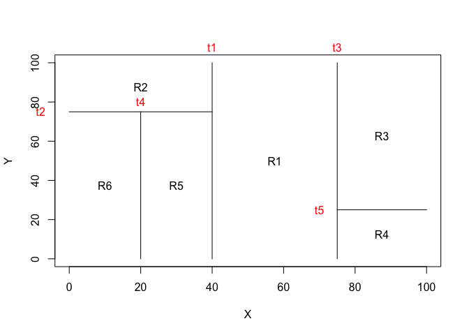
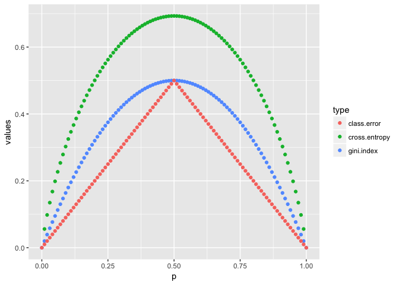
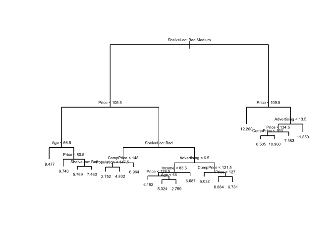
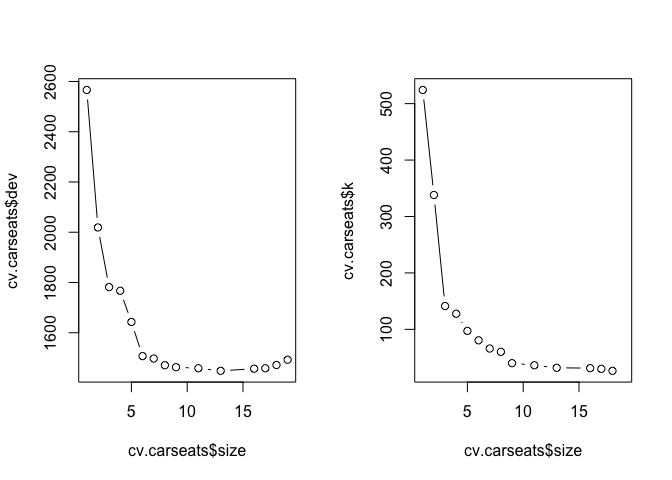
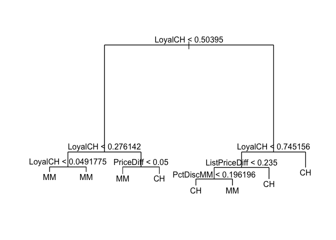
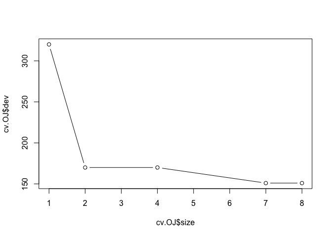

```r
library(tidyverse)
```

```
## ── Attaching packages ────────────────────────────────── tidyverse 1.2.1 ──
```

```
## ✔ ggplot2 2.2.1     ✔ purrr   0.2.4
## ✔ tibble  1.4.2     ✔ dplyr   0.7.4
## ✔ tidyr   0.8.0     ✔ stringr 1.3.0
## ✔ readr   1.1.1     ✔ forcats 0.3.0
```

```
## Warning: package 'ggplot2' was built under R version 3.2.5
```

```
## Warning: package 'readr' was built under R version 3.2.5
```

```
## Warning: package 'purrr' was built under R version 3.2.5
```

```
## Warning: package 'dplyr' was built under R version 3.2.5
```

```
## ── Conflicts ───────────────────────────────────── tidyverse_conflicts() ──
## ✖ dplyr::filter() masks stats::filter()
## ✖ dplyr::lag()    masks stats::lag()
```

```r
library(MASS)
```

```
## Warning: package 'MASS' was built under R version 3.2.5
```

```
## 
## Attaching package: 'MASS'
```

```
## The following object is masked from 'package:dplyr':
## 
##     select
```

```r
library(tree)
library(ISLR)
```

```
## Warning: package 'ISLR' was built under R version 3.2.5
```

### 1

Draw an example (of your own invention) of a partition of two- dimensional feature space that could result from recursive binary splitting. Your example should contain at least six regions. Draw a decision tree corresponding to this partition. Be sure to label all aspects of your figures, including the regions R1, R2, . . ., the cutpoints t1,t2,..., and so forth.
Hint: Your result should look something like Figures 8.1 and 8.2.


```r
par(xpd = NA) # if NA, all plotting is clipped to the device region
plot(NA, NA, type = "n", xlim = c(0,100), ylim = c(0,100), xlab = "X", ylab = "Y")
# t1: x = 40; (40, 0) (40, 100)
lines(x = c(40,40), y = c(0,100)) 
text(x = 40, y = 108, labels = c("t1"), col = "red")
# t2: y = 75; (0, 75) (40, 75)
lines(x = c(0,40), y = c(75,75))
text(x = -8, y = 75, labels = c("t2"), col = "red")
# t3: x = 75; (75,0) (75, 100)
lines(x = c(75,75), y = c(0,100))
text(x = 75, y = 108, labels = c("t3"), col = "red")
# t4: x = 20; (20,0) (20, 75)
lines(x = c(20,20), y = c(0,75))
text(x = 20, y = 80, labels = c("t4"), col = "red")
# t5: y=25; (75,25) (100,25)
lines(x = c(75,100), y = c(25,25))
text(x = 70, y = 25, labels = c("t5"), col = "red")

text(x = (40+75)/2, y = 50, labels = c("R1"))
text(x = 20, y = (100+75)/2, labels = c("R2"))
text(x = (75+100)/2, y = (100+25)/2, labels = c("R3"))
text(x = (75+100)/2, y = 25/2, labels = c("R4"))
text(x = 30, y = 75/2, labels = c("R5"))
text(x = 10, y = 75/2, labels = c("R6"))
```

<!-- -->

```r
# the tree 
```

### 3 

Consider the Gini index, classification error, and entropy in a simple classification setting with two classes. Create a single plot that displays each of these quantities as a function of pˆm1. The x- axis should display pˆm1, ranging from 0 to 1, and the y-axis should display the value of the Gini index, classification error, and entropy.

Hint: In a setting with two classes, pˆm1 = 1 − pˆm2. You could make this plot by hand, but it will be much easier to make in R.


```r
p <- seq(0, 1, 0.01)
gini.index <- 2 * p * (1 - p) # the formula 
cross.entropy <- - (p * log(p) + (1 - p) * log(1 - p)) # the formula
class.error <- 1 - pmax(p, 1 - p) # the fomula 

cbind(p, gini.index, class.error, cross.entropy) %>% as.data.frame() %>% 
  gather("gini.index", "cross.entropy", "class.error", key = "type", value = "values") %>% 
  ggplot() + 
  geom_point(aes(x = p, y = values, color = type))  
```

```
## Warning: Removed 2 rows containing missing values (geom_point).
```

<!-- -->

### 8 

In the lab, a classification tree was applied to the Carseats data set after converting Sales into a qualitative response variable. Now we will seek to predict Sales using regression trees and related approaches, treating the response as a quantitative variable.

(a) Split the data set into a training set and a test set.


```r
set.seed(1)
train_ID <- sample(rownames(Carseats), size = round(nrow(Carseats) * 0.8), replace = F) 
train <- Carseats[rownames(Carseats) %in% train_ID,]
test <- Carseats[!(rownames(Carseats) %in% train_ID),]

colnames(Carseats)
```

```
##  [1] "Sales"       "CompPrice"   "Income"      "Advertising" "Population" 
##  [6] "Price"       "ShelveLoc"   "Age"         "Education"   "Urban"      
## [11] "US"
```

(b) Fit a regression tree to the training set. Plot the tree, and interpret the results. What test MSE do you obtain?


```r
tree.carseats =tree(Sales~.-Sales ,train)

summary(tree.carseats) 
```

```
## 
## Regression tree:
## tree(formula = Sales ~ . - Sales, data = train)
## Variables actually used in tree construction:
## [1] "ShelveLoc"   "Price"       "Age"         "CompPrice"   "Population" 
## [6] "Advertising" "Income"     
## Number of terminal nodes:  19 
## Residual mean deviance:  2.452 = 738.2 / 301 
## Distribution of residuals:
##     Min.  1st Qu.   Median     Mean  3rd Qu.     Max. 
## -3.80300 -0.97550 -0.06679  0.00000  0.95970  5.30800
```

```r
plot(tree.carseats )
text(tree.carseats, pretty = 0, cex = 0.5) 
```

<!-- -->

```r
tree.pred=predict(tree.carseats,test)
mean((tree.pred - test$Sales)^2) 
```

```
## [1] 4.817033
```

(c) Use cross-validation in order to determine the optimal level of tree complexity. Does pruning the tree improve the test MSE?


```r
set.seed(2)
cv.carseats =cv.tree(tree.carseats)
cv.carseats
```

```
## $size
##  [1] 19 18 17 16 13 11  9  8  7  6  5  4  3  2  1
## 
## $dev
##  [1] 1492.551 1471.653 1458.577 1456.825 1448.314 1458.671 1462.832
##  [8] 1470.757 1497.250 1506.864 1642.913 1767.024 1781.596 2018.923
## [15] 2566.197
## 
## $k
##  [1]      -Inf  26.46888  29.98126  31.22339  31.89685  36.35474  40.08414
##  [8]  60.18026  66.00291  80.56524  97.29287 127.66651 141.29195 338.16101
## [15] 524.24198
## 
## $method
## [1] "deviance"
## 
## attr(,"class")
## [1] "prune"         "tree.sequence"
```

```r
par(mfrow=c(1,2))
plot(cv.carseats$size ,cv.carseats$dev ,type='b')
plot(cv.carseats$size ,cv.carseats$k ,type='b') # size 13 gave the smallest CV error 
```

<!-- -->

```r
# 
prune.carseats=prune.tree(tree.carseats,best=13)
tree.pred=predict(prune.carseats,test)
mean((tree.pred - test$Sales)^2) 
```

```
## [1] 4.891394
```

### 9 

9. This problem involves the OJ data set which is part of the ISLR package.

(a) Create a training set containing a random sample of 800 observations, and a test set containing the remaining observations.


```r
set.seed(2)
train=sample(1:nrow(OJ), 800)
OJ.test=OJ[-train ,]
```

(b) Fit a tree to the training data, with Purchase as the response and the other variables as predictors. Use the summary() function to produce summary statistics about the tree, and describe the results obtained. What is the training error rate? How many terminal nodes does the tree have?


```r
?OJ
tree.OJ=tree(Purchase~.-Purchase,OJ,subset=train)
summary(tree.OJ) 
```

```
## 
## Classification tree:
## tree(formula = Purchase ~ . - Purchase, data = OJ, subset = train)
## Variables actually used in tree construction:
## [1] "LoyalCH"       "PriceDiff"     "ListPriceDiff" "PctDiscMM"    
## Number of terminal nodes:  8 
## Residual mean deviance:  0.7659 = 606.6 / 792 
## Misclassification error rate: 0.1675 = 134 / 800
```

```r
# 8 termail nodes, training error rate of 0.167
```

(c) Type in the name of the tree object in order to get a detailed text output. Pick one of the terminal nodes, and interpret the information displayed.


```r
tree.OJ 
```

```
## node), split, n, deviance, yval, (yprob)
##       * denotes terminal node
## 
##  1) root 800 1077.00 CH ( 0.60000 0.40000 )  
##    2) LoyalCH < 0.50395 360  425.40 MM ( 0.27778 0.72222 )  
##      4) LoyalCH < 0.276142 176  132.60 MM ( 0.12500 0.87500 )  
##        8) LoyalCH < 0.0491775 63   10.27 MM ( 0.01587 0.98413 ) *
##        9) LoyalCH > 0.0491775 113  108.50 MM ( 0.18584 0.81416 ) *
##      5) LoyalCH > 0.276142 184  250.80 MM ( 0.42391 0.57609 )  
##       10) PriceDiff < 0.05 71   75.77 MM ( 0.22535 0.77465 ) *
##       11) PriceDiff > 0.05 113  155.60 CH ( 0.54867 0.45133 ) *
##    3) LoyalCH > 0.50395 440  350.50 CH ( 0.86364 0.13636 )  
##      6) LoyalCH < 0.745156 182  210.00 CH ( 0.73626 0.26374 )  
##       12) ListPriceDiff < 0.235 70   97.04 CH ( 0.50000 0.50000 )  
##         24) PctDiscMM < 0.196196 51   66.22 CH ( 0.64706 0.35294 ) *
##         25) PctDiscMM > 0.196196 19   12.79 MM ( 0.10526 0.89474 ) *
##       13) ListPriceDiff > 0.235 112   80.42 CH ( 0.88393 0.11607 ) *
##      7) LoyalCH > 0.745156 258   97.07 CH ( 0.95349 0.04651 ) *
```

(d) Create a plot of the tree, and interpret the results.

```r
plot(tree.OJ )
text(tree.OJ ,pretty =0) 
```

<!-- -->

(e) Predict the response on the test data, and produce a confusion matrix comparing the test labels to the predicted test labels. What is the test error rate?


```r
tree.pred=predict(tree.OJ,OJ.test,type="class")
table(tree.pred ,OJ.test$Purchase)
```

```
##          
## tree.pred  CH  MM
##        CH 161  28
##        MM  12  69
```

```r
(28+12) /270 
```

```
## [1] 0.1481481
```

(f) Apply the cv.tree() function to the training set in order to determine the optimal tree size.


```r
set.seed(3)
cv.OJ =cv.tree(tree.OJ ,FUN=prune.misclass )
```

(g) Produce a plot with tree size on the x-axis and cross-validated classification error rate on the y-axis.


```r
plot(cv.OJ$size ,cv.OJ$dev ,type="b")  # 7 
```

<!-- -->

```r
cv.OJ
```

```
## $size
## [1] 8 7 4 2 1
## 
## $dev
## [1] 151 151 170 170 320
## 
## $k
## [1]  -Inf   0.0   5.0   5.5 160.0
## 
## $method
## [1] "misclass"
## 
## attr(,"class")
## [1] "prune"         "tree.sequence"
```

(h) Which tree size corresponds to the lowest cross-validated classi- fication error rate?

7

(i) Produce a pruned tree corresponding to the optimal tree size obtained using cross-validation. If cross-validation does not lead to selection of a pruned tree, then create a pruned tree with five terminal nodes.


```r
prune.OJ=prune.misclass(tree.OJ,best=7)
```

(j) Compare the training error rates between the pruned and un- pruned trees. Which is higher?


```r
tree.pred=predict(prune.OJ,OJ.test,type="class")
table(tree.pred ,OJ.test$Purchase)
```

```
##          
## tree.pred  CH  MM
##        CH 161  28
##        MM  12  69
```

```r
(28+12) /270 # no difference 
```

```
## [1] 0.1481481
```

```r
# use 5 
prune.OJ=prune.misclass(tree.OJ,best=5)
tree.pred=predict(prune.OJ,OJ.test,type="class")
table(tree.pred ,OJ.test$Purchase)
```

```
##          
## tree.pred  CH  MM
##        CH 161  28
##        MM  12  69
```

```r
(28+12) /270 # no difference 
```

```
## [1] 0.1481481
```

(k) Compare the test error rates between the pruned and unpruned trees. Which is higher? 

same ... 
