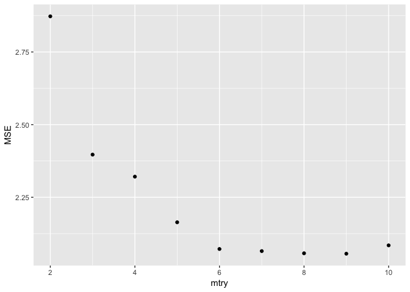

```r
library(tidyverse)
```

```
## ── Attaching packages ────────────────────────────────── tidyverse 1.2.1 ──
```

```
## ✔ ggplot2 2.2.1     ✔ purrr   0.2.4
## ✔ tibble  1.4.2     ✔ dplyr   0.7.4
## ✔ tidyr   0.8.0     ✔ stringr 1.3.0
## ✔ readr   1.1.1     ✔ forcats 0.3.0
```

```
## Warning: package 'ggplot2' was built under R version 3.2.5
```

```
## Warning: package 'readr' was built under R version 3.2.5
```

```
## Warning: package 'purrr' was built under R version 3.2.5
```

```
## Warning: package 'dplyr' was built under R version 3.2.5
```

```
## ── Conflicts ───────────────────────────────────── tidyverse_conflicts() ──
## ✖ dplyr::filter() masks stats::filter()
## ✖ dplyr::lag()    masks stats::lag()
```

```r
library(MASS)
```

```
## Warning: package 'MASS' was built under R version 3.2.5
```

```
## 
## Attaching package: 'MASS'
```

```
## The following object is masked from 'package:dplyr':
## 
##     select
```

```r
library(tree)
library(ISLR)
```

```
## Warning: package 'ISLR' was built under R version 3.2.5
```

### 1

Draw an example (of your own invention) of a partition of two- dimensional feature space that could result from recursive binary splitting. Your example should contain at least six regions. Draw a decision tree corresponding to this partition. Be sure to label all aspects of your figures, including the regions R1, R2, . . ., the cutpoints t1,t2,..., and so forth.
Hint: Your result should look something like Figures 8.1 and 8.2.


```r
par(xpd = NA) # if NA, all plotting is clipped to the device region
plot(NA, NA, type = "n", xlim = c(0,100), ylim = c(0,100), xlab = "X", ylab = "Y")
# t1: x = 40; (40, 0) (40, 100)
lines(x = c(40,40), y = c(0,100)) 
text(x = 40, y = 108, labels = c("t1"), col = "red")
# t2: y = 75; (0, 75) (40, 75)
lines(x = c(0,40), y = c(75,75))
text(x = -8, y = 75, labels = c("t2"), col = "red")
# t3: x = 75; (75,0) (75, 100)
lines(x = c(75,75), y = c(0,100))
text(x = 75, y = 108, labels = c("t3"), col = "red")
# t4: x = 20; (20,0) (20, 75)
lines(x = c(20,20), y = c(0,75))
text(x = 20, y = 80, labels = c("t4"), col = "red")
# t5: y=25; (75,25) (100,25)
lines(x = c(75,100), y = c(25,25))
text(x = 70, y = 25, labels = c("t5"), col = "red")

text(x = (40+75)/2, y = 50, labels = c("R1"))
text(x = 20, y = (100+75)/2, labels = c("R2"))
text(x = (75+100)/2, y = (100+25)/2, labels = c("R3"))
text(x = (75+100)/2, y = 25/2, labels = c("R4"))
text(x = 30, y = 75/2, labels = c("R5"))
text(x = 10, y = 75/2, labels = c("R6"))
```

<!-- -->

```r
# the tree 
```

### 3 

Consider the Gini index, classification error, and entropy in a simple classification setting with two classes. Create a single plot that displays each of these quantities as a function of pˆm1. The x- axis should display pˆm1, ranging from 0 to 1, and the y-axis should display the value of the Gini index, classification error, and entropy.

Hint: In a setting with two classes, pˆm1 = 1 − pˆm2. You could make this plot by hand, but it will be much easier to make in R.


```r
p <- seq(0, 1, 0.01)
gini.index <- 2 * p * (1 - p) # the formula 
cross.entropy <- - (p * log(p) + (1 - p) * log(1 - p)) # the formula
class.error <- 1 - pmax(p, 1 - p) # the fomula 

cbind(p, gini.index, class.error, cross.entropy) %>% as.data.frame() %>% 
  gather("gini.index", "cross.entropy", "class.error", key = "type", value = "values") %>% 
  ggplot() + 
  geom_point(aes(x = p, y = values, color = type))  
```

```
## Warning: Removed 2 rows containing missing values (geom_point).
```

<!-- -->

### 8 

In the lab, a classification tree was applied to the Carseats data set after converting Sales into a qualitative response variable. Now we will seek to predict Sales using regression trees and related approaches, treating the response as a quantitative variable.

(a) Split the data set into a training set and a test set.


```r
set.seed(1)
train_ID <- sample(rownames(Carseats), size = round(nrow(Carseats) * 0.8), replace = F) 
train <- Carseats[rownames(Carseats) %in% train_ID,]
test <- Carseats[!(rownames(Carseats) %in% train_ID),]

colnames(Carseats)
```

```
##  [1] "Sales"       "CompPrice"   "Income"      "Advertising" "Population" 
##  [6] "Price"       "ShelveLoc"   "Age"         "Education"   "Urban"      
## [11] "US"
```

(b) Fit a regression tree to the training set. Plot the tree, and interpret the results. What test MSE do you obtain?


```r
tree.carseats =tree(Sales~.-Sales ,train)

summary(tree.carseats) 
```

```
## 
## Regression tree:
## tree(formula = Sales ~ . - Sales, data = train)
## Variables actually used in tree construction:
## [1] "ShelveLoc"   "Price"       "Age"         "CompPrice"   "Population" 
## [6] "Advertising" "Income"     
## Number of terminal nodes:  19 
## Residual mean deviance:  2.452 = 738.2 / 301 
## Distribution of residuals:
##     Min.  1st Qu.   Median     Mean  3rd Qu.     Max. 
## -3.80300 -0.97550 -0.06679  0.00000  0.95970  5.30800
```

```r
plot(tree.carseats )
text(tree.carseats, pretty = 0, cex = 0.5) 
```

<!-- -->

```r
tree.pred=predict(tree.carseats,test)
mean((tree.pred - test$Sales)^2) 
```

```
## [1] 4.817033
```

(c) Use cross-validation in order to determine the optimal level of tree complexity. Does pruning the tree improve the test MSE?


```r
set.seed(2)
cv.carseats =cv.tree(tree.carseats)
cv.carseats
```

```
## $size
##  [1] 19 18 17 16 13 11  9  8  7  6  5  4  3  2  1
## 
## $dev
##  [1] 1492.551 1471.653 1458.577 1456.825 1448.314 1458.671 1462.832
##  [8] 1470.757 1497.250 1506.864 1642.913 1767.024 1781.596 2018.923
## [15] 2566.197
## 
## $k
##  [1]      -Inf  26.46888  29.98126  31.22339  31.89685  36.35474  40.08414
##  [8]  60.18026  66.00291  80.56524  97.29287 127.66651 141.29195 338.16101
## [15] 524.24198
## 
## $method
## [1] "deviance"
## 
## attr(,"class")
## [1] "prune"         "tree.sequence"
```

```r
par(mfrow=c(1,2))
plot(cv.carseats$size ,cv.carseats$dev ,type='b') 
plot(cv.carseats$size ,cv.carseats$k ,type='b') # size 13 gave the smallest CV error 
```

<!-- -->

```r
# 
prune.carseats=prune.tree(tree.carseats,best=13)
tree.pred=predict(prune.carseats,test)
mean((tree.pred - test$Sales)^2) 
```

```
## [1] 4.891394
```

### 9 

9. This problem involves the OJ data set which is part of the ISLR package.

(a) Create a training set containing a random sample of 800 observations, and a test set containing the remaining observations.


```r
set.seed(2)
train=sample(1:nrow(OJ), 800)
OJ.test=OJ[-train ,]
```

(b) Fit a tree to the training data, with Purchase as the response and the other variables as predictors. Use the summary() function to produce summary statistics about the tree, and describe the results obtained. What is the training error rate? How many terminal nodes does the tree have?


```r
?OJ
tree.OJ=tree(Purchase~.-Purchase,OJ,subset=train)
summary(tree.OJ) 
```

```
## 
## Classification tree:
## tree(formula = Purchase ~ . - Purchase, data = OJ, subset = train)
## Variables actually used in tree construction:
## [1] "LoyalCH"       "PriceDiff"     "ListPriceDiff" "PctDiscMM"    
## Number of terminal nodes:  8 
## Residual mean deviance:  0.7659 = 606.6 / 792 
## Misclassification error rate: 0.1675 = 134 / 800
```

```r
# 8 termail nodes, training error rate of 0.167
```

(c) Type in the name of the tree object in order to get a detailed text output. Pick one of the terminal nodes, and interpret the information displayed.


```r
tree.OJ 
```

```
## node), split, n, deviance, yval, (yprob)
##       * denotes terminal node
## 
##  1) root 800 1077.00 CH ( 0.60000 0.40000 )  
##    2) LoyalCH < 0.50395 360  425.40 MM ( 0.27778 0.72222 )  
##      4) LoyalCH < 0.276142 176  132.60 MM ( 0.12500 0.87500 )  
##        8) LoyalCH < 0.0491775 63   10.27 MM ( 0.01587 0.98413 ) *
##        9) LoyalCH > 0.0491775 113  108.50 MM ( 0.18584 0.81416 ) *
##      5) LoyalCH > 0.276142 184  250.80 MM ( 0.42391 0.57609 )  
##       10) PriceDiff < 0.05 71   75.77 MM ( 0.22535 0.77465 ) *
##       11) PriceDiff > 0.05 113  155.60 CH ( 0.54867 0.45133 ) *
##    3) LoyalCH > 0.50395 440  350.50 CH ( 0.86364 0.13636 )  
##      6) LoyalCH < 0.745156 182  210.00 CH ( 0.73626 0.26374 )  
##       12) ListPriceDiff < 0.235 70   97.04 CH ( 0.50000 0.50000 )  
##         24) PctDiscMM < 0.196196 51   66.22 CH ( 0.64706 0.35294 ) *
##         25) PctDiscMM > 0.196196 19   12.79 MM ( 0.10526 0.89474 ) *
##       13) ListPriceDiff > 0.235 112   80.42 CH ( 0.88393 0.11607 ) *
##      7) LoyalCH > 0.745156 258   97.07 CH ( 0.95349 0.04651 ) *
```

(d) Create a plot of the tree, and interpret the results.

```r
plot(tree.OJ )
text(tree.OJ ,pretty =0) 
```

<!-- -->

(e) Predict the response on the test data, and produce a confusion matrix comparing the test labels to the predicted test labels. What is the test error rate?


```r
tree.pred=predict(tree.OJ,OJ.test,type="class")
table(tree.pred ,OJ.test$Purchase)
```

```
##          
## tree.pred  CH  MM
##        CH 161  28
##        MM  12  69
```

```r
(28+12) /270 
```

```
## [1] 0.1481481
```

(f) Apply the cv.tree() function to the training set in order to determine the optimal tree size.


```r
set.seed(3)
cv.OJ =cv.tree(tree.OJ ,FUN=prune.misclass )
```

(g) Produce a plot with tree size on the x-axis and cross-validated classification error rate on the y-axis.


```r
plot(cv.OJ$size ,cv.OJ$dev ,type="b")  # 7 
```

<!-- -->

```r
cv.OJ
```

```
## $size
## [1] 8 7 4 2 1
## 
## $dev
## [1] 151 151 170 170 320
## 
## $k
## [1]  -Inf   0.0   5.0   5.5 160.0
## 
## $method
## [1] "misclass"
## 
## attr(,"class")
## [1] "prune"         "tree.sequence"
```

(h) Which tree size corresponds to the lowest cross-validated classi- fication error rate?

7

(i) Produce a pruned tree corresponding to the optimal tree size obtained using cross-validation. If cross-validation does not lead to selection of a pruned tree, then create a pruned tree with five terminal nodes.


```r
prune.OJ=prune.misclass(tree.OJ,best=7)
```

(j) Compare the training error rates between the pruned and un- pruned trees. Which is higher?


```r
tree.pred=predict(prune.OJ,OJ.test,type="class")
table(tree.pred ,OJ.test$Purchase)
```

```
##          
## tree.pred  CH  MM
##        CH 161  28
##        MM  12  69
```

```r
(28+12) /270 # no difference 
```

```
## [1] 0.1481481
```

```r
# use 5 
prune.OJ=prune.misclass(tree.OJ,best=5)
tree.pred=predict(prune.OJ,OJ.test,type="class")
table(tree.pred ,OJ.test$Purchase)
```

```
##          
## tree.pred  CH  MM
##        CH 161  28
##        MM  12  69
```

```r
(28+12) /270 # no difference 
```

```
## [1] 0.1481481
```

(k) Compare the test error rates between the pruned and unpruned trees. Which is higher? 

same ... 

### bagging, random forest, and boosting 

### 5

Suppose we produce ten bootstrapped samples from a data set containing red and green classes. We then apply a classification tree to each bootstrapped sample and, for a specific value of X, produce 10 estimates of P(Class is Red|X):
0.1, 0.15, 0.2, 0.2, 0.55, 0.6, 0.6, 0.65, 0.7, and 0.75.

There are two common ways to combine these results together into a single class prediction. One is the majority vote approach discussed in this chapter. The second approach is to classify based on the average probability. In this example, what is the final classification under each of these two approaches?


```r
P <- c(0.1, 0.15, 0.2, 0.2, 0.55, 0.6, 0.6, 0.65, 0.7, 0.75)

# majority vote
sum(P < 0.5)/length(P) # less than 0.5, so green 
```

```
## [1] 0.4
```

```r
# average 
mean(P) # less than 0.5 as well, green 
```

```
## [1] 0.45
```

### 7

In the lab, we applied random forests to the Boston data using mtry=6 and using ntree=25 and ntree=500. Create a plot displaying the test error resulting from random forests on this data set for a more com- prehensive range of values for mtry and ntree. You can model your plot after Figure 8.10. Describe the results obtained.


```r
library(randomForest)
```

```
## randomForest 4.6-12
```

```
## Type rfNews() to see new features/changes/bug fixes.
```

```
## 
## Attaching package: 'randomForest'
```

```
## The following object is masked from 'package:dplyr':
## 
##     combine
```

```
## The following object is masked from 'package:ggplot2':
## 
##     margin
```

```r
set.seed(1)
train = sample(1:nrow(Boston), nrow(Boston)/2)
boston.test=Boston[-train ,"medv"]

mtry <- c(ncol(Boston)-1, round((ncol(Boston)-1)/2, digits = 0), round(sqrt(ncol(Boston)-1), digits = 0))
ntree <- seq(1,500, by = 20)

output <- 
sapply(mtry, function(i){
sapply(ntree, function(j) {
  bag.boston=randomForest(medv~.,data=Boston,subset=train,mtry=i,importance =TRUE, ntree=j) 
  yhat.bag = predict(bag.boston ,newdata=Boston[-train,])
  mean((yhat.bag-boston.test)^2)
})
})

output <- as.data.frame(output) 
colnames(output) <- mtry
output$ntree <- ntree

library(tidyverse)

output %>% 
  gather(`13`, `6`, `4`, key = "mtry", value = "MSE") %>% 
  ggplot(aes(x = ntree, y = MSE, group = mtry)) + 
  geom_line(aes(color = mtry))   
```

<!-- -->

### 8 d,e

(d) Use the bagging approach in order to analyze this data. What test MSE do you obtain? Use the importance() function to de- termine which variables are most important.


```r
train_ID <- sample(rownames(Carseats), size = round(nrow(Carseats) * 0.8), replace = F) 
train <- Carseats[rownames(Carseats) %in% train_ID,]
test <- Carseats[!(rownames(Carseats) %in% train_ID),]

colnames(Carseats)
```

```
##  [1] "Sales"       "CompPrice"   "Income"      "Advertising" "Population" 
##  [6] "Price"       "ShelveLoc"   "Age"         "Education"   "Urban"      
## [11] "US"
```

```r
colnames(Carseats)
```

```
##  [1] "Sales"       "CompPrice"   "Income"      "Advertising" "Population" 
##  [6] "Price"       "ShelveLoc"   "Age"         "Education"   "Urban"      
## [11] "US"
```

```r
set.seed (1)
bag.carseats=randomForest(Sales~.,data=train,mtry=ncol(Carseats)-1,importance =TRUE)

yhat.bag = predict(bag.carseats,newdata=test)
mean((yhat.bag-test$Sales)^2) 
```

```
## [1] 2.07279
```

```r
importance(bag.carseats) 
```

```
##                %IncMSE IncNodePurity
## CompPrice   30.9261605     288.56149
## Income       8.8066283     129.89277
## Advertising 25.3264500     204.73627
## Population  -3.2662125      84.64993
## Price       74.5884768     723.84119
## ShelveLoc   80.9117600     778.71398
## Age         24.9827388     244.24344
## Education   -0.4744652      68.66151
## Urban        0.7733735      11.82605
## US           1.5422595      12.86153
```

```r
varImpPlot(bag.carseats)   
```

<!-- -->

(e) Use random forests to analyze this data. What test MSE do you obtain? Use the importance() function to determine which vari- ables are most important. Describe the effect of m, the number of variables considered at each split, on the error rate obtained. 


```r
mtry <- (2:(ncol(Carseats)-1))
mtry
```

```
## [1]  2  3  4  5  6  7  8  9 10
```

```r
output <- 
sapply(mtry, function(i){
  rf.carseats=randomForest(Sales~.,data=train,mtry=i,importance =TRUE) 
  yhat.rf = predict(rf.carseats ,newdata=test)
  mean((yhat.rf-test$Sales)^2)
})

output <- as.data.frame(output)
output$mtry <- mtry
output %>% 
  ggplot() + 
  geom_point(aes(x = mtry, y = output)) + 
  labs(x = "mtry", y = "MSE") 
```

<!-- -->

### 10

10. We now use boosting to predict Salary in the Hitters data set.

(a) Remove the observations for whom the salary information is unknown, and then log-transform the salaries.


```r
colnames(Hitters)
```

```
##  [1] "AtBat"     "Hits"      "HmRun"     "Runs"      "RBI"      
##  [6] "Walks"     "Years"     "CAtBat"    "CHits"     "CHmRun"   
## [11] "CRuns"     "CRBI"      "CWalks"    "League"    "Division" 
## [16] "PutOuts"   "Assists"   "Errors"    "Salary"    "NewLeague"
```

```r
dim(Hitters)
```

```
## [1] 322  20
```

```r
Hitters <- Hitters[!is.na(Hitters$Salary),] 
dim(Hitters)
```

```
## [1] 263  20
```

```r
Hitters$Salary_log <- log(Hitters$Salary) 
```

(b) Create a training set consisting of the first 200 observations, and a test set consisting of the remaining observations.


```r
train_ID <- rownames(Hitters)[1:200] 
train <- Hitters[rownames(Hitters) %in% train_ID,]
test <- Hitters[!(rownames(Hitters) %in% train_ID),]
train %>% dim()
```

```
## [1] 200  21
```

(c) Perform boosting on the training set with 1,000 trees for a range of values of the shrinkage parameter λ. Produce a plot with different shrinkage values on the x-axis and the corresponding training set MSE on the y-axis.


```r
library(gbm)
```

```
## Warning: package 'gbm' was built under R version 3.2.5
```

```
## Loading required package: survival
```

```
## Warning: package 'survival' was built under R version 3.2.5
```

```
## Loading required package: lattice
```

```
## Warning: package 'lattice' was built under R version 3.2.5
```

```
## Loading required package: splines
```

```
## Loading required package: parallel
```

```
## Loaded gbm 2.1.3
```

```r
set.seed(1)
shrinkage <- seq(0.001, 1, length.out = 20)
shrinkage 
```

```
##  [1] 0.00100000 0.05357895 0.10615789 0.15873684 0.21131579 0.26389474
##  [7] 0.31647368 0.36905263 0.42163158 0.47421053 0.52678947 0.57936842
## [13] 0.63194737 0.68452632 0.73710526 0.78968421 0.84226316 0.89484211
## [19] 0.94742105 1.00000000
```

```r
output <- 
sapply(shrinkage, function(i){
  boost.Hitter=gbm(Salary_log~.-Salary,data=train,distribution="gaussian",n.trees=1000, interaction.depth=4, shrinkage =i)
  yhat.boost=predict(boost.Hitter,newdata=test, n.trees=1000)
  mean((yhat.boost -test$Salary_log)^2) 
}) 

output <- as.data.frame(output)  
output$shrinkage <- shrinkage
```

(d) Produce a plot with different shrinkage values on the x-axis and the corresponding test set MSE on the y-axis.


```r
output %>%  
  ggplot() + 
  geom_point(aes(x = shrinkage, y = output)) + 
  labs(x = "shrinkage", y = "MSE") 
```

<!-- -->

(e) Compare the test MSE of boosting to the test MSE that results from applying two of the regression approaches seen in Chapters 3 and 6.


```r
# multiple linear regression 
fit.m1 <- lm(Salary_log ~ .-Salary, data = train)
summary(fit.m1)
```

```
## 
## Call:
## lm(formula = Salary_log ~ . - Salary, data = train)
## 
## Residuals:
##      Min       1Q   Median       3Q      Max 
## -1.44628 -0.43844  0.02835  0.39266  2.83081 
## 
## Coefficients:
##               Estimate Std. Error t value Pr(>|t|)    
## (Intercept)  4.4531779  0.1953605  22.795  < 2e-16 ***
## AtBat       -0.0041511  0.0015441  -2.688 0.007852 ** 
## Hits         0.0189964  0.0054505   3.485 0.000618 ***
## HmRun        0.0094426  0.0134247   0.703 0.482728    
## Runs        -0.0029961  0.0067142  -0.446 0.655968    
## RBI         -0.0026030  0.0056677  -0.459 0.646590    
## Walks        0.0113452  0.0039819   2.849 0.004894 ** 
## Years        0.0686664  0.0259832   2.643 0.008949 ** 
## CAtBat       0.0001479  0.0002850   0.519 0.604507    
## CHits       -0.0012085  0.0014250  -0.848 0.397515    
## CHmRun       0.0004085  0.0034671   0.118 0.906335    
## CRuns        0.0025268  0.0016188   1.561 0.120299    
## CRBI         0.0003625  0.0014589   0.248 0.804062    
## CWalks      -0.0016141  0.0006971  -2.316 0.021712 *  
## LeagueN      0.1487966  0.1654780   0.899 0.369751    
## DivisionW   -0.1359398  0.0880186  -1.544 0.124237    
## PutOuts      0.0005631  0.0001856   3.034 0.002770 ** 
## Assists      0.0008936  0.0005092   1.755 0.080969 .  
## Errors      -0.0099497  0.0100046  -0.995 0.321308    
## NewLeagueN  -0.0315309  0.1655198  -0.190 0.849135    
## ---
## Signif. codes:  0 '***' 0.001 '**' 0.01 '*' 0.05 '.' 0.1 ' ' 1
## 
## Residual standard error: 0.5966 on 180 degrees of freedom
## Multiple R-squared:  0.6149,	Adjusted R-squared:  0.5743 
## F-statistic: 15.13 on 19 and 180 DF,  p-value: < 2.2e-16
```

```r
fit.m2 <- lm(Salary_log ~ Walks + Division + League, data = train)
yhat.fit=predict(fit.m2,newdata=test)
mean((yhat.fit -test$Salary_log)^2) 
```

```
## [1] 0.6433183
```

```r
# bestsubset  
library(leaps)
```

```
## Warning: package 'leaps' was built under R version 3.2.5
```

```r
colnames(Hitters)
```

```
##  [1] "AtBat"      "Hits"       "HmRun"      "Runs"       "RBI"       
##  [6] "Walks"      "Years"      "CAtBat"     "CHits"      "CHmRun"    
## [11] "CRuns"      "CRBI"       "CWalks"     "League"     "Division"  
## [16] "PutOuts"    "Assists"    "Errors"     "Salary"     "NewLeague" 
## [21] "Salary_log"
```

```r
regfit.Hitter=regsubsets(Salary_log~.-Salary,data=train, nvmax =19) # best subset using only traning data 
plot(regfit.Hitter,scale="bic") # 5 predictor is the best 
```

<!-- -->

```r
test.Hitter<-model.matrix(Salary_log~.-Salary,data=test) 
dim(test.Hitter) 
```

```
## [1] 63 20
```

```r
dim(test)
```

```
## [1] 63 21
```

```r
val.errors=rep(NA,19) 

for(i in 1:19){
coefi=coef(regfit.Hitter,id=i)
pred=test.Hitter[,names(coefi)]%*%coefi
val.errors[i]=mean((test$Salary_log-pred)^2) }

val.errors
```

```
##  [1] 0.5211386 0.4791536 0.5093131 0.4942052 0.4981346 0.4886233 0.4793456
##  [8] 0.4684570 0.4744261 0.4931775 0.4896387 0.5045408 0.4992357 0.4991217
## [15] 0.4934107 0.4936354 0.4935914 0.4912519 0.4917959
```

```r
min <- which.min(val.errors) # 9 predictors  
min
```

```
## [1] 8
```

```r
val.errors[min]  
```

```
## [1] 0.468457
```

(f) Which variables appear to be the most important predictors in the boosted model?


```r
set.seed(1)
boost.Hitter=gbm(Salary_log~.-Salary,data=train,distribution="gaussian",n.trees=5000, interaction.depth=4)

summary(boost.Hitter)
```

<!-- -->

```
##                 var    rel.inf
## CAtBat       CAtBat 33.1332936
## CWalks       CWalks 10.5635544
## CHits         CHits  8.6412668
## CRBI           CRBI  8.3945235
## CRuns         CRuns  7.9845961
## Years         Years  4.9252520
## Walks         Walks  3.9501480
## CHmRun       CHmRun  3.5615292
## AtBat         AtBat  3.5247204
## PutOuts     PutOuts  3.3973584
## Assists     Assists  2.1750479
## Hits           Hits  2.0967941
## RBI             RBI  2.0358010
## Errors       Errors  1.7411299
## Runs           Runs  1.3517266
## HmRun         HmRun  1.3049502
## NewLeague NewLeague  0.5125769
## Division   Division  0.5122119
## League       League  0.1935189
```

(g) Now apply bagging to the training set. What is the test set MSE for this approach?


```r
set.seed(1)
colnames(Hitters) 
```

```
##  [1] "AtBat"      "Hits"       "HmRun"      "Runs"       "RBI"       
##  [6] "Walks"      "Years"      "CAtBat"     "CHits"      "CHmRun"    
## [11] "CRuns"      "CRBI"       "CWalks"     "League"     "Division"  
## [16] "PutOuts"    "Assists"    "Errors"     "Salary"     "NewLeague" 
## [21] "Salary_log"
```

```r
bag.Hitter=randomForest(Salary_log~.-Salary,data=train,mtry=19,importance =TRUE)
bag.Hitter
```

```
## 
## Call:
##  randomForest(formula = Salary_log ~ . - Salary, data = train,      mtry = 19, importance = TRUE) 
##                Type of random forest: regression
##                      Number of trees: 500
## No. of variables tried at each split: 19
## 
##           Mean of squared residuals: 0.2191942
##                     % Var explained: 73.65
```

```r
yhat.bag = predict(bag.Hitter ,newdata=test)
mean((yhat.bag-test$Salary_log)^2)
```

```
## [1] 0.228722
```

### 11

11. This question uses the Caravan data set. 

(a) Create a training set consisting of the first 1,000 observations,
and a test set consisting of the remaining observations.


```r
colnames(Caravan)
```

```
##  [1] "MOSTYPE"  "MAANTHUI" "MGEMOMV"  "MGEMLEEF" "MOSHOOFD" "MGODRK"  
##  [7] "MGODPR"   "MGODOV"   "MGODGE"   "MRELGE"   "MRELSA"   "MRELOV"  
## [13] "MFALLEEN" "MFGEKIND" "MFWEKIND" "MOPLHOOG" "MOPLMIDD" "MOPLLAAG"
## [19] "MBERHOOG" "MBERZELF" "MBERBOER" "MBERMIDD" "MBERARBG" "MBERARBO"
## [25] "MSKA"     "MSKB1"    "MSKB2"    "MSKC"     "MSKD"     "MHHUUR"  
## [31] "MHKOOP"   "MAUT1"    "MAUT2"    "MAUT0"    "MZFONDS"  "MZPART"  
## [37] "MINKM30"  "MINK3045" "MINK4575" "MINK7512" "MINK123M" "MINKGEM" 
## [43] "MKOOPKLA" "PWAPART"  "PWABEDR"  "PWALAND"  "PPERSAUT" "PBESAUT" 
## [49] "PMOTSCO"  "PVRAAUT"  "PAANHANG" "PTRACTOR" "PWERKT"   "PBROM"   
## [55] "PLEVEN"   "PPERSONG" "PGEZONG"  "PWAOREG"  "PBRAND"   "PZEILPL" 
## [61] "PPLEZIER" "PFIETS"   "PINBOED"  "PBYSTAND" "AWAPART"  "AWABEDR" 
## [67] "AWALAND"  "APERSAUT" "ABESAUT"  "AMOTSCO"  "AVRAAUT"  "AAANHANG"
## [73] "ATRACTOR" "AWERKT"   "ABROM"    "ALEVEN"   "APERSONG" "AGEZONG" 
## [79] "AWAOREG"  "ABRAND"   "AZEILPL"  "APLEZIER" "AFIETS"   "AINBOED" 
## [85] "ABYSTAND" "Purchase"
```

```r
dim(Caravan)
```

```
## [1] 5822   86
```

```r
Caravan$Purchase_2 <- ifelse(Caravan$Purchase == "Yes", 1, 0)

train_ID <- rownames(Caravan)[1:1000]
train <- Caravan[rownames(Caravan) %in% train_ID,]
test <- Caravan[!(rownames(Caravan) %in% train_ID),]
train %>% dim() 
```

```
## [1] 1000   87
```

(b) Fit a boosting model to the training set with Purchase as the response and the other variables as predictors. Use 1,000 trees, and a shrinkage value of 0.01. Which predictors appear to be the most important?


```r
boost.Caravan=gbm(Purchase_2~.-Purchase,data=train,distribution= "bernoulli",n.trees=1000, interaction.depth=4,shrinkage =0.01, verbose =F)
```

```
## Warning in gbm.fit(x, y, offset = offset, distribution = distribution, w =
## w, : variable 50: PVRAAUT has no variation.
```

```
## Warning in gbm.fit(x, y, offset = offset, distribution = distribution, w =
## w, : variable 71: AVRAAUT has no variation.
```

```r
summary(boost.Caravan) # the top ones  
```

<!-- -->

```
##               var     rel.inf
## PPERSAUT PPERSAUT 6.709301433
## MGODGE     MGODGE 4.688479010
## MKOOPKLA MKOOPKLA 4.654784133
## PBRAND     PBRAND 4.417165130
## MOPLHOOG MOPLHOOG 4.090940721
## MOSTYPE   MOSTYPE 4.006297360
## MAUT2       MAUT2 3.814717180
## MBERMIDD MBERMIDD 3.782622424
## MGODPR     MGODPR 3.585559224
## MBERARBG MBERARBG 3.459382949
## MINK3045 MINK3045 3.430452224
## MSKC         MSKC 2.362011592
## MSKB1       MSKB1 2.293141617
## MBERARBO MBERARBO 2.241128113
## MINKM30   MINKM30 2.206045082
## MSKA         MSKA 2.064610626
## PWAPART   PWAPART 2.052336620
## MOPLMIDD MOPLMIDD 2.050412074
## MFGEKIND MFGEKIND 1.994940330
## MFWEKIND MFWEKIND 1.941879520
## MRELGE     MRELGE 1.908777746
## MINK7512 MINK7512 1.793622239
## MBERHOOG MBERHOOG 1.742956144
## MFALLEEN MFALLEEN 1.725389380
## MSKB2       MSKB2 1.699079440
## MRELOV     MRELOV 1.671436937
## MZFONDS   MZFONDS 1.615004495
## MAUT1       MAUT1 1.596043870
## MZPART     MZPART 1.561073919
## MINKGEM   MINKGEM 1.559299196
## MAUT0       MAUT0 1.438753478
## MINK4575 MINK4575 1.313248231
## MGODOV     MGODOV 1.293157019
## ABRAND     ABRAND 1.255381241
## MSKD         MSKD 1.212613426
## MHKOOP     MHKOOP 1.138201881
## MGODRK     MGODRK 1.088205393
## MGEMLEEF MGEMLEEF 0.999642657
## MHHUUR     MHHUUR 0.975658505
## MRELSA     MRELSA 0.881655127
## MOPLLAAG MOPLLAAG 0.834027752
## MBERZELF MBERZELF 0.813863880
## APERSAUT APERSAUT 0.772967403
## MGEMOMV   MGEMOMV 0.682727245
## MOSHOOFD MOSHOOFD 0.502430004
## MBERBOER MBERBOER 0.490914024
## PMOTSCO   PMOTSCO 0.445720133
## PLEVEN     PLEVEN 0.414059417
## MINK123M MINK123M 0.332205805
## PBYSTAND PBYSTAND 0.282707490
## MAANTHUI MAANTHUI 0.063673557
## ALEVEN     ALEVEN 0.035948808
## PAANHANG PAANHANG 0.008360487
## PFIETS     PFIETS 0.004986308
## PWABEDR   PWABEDR 0.000000000
## PWALAND   PWALAND 0.000000000
## PBESAUT   PBESAUT 0.000000000
## PVRAAUT   PVRAAUT 0.000000000
## PTRACTOR PTRACTOR 0.000000000
## PWERKT     PWERKT 0.000000000
## PBROM       PBROM 0.000000000
## PPERSONG PPERSONG 0.000000000
## PGEZONG   PGEZONG 0.000000000
## PWAOREG   PWAOREG 0.000000000
## PZEILPL   PZEILPL 0.000000000
## PPLEZIER PPLEZIER 0.000000000
## PINBOED   PINBOED 0.000000000
## AWAPART   AWAPART 0.000000000
## AWABEDR   AWABEDR 0.000000000
## AWALAND   AWALAND 0.000000000
## ABESAUT   ABESAUT 0.000000000
## AMOTSCO   AMOTSCO 0.000000000
## AVRAAUT   AVRAAUT 0.000000000
## AAANHANG AAANHANG 0.000000000
## ATRACTOR ATRACTOR 0.000000000
## AWERKT     AWERKT 0.000000000
## ABROM       ABROM 0.000000000
## APERSONG APERSONG 0.000000000
## AGEZONG   AGEZONG 0.000000000
## AWAOREG   AWAOREG 0.000000000
## AZEILPL   AZEILPL 0.000000000
## APLEZIER APLEZIER 0.000000000
## AFIETS     AFIETS 0.000000000
## AINBOED   AINBOED 0.000000000
## ABYSTAND ABYSTAND 0.000000000
```

(c) Use the boosting model to predict the response on the test data. Predict that a person will make a purchase if the estimated prob- ability of purchase is greater than 20 %. Form a confusion ma- trix. What fraction of the people predicted to make a purchase do in fact make one? How does this compare with the results obtained from applying KNN or logistic regression to this data set? 


```r
library(class) 
### boosting model   
yhat.boost=predict(boost.Caravan,newdata=test, n.trees=1000, type = "response")
yhat.boost <- ifelse(yhat.boost > 0.2, 1, 0)
table(yhat.boost, test$Purchase_2)
```

```
##           
## yhat.boost    0    1
##          0 4338  256
##          1  195   33
```

```r
30/(30+259) # why so low. 
```

```
## [1] 0.1038062
```

```r
### logistic
glm.fits=glm(Purchase_2 ~ .-Purchase, data=train,family=binomial) 
```

```
## Warning: glm.fit: fitted probabilities numerically 0 or 1 occurred
```

```r
glm.probs=predict(glm.fits,test,type="response")
```

```
## Warning in predict.lm(object, newdata, se.fit, scale = 1, type =
## ifelse(type == : prediction from a rank-deficient fit may be misleading
```

```r
glm.probs <- ifelse(glm.probs > 0.2, 1, 0)
table(glm.probs, test$Purchase_2)
```

```
##          
## glm.probs    0    1
##         0 4183  231
##         1  350   58
```

```r
58/(58+231) # higher but still very low 
```

```
## [1] 0.200692
```

### 12 (will skip) 

Apply boosting, bagging, and random forests to a data set of your choice. Be sure to fit the models on a training set and to evaluate their performance on a test set. How accurate are the results compared to simple methods like linear or logistic regression? Which of these approaches yields the best performance? 
