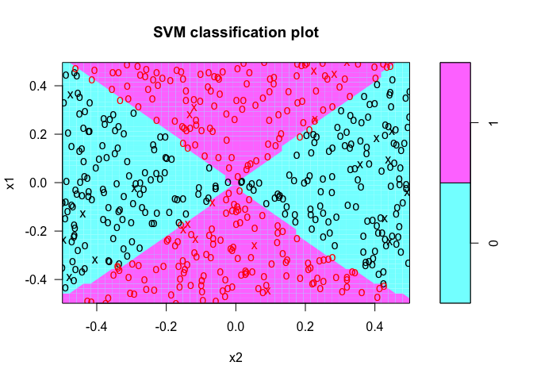

### 4
Generate a simulated two-class data set with 100 observations and two features in which there is a visible but non-linear separation between the two classes. Show that in this setting, a support vector machine with a polynomial kernel (with degree greater than 1) or a radial kernel will outperform a support vector classifier on the training data. Which technique performs best on the test data? Make plots and report training and test error rates in order to back up your assertions.


```r
library(e1071)
```

```
## Warning: package 'e1071' was built under R version 3.2.5
```

```r
# generate data 
set.seed (1)
x=matrix(rnorm(100*2), ncol=2)
y=c(rep(-1,50), rep(1,50))
x[y==1,]=x[y==1,] + 1 # don't understand 
plot(x, col=(3-y)) # don't understand 
```

<!-- -->

```r
# splitting to training and test data set 
train=sample(100,80)

# support vector classifier, use CV to decide cost value 
dat=data.frame(x=x, y=as.factor(y))

set.seed(1)
tune.out=tune(svm,y~.,data=dat[train,],kernel="linear",ranges=list(cost=c(0.001, 0.01, 0.1, 1,5,10,100)))
summary(tune.out) # training error, 0.225 
```

```
## 
## Parameter tuning of 'svm':
## 
## - sampling method: 10-fold cross validation 
## 
## - best parameters:
##  cost
##   0.1
## 
## - best performance: 0.2125 
## 
## - Detailed performance results:
##    cost  error dispersion
## 1 1e-03 0.5125  0.1608355
## 2 1e-02 0.2250  0.1536591
## 3 1e-01 0.2125  0.1449377
## 4 1e+00 0.2250  0.1645701
## 5 5e+00 0.2250  0.1645701
## 6 1e+01 0.2250  0.1645701
## 7 1e+02 0.2250  0.1645701
```

```r
bestmod=tune.out$best.model 
summary(bestmod)
```

```
## 
## Call:
## best.tune(method = svm, train.x = y ~ ., data = dat[train, ], 
##     ranges = list(cost = c(0.001, 0.01, 0.1, 1, 5, 10, 100)), 
##     kernel = "linear")
## 
## 
## Parameters:
##    SVM-Type:  C-classification 
##  SVM-Kernel:  linear 
##        cost:  0.1 
##       gamma:  0.5 
## 
## Number of Support Vectors:  50
## 
##  ( 25 25 )
## 
## 
## Number of Classes:  2 
## 
## Levels: 
##  -1 1
```

```r
plot(bestmod, dat)
```

<!-- -->

```r
ypred=predict(bestmod ,dat[-train,])
table(predict=ypred, truth=dat[-train,]$y) 
```

```
##        truth
## predict -1 1
##      -1  7 3
##      1   2 8
```

```r
(2+3)/20 # 0.25 test error 
```

```
## [1] 0.25
```

```r
# support vector machine with radial kernel 
set.seed(1)
tune.out=tune(svm, y~., data=dat[train,], kernel="radial",ranges=list(cost=c(0.1,1,10,100,1000),gamma=c(0.5,1,2,3,4) ))
summary(tune.out) # training error 0.2 
```

```
## 
## Parameter tuning of 'svm':
## 
## - sampling method: 10-fold cross validation 
## 
## - best parameters:
##  cost gamma
##   0.1   0.5
## 
## - best performance: 0.225 
## 
## - Detailed performance results:
##     cost gamma  error dispersion
## 1  1e-01   0.5 0.2250  0.1645701
## 2  1e+00   0.5 0.2625  0.1811422
## 3  1e+01   0.5 0.2750  0.1936492
## 4  1e+02   0.5 0.3000  0.2140872
## 5  1e+03   0.5 0.3125  0.1976424
## 6  1e-01   1.0 0.2250  0.1645701
## 7  1e+00   1.0 0.2875  0.1772671
## 8  1e+01   1.0 0.2875  0.2045490
## 9  1e+02   1.0 0.3125  0.2224391
## 10 1e+03   1.0 0.3375  0.1671867
## 11 1e-01   2.0 0.3625  0.1496524
## 12 1e+00   2.0 0.2875  0.1868043
## 13 1e+01   2.0 0.3250  0.1972027
## 14 1e+02   2.0 0.3000  0.1787301
## 15 1e+03   2.0 0.3750  0.1559024
## 16 1e-01   3.0 0.4875  0.1094494
## 17 1e+00   3.0 0.3000  0.1787301
## 18 1e+01   3.0 0.3375  0.2045490
## 19 1e+02   3.0 0.3250  0.1581139
## 20 1e+03   3.0 0.3375  0.1772671
## 21 1e-01   4.0 0.5375  0.1029091
## 22 1e+00   4.0 0.3000  0.1881932
## 23 1e+01   4.0 0.3000  0.1972027
## 24 1e+02   4.0 0.3125  0.1976424
## 25 1e+03   4.0 0.3375  0.1868043
```

```r
plot(tune.out$best.model,dat)
```

<!-- -->

```r
table(true=dat[-train,"y"], pred=predict(tune.out$best.model, newdata=dat[-train,]))
```

```
##     pred
## true -1 1
##   -1  6 3
##   1   3 8
```

```r
(4+1)/20 # 0.25 test error, same as suppor vecotr classifier 
```

```
## [1] 0.25
```

### 5
We have seen that we can fit an SVM with a non-linear kernel in order to perform classification using a non-linear decision boundary. We will now see that we can also obtain a non-linear decision boundary by performing logistic regression using non-linear transformations of the features.

(a) Generate a data set with n = 500 and p = 2, such that the observations belong to two classes with a quadratic decision boundary between them. For instance, you can do this as follows:

```r
x1=runif(500)-0.5
x2=runif(500)-0.5
y=1*(x1^2-x2^2 > 0)
```

(b) Plot the observations, colored according to their class labels. Your plot should display X1 on the x-axis, and X2 on the y- axis.

```r
library(tidyverse)
```

```
## ── Attaching packages ────────────────────────────────── tidyverse 1.2.1 ──
```

```
## ✔ ggplot2 2.2.1     ✔ purrr   0.2.4
## ✔ tibble  1.4.2     ✔ dplyr   0.7.4
## ✔ tidyr   0.8.0     ✔ stringr 1.3.0
## ✔ readr   1.1.1     ✔ forcats 0.3.0
```

```
## Warning: package 'ggplot2' was built under R version 3.2.5
```

```
## Warning: package 'readr' was built under R version 3.2.5
```

```
## Warning: package 'purrr' was built under R version 3.2.5
```

```
## Warning: package 'dplyr' was built under R version 3.2.5
```

```
## ── Conflicts ───────────────────────────────────── tidyverse_conflicts() ──
## ✖ dplyr::filter() masks stats::filter()
## ✖ dplyr::lag()    masks stats::lag()
```

```r
dat <- data.frame(x1 = x1, 
                  x2 = x2,
                  y = as.factor(y))

dat %>% 
  ggplot() + 
  geom_point(aes(x = x1, y = x2, color = y))
```

<!-- -->

(c) Fit a logistic regression model to the data, using X1 and X2 as predictors.

```r
library(ISLR)
```

```
## Warning: package 'ISLR' was built under R version 3.2.5
```

```r
glm.fits=glm(y ~ ., data=dat,family=binomial)
summary(glm.fits)
```

```
## 
## Call:
## glm(formula = y ~ ., family = binomial, data = dat)
## 
## Deviance Residuals: 
##    Min      1Q  Median      3Q     Max  
## -1.196  -1.160  -1.133   1.194   1.229  
## 
## Coefficients:
##             Estimate Std. Error z value Pr(>|z|)
## (Intercept) -0.03983    0.08949  -0.445    0.656
## x1           0.11727    0.31321   0.374    0.708
## x2          -0.06411    0.30463  -0.210    0.833
## 
## (Dispersion parameter for binomial family taken to be 1)
## 
##     Null deviance: 692.95  on 499  degrees of freedom
## Residual deviance: 692.77  on 497  degrees of freedom
## AIC: 698.77
## 
## Number of Fisher Scoring iterations: 3
```

(d) Apply this model to the training data in order to obtain a predicted class label for each training observation. Plot the observations, colored according to the predicted class labels. The decision boundary should be linear.

```r
set.seed(1)
train = sample(500, 500*0.8)
glm.fits=glm(y ~ ., data=dat[train,],family=binomial)
glm.probs=predict(glm.fits,type="response")
glm.pred <- ifelse(glm.probs > .5, 1, 0) %>% as.character() %>% as.factor() 

dat[train,] %>% 
  ggplot() + 
  geom_point(aes(x = x1, y = x2, color = glm.pred))
```

<!-- -->

(e) Now fit a logistic regression model to the data using non-linear functions of X1 and X2 as predictors (e.g. X12, X1 ×X2, log(X2), and so forth).

```r
library(ISLR)
glm.fits=glm(y ~ poly(x1, 2) + x1*x2, data=dat,family=binomial)
summary(glm.fits)
```

```
## 
## Call:
## glm(formula = y ~ poly(x1, 2) + x1 * x2, family = binomial, data = dat)
## 
## Deviance Residuals: 
##     Min       1Q   Median       3Q      Max  
## -2.4169  -0.7427  -0.5938   0.7615   1.8990  
## 
## Coefficients: (1 not defined because of singularities)
##              Estimate Std. Error z value Pr(>|z|)    
## (Intercept)   0.07463    0.11284   0.661    0.508    
## poly(x1, 2)1  1.61592    2.69516   0.600    0.549    
## poly(x1, 2)2 34.33414    3.12900  10.973   <2e-16 ***
## x1                 NA         NA      NA       NA    
## x2           -0.04964    0.37041  -0.134    0.893    
## x1:x2        -1.26469    1.43849  -0.879    0.379    
## ---
## Signif. codes:  0 '***' 0.001 '**' 0.01 '*' 0.05 '.' 0.1 ' ' 1
## 
## (Dispersion parameter for binomial family taken to be 1)
## 
##     Null deviance: 692.95  on 499  degrees of freedom
## Residual deviance: 505.68  on 495  degrees of freedom
## AIC: 515.68
## 
## Number of Fisher Scoring iterations: 4
```

(f) Apply this model to the training data in order to obtain a predicted class label for each training observation. Plot the observations, colored according to the predicted class labels. The decision boundary should be obviously non-linear. If it is not, then repeat (a)-(e) until you come up with an example in which the predicted class labels are obviously non-linear.

```r
glm.fits=glm(y ~ poly(x1, 2) + x1*x2, data=dat[train,],family=binomial)
glm.probs=predict(glm.fits,type="response")
glm.pred <- ifelse(glm.probs > .5, 1, 0) %>% as.character() %>% as.factor() 

dat[train,] %>% 
  ggplot() + 
  geom_point(aes(x = x1, y = x2, color = glm.pred))
```

<!-- -->

(g) Fit a support vector classifier to the data with X1 and X2 as predictors. Obtain a class prediction for each training observation. Plot the observations, colored according to the predicted class labels.

```r
set.seed(1)
tune.out=tune(svm,y~.,data=dat[train,],kernel="linear",ranges=list(cost=c(0.001, 0.01, 0.1, 1,5,10,100)))
summary(tune.out) 
```

```
## 
## Parameter tuning of 'svm':
## 
## - sampling method: 10-fold cross validation 
## 
## - best parameters:
##  cost
##     5
## 
## - best performance: 0.5225 
## 
## - Detailed performance results:
##    cost  error dispersion
## 1 1e-03 0.5325 0.07732507
## 2 1e-02 0.5325 0.07732507
## 3 1e-01 0.5275 0.08287373
## 4 1e+00 0.5250 0.08498366
## 5 5e+00 0.5225 0.08535058
## 6 1e+01 0.5225 0.08535058
## 7 1e+02 0.5225 0.08535058
```

```r
bestmod=tune.out$best.model 
summary(bestmod)
```

```
## 
## Call:
## best.tune(method = svm, train.x = y ~ ., data = dat[train, ], 
##     ranges = list(cost = c(0.001, 0.01, 0.1, 1, 5, 10, 100)), 
##     kernel = "linear")
## 
## 
## Parameters:
##    SVM-Type:  C-classification 
##  SVM-Kernel:  linear 
##        cost:  5 
##       gamma:  0.5 
## 
## Number of Support Vectors:  393
## 
##  ( 197 196 )
## 
## 
## Number of Classes:  2 
## 
## Levels: 
##  0 1
```

```r
plot(bestmod, dat)
```

<!-- -->

```r
ypred=predict(bestmod ,dat[-train,])
table(predict=ypred, truth=dat[-train,]$y) 
```

```
##        truth
## predict  0  1
##       0 21 25
##       1 31 23
```

```r
(25+31)/100 # 0.56 test error 
```

```
## [1] 0.56
```

(h) Fit a SVM using a non-linear kernel to the data. Obtain a class prediction for each training observation. Plot the observations, colored according to the predicted class labels.

```r
set.seed(1)
tune.out=tune(svm, y~., data=dat[train,], kernel="radial",ranges=list(cost=c(0.1,1,10,100,1000),gamma=c(0.5,1,2,3,4) ))
summary(tune.out) 
```

```
## 
## Parameter tuning of 'svm':
## 
## - sampling method: 10-fold cross validation 
## 
## - best parameters:
##  cost gamma
##  1000   0.5
## 
## - best performance: 0.0275 
## 
## - Detailed performance results:
##     cost gamma  error dispersion
## 1  1e-01   0.5 0.0550 0.05627314
## 2  1e+00   0.5 0.0650 0.04116363
## 3  1e+01   0.5 0.0450 0.05109903
## 4  1e+02   0.5 0.0400 0.02108185
## 5  1e+03   0.5 0.0275 0.02188988
## 6  1e-01   1.0 0.0550 0.04048319
## 7  1e+00   1.0 0.0600 0.04281744
## 8  1e+01   1.0 0.0450 0.03496029
## 9  1e+02   1.0 0.0325 0.01687371
## 10 1e+03   1.0 0.0350 0.02415229
## 11 1e-01   2.0 0.0575 0.04257347
## 12 1e+00   2.0 0.0425 0.02898755
## 13 1e+01   2.0 0.0475 0.02486072
## 14 1e+02   2.0 0.0325 0.02371708
## 15 1e+03   2.0 0.0350 0.02415229
## 16 1e-01   3.0 0.0550 0.04048319
## 17 1e+00   3.0 0.0550 0.04048319
## 18 1e+01   3.0 0.0450 0.02297341
## 19 1e+02   3.0 0.0375 0.02946278
## 20 1e+03   3.0 0.0475 0.02751262
## 21 1e-01   4.0 0.0575 0.03917553
## 22 1e+00   4.0 0.0525 0.04632314
## 23 1e+01   4.0 0.0450 0.02838231
## 24 1e+02   4.0 0.0450 0.03291403
## 25 1e+03   4.0 0.0425 0.02898755
```

```r
plot(tune.out$best.model,dat)
```

<!-- -->

```r
table(true=dat[-train,"y"], pred=predict(tune.out$best.model, newdata=dat[-train,]))
```

```
##     pred
## true  0  1
##    0 51  1
##    1  0 48
```

```r
(0+1)/100 # 0.01 test error 
```

```
## [1] 0.01
```

(i) Comment on your results. 
SVM has the best performance 

### 7
In this problem, you will use support vector approaches in order to predict whether a given car gets high or low gas mileage based on the Auto data set.

(a) Create a binary variable that takes on a 1 for cars with gas mileage above the median, and a 0 for cars with gas mileage below the median.


```r
Auto$y <- ifelse(Auto$mpg < median(Auto$mpg), 1, 0)
dim(Auto)
```

```
## [1] 392  10
```

(b) Fit a support vector classifier to the data with various values of cost, in order to predict whether a car gets high or low gas mileage. Report the cross-validation errors associated with different values of this parameter. Comment on your results.


```r
set.seed(1)
train <- sample(392, 392*0.8)
tune.out1=tune(svm,y~.-mpg,data=Auto[train,],kernel="linear",ranges=list(cost=c(0.001, 0.01, 0.1, 1,5,10,100)))
summary(tune.out1) 
```

```
## 
## Parameter tuning of 'svm':
## 
## - sampling method: 10-fold cross validation 
## 
## - best parameters:
##  cost
##     1
## 
## - best performance: 0.1006754 
## 
## - Detailed performance results:
##    cost     error dispersion
## 1 1e-03 0.1169002 0.02558848
## 2 1e-02 0.1109205 0.02955056
## 3 1e-01 0.1089096 0.03002889
## 4 1e+00 0.1006754 0.02383325
## 5 5e+00 0.1039840 0.02709341
## 6 1e+01 0.1066795 0.02799805
## 7 1e+02 0.1205500 0.03329877
```

```r
tune.out1$best.model 
```

```
## 
## Call:
## best.tune(method = svm, train.x = y ~ . - mpg, data = Auto[train, 
##     ], ranges = list(cost = c(0.001, 0.01, 0.1, 1, 5, 10, 100)), 
##     kernel = "linear")
## 
## 
## Parameters:
##    SVM-Type:  eps-regression 
##  SVM-Kernel:  linear 
##        cost:  1 
##       gamma:  0.003215434 
##     epsilon:  0.1 
## 
## 
## Number of Support Vectors:  253
```

(c) Now repeat (b), this time using SVMs with radial and polynomial basis kernels, with different values of gamma and degree and cost. Comment on your results.

```r
# radial 
set.seed(1)
tune.out2=tune(svm, y~.-mpg, data=Auto[train,], kernel="radial",ranges=list(cost=c(0.1,1,10,100,1000),gamma=c(0.5,1,2,3,4) ))
summary(tune.out2) 
```

```
## 
## Parameter tuning of 'svm':
## 
## - sampling method: 10-fold cross validation 
## 
## - best parameters:
##  cost gamma
##     1   0.5
## 
## - best performance: 0.06604259 
## 
## - Detailed performance results:
##     cost gamma      error  dispersion
## 1  1e-01   0.5 0.09307622 0.026833735
## 2  1e+00   0.5 0.06604259 0.029843375
## 3  1e+01   0.5 0.07227406 0.036208621
## 4  1e+02   0.5 0.07804374 0.040298461
## 5  1e+03   0.5 0.07804374 0.040298461
## 6  1e-01   1.0 0.28651288 0.043442876
## 7  1e+00   1.0 0.10535064 0.022386076
## 8  1e+01   1.0 0.11175282 0.027418721
## 9  1e+02   1.0 0.11175238 0.027419431
## 10 1e+03   1.0 0.11175238 0.027419431
## 11 1e-01   2.0 0.38461563 0.063136134
## 12 1e+00   2.0 0.20829460 0.009919853
## 13 1e+01   2.0 0.20952206 0.010854953
## 14 1e+02   2.0 0.20952206 0.010854953
## 15 1e+03   2.0 0.20952206 0.010854953
## 16 1e-01   3.0 0.39191369 0.064179519
## 17 1e+00   3.0 0.23151207 0.008021795
## 18 1e+01   3.0 0.23177774 0.007999518
## 19 1e+02   3.0 0.23177774 0.007999518
## 20 1e+03   3.0 0.23177774 0.007999518
## 21 1e-01   4.0 0.39305500 0.064434788
## 22 1e+00   4.0 0.23581811 0.007018306
## 23 1e+01   4.0 0.23589345 0.006952151
## 24 1e+02   4.0 0.23589345 0.006952151
## 25 1e+03   4.0 0.23589345 0.006952151
```

```r
tune.out2$best.model
```

```
## 
## Call:
## best.tune(method = svm, train.x = y ~ . - mpg, data = Auto[train, 
##     ], ranges = list(cost = c(0.1, 1, 10, 100, 1000), gamma = c(0.5, 
##     1, 2, 3, 4)), kernel = "radial")
## 
## 
## Parameters:
##    SVM-Type:  eps-regression 
##  SVM-Kernel:  radial 
##        cost:  1 
##       gamma:  0.5 
##     epsilon:  0.1 
## 
## 
## Number of Support Vectors:  234
```

```r
# poly 
tune.out3=tune(svm, y~.-mpg, data=Auto[train,], kernel="poly",ranges=list(cost=c(0.1,1,10,100,1000),degree=c(2,3,4)))
summary(tune.out3)  
```

```
## 
## Parameter tuning of 'svm':
## 
## - sampling method: 10-fold cross validation 
## 
## - best parameters:
##  cost degree
##  1000      2
## 
## - best performance: 0.1628445 
## 
## - Detailed performance results:
##     cost degree     error dispersion
## 1  1e-01      2 0.4666083 0.06827711
## 2  1e+00      2 0.4560773 0.07237260
## 3  1e+01      2 0.3724905 0.09147222
## 4  1e+02      2 0.2522514 0.05673007
## 5  1e+03      2 0.1628445 0.03231387
## 6  1e-01      3 0.4674635 0.06786389
## 7  1e+00      3 0.4638503 0.06848090
## 8  1e+01      3 0.4293140 0.07360432
## 9  1e+02      3 0.2413236 0.05167633
## 10 1e+03      3 0.1750491 0.03579203
## 11 1e-01      4 0.4678592 0.06779862
## 12 1e+00      4 0.4677914 0.06783836
## 13 1e+01      4 0.4671525 0.06826009
## 14 1e+02      4 0.4608314 0.07233481
## 15 1e+03      4 0.4082949 0.09843106
```

```r
tune.out3$best.model 
```

```
## 
## Call:
## best.tune(method = svm, train.x = y ~ . - mpg, data = Auto[train, 
##     ], ranges = list(cost = c(0.1, 1, 10, 100, 1000), degree = c(2, 
##     3, 4)), kernel = "poly")
## 
## 
## Parameters:
##    SVM-Type:  eps-regression 
##  SVM-Kernel:  polynomial 
##        cost:  1000 
##      degree:  2 
##       gamma:  0.003215434 
##      coef.0:  0 
##     epsilon:  0.1 
## 
## 
## Number of Support Vectors:  283
```

```r
# radial performs the best  
```

(d) Make some plots to back up your assertions in (b) and (c).
Hint: In the lab, we used the plot() function for svm objects only in cases with p = 2. When p > 2, you can use the plot() function to create plots displaying pairs of variables at a time. Essentially, instead of typing


where svmfit contains your fitted model and dat is a data frame containing your data, you can type

```r
# plot(svmfit , dat , x1~x4)
```

in order to plot just the first and fourth variables. However, you must replace x1 and x4 with the correct variable names. To find out more, type ?plot.svm.

### 8
This problem involves the OJ data set which is part of the ISLR package.

(a) Create a training set containing a random sample of 800 observations, and a test set containing the remaining observations.

(b) Fit a support vector classifier to the training data using
cost=0.01, with Purchase as the response and the other variables as predictors. Use the summary() function to produce summary statistics, and describe the results obtained.

(c) What are the training and test error rates?

(d) Use the tune() function to select an optimal cost. Consider val-
ues in the range 0.01 to 10.

(e) Compute the training and test error rates using this new value
for cost.

(f) Repeat parts (b) through (e) using a support vector machine
with a radial kernel. Use the default value for gamma.

(g) Repeat parts (b) through (e) using a support vector machine
with a polynomial kernel. Set degree=2.

(h) Overall, which approach seems to give the best results on this data?
